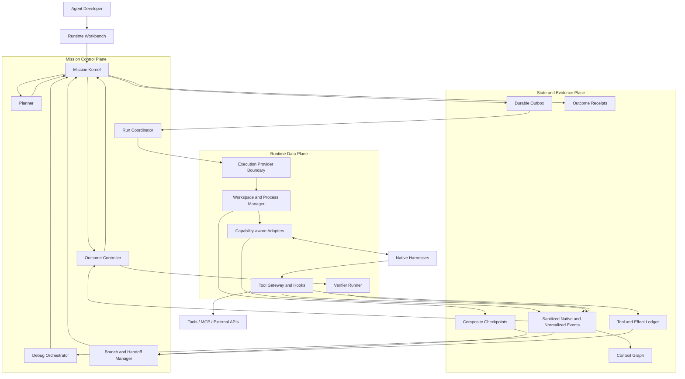

# MissionBraid

**English** | [简体中文](README.zh-CN.md)

**One Mission. Multiple Runtimes. Debuggable execution.**

MissionBraid is a local-first **Agent Runtime Workbench** for developers who
build with native coding agents. It is designed to make Codex, Qoder, Claude
Code, OpenCode, Hermes, and future Harnesses replaceable execution runtimes
behind one durable Mission:

```text
configure → plan → run → observe → debug → fork → hand off → compare → verify
```

> **Status:** pre-alpha, local-first, and run from source. The repository
> already implements a real Codex-to-Qoder Mission and the Iteration 2 code
> paths for Codex, Qoder, and Claude Code execution; a root Branch; Runtime
> Profile Definition, Catalog Observation, immutable Snapshot, and Attempt
> Binding; source-scoped Event IR with sanitized native artifacts; and durable
> command/outbox recovery. The integrated real three-Harness Workbench proof is
> still pending, so Iteration 2 is not yet claimed complete. Live Context Graph
> debugging, tool gates, executable forks, adaptive planning, and the other
> Iteration 3+ capabilities remain target architecture.


[Open the current verified timeline and Receipt](docs/assets/missionbraid-workbench-verified.png).

## The product in one view

|                   | MissionBraid                                                                                                                                                                                                                                                                                                        |
| ----------------- | ------------------------------------------------------------------------------------------------------------------------------------------------------------------------------------------------------------------------------------------------------------------------------------------------------------------- |
| User problem      | Native coding agents are powerful but fragmented and opaque. Developers lose execution state when switching tools and often debug only after an expensive run has failed.                                                                                                                                           |
| Product           | One Workbench to configure Runtime Profiles, run a durable Mission, inspect context and tools live, pause at supported boundaries, fork from a checkpoint, switch Harnesses, compare branches, and verify the outcome.                                                                                              |
| Core abstraction  | A **Mission** owns intent, execution branches, evidence, effects, and completion. A Harness is a replaceable Runtime.                                                                                                                                                                                               |
| Implemented today | Bilingual local Workbench, Mission Kernel, Codex/Qoder/Claude Code execution adapters, root Branch, resolved Runtime Profiles and bindings, source-scoped Event IR with sanitized native artifacts, durable command/outbox recovery, workspace checkpoint evidence, Handoff Capsule, verifier, and Outcome Receipt. |
| Delivery plan     | **10 major product iterations in total. Iteration 1 is complete; Iteration 2 is implemented in source but remains open until its real three-Harness Workbench proof; Iterations 3–10 are planned.**                                                                                                                 |

## Why this exists

The hard part of using several Agent tools is not launching another process. It
is preserving and understanding the execution:

- which effective model, instructions, Skills, MCP servers, permissions, and
  tools were active;
- which observable context the Harness exposed before it acted;
- which tool call or context change caused a failure;
- how to retry from a useful boundary without rerunning everything;
- how to continue in another Harness without manually reconstructing the task;
- which external effects already happened and must not be repeated;
- whether the Branch-bound result was actually achieved.

MissionBraid makes this state explicit and keeps it above any vendor session.

> **The Mission outlives every Runtime, session, and execution branch.**

## Target user story

An Agent developer opens a repository and creates a Mission with an objective,
constraints, and an Outcome Contract. MissionBraid discovers the effective
Runtime Profiles on the machine—not just “Codex” or “Qoder”, but the actual
Harness, model, reasoning mode, instructions, Skills, MCP servers, tools,
permissions, and available resource signals.

The developer starts the Mission. The selected native Harness still performs
the work, while MissionBraid records a unified live trace of model turns,
context assembly, tool calls, workspace mutations, and lifecycle events.

Most runs need no intervention. If an anomaly or semantic breakpoint fires, the
developer can inspect the exact observable context and state before the next
controlled action. They can change a prompt, context item, tool result, model,
or Harness; narrow authority; or explicitly approve a new Grant/Contract
revision. They can then resume or create an isolated execution branch from a
composite checkpoint.

MissionBraid compares the branches, explains failure candidates without
inventing hidden reasoning, runs the verifier bound to the selected Branch's
immutable Contract revision, and issues an Outcome Receipt. The developer
debugs the Agent execution itself instead of waiting for the final repository
state and guessing what went wrong.

## Product architecture



MissionBraid is designed as a modular local application, not a distributed
platform assembled prematurely. Mission Kernel events are the only authority
for control-state transitions. Native Harnesses, Git, and external systems
remain evidence sources for their own real state. Adapters preserve sanitized
native-format evidence and add normalized events without flattening away unique
capabilities.

Kandev may be used through a public provider boundary for mature workspace and
process execution. It is not forked, embedded as MissionBraid's state machine,
or required for direct local adapters.

Read the [final architecture](docs/architecture.md) and
[target product requirements](docs/product-requirements.md).

## Core design decisions

1. **Schedule a Runtime Profile, not a brand name.** Resolve Harness × model ×
   reasoning × instructions × Skills × MCP/tools × permissions × capabilities,
   then bind that snapshot to a Mission, workspace, authority, and budget.
2. **Preserve native fidelity before normalization.** Sanitized native-format
   evidence remains addressable; the common Event IR supports shared product
   behavior.
3. **Debug at real control boundaries.** Adapters declare whether they can
   observe, gate, interrupt, steer, resume, or reconstruct each boundary.
4. **A checkpoint is composite.** It binds Mission revision, event prefix,
   visible context, workspace state, Runtime binding, process/session locator,
   and Effect history.
5. **Replay never rewrites history.** Playback does not execute or branch.
   Cached replay, counterfactual resampling, and execution fork create child
   Branches whenever they produce new evidence.
6. **External effects survive time travel.** A branch must inherit, reconcile,
   compensate, or stop on effects that cannot be undone.
7. **Handoff transfers evidence, not hidden state.** MissionBraid does not claim
   to move KV cache, private chain-of-thought, or identical internal
   understanding.
8. **Models propose; deterministic code controls.** Models may propose
   structured soft requirements or features and explain a result. Once
   accepted, a versioned deterministic policy owns filter, rank, bind,
   authority, state, and final acceptance.
9. **Done is a Receipt, not an Agent claim.** Completion evaluates the exact
   immutable Contract revision bound to the selected Branch using
   controller-run evidence.

The reasoning behind these choices is collected in
[Key Questions](docs/key-questions.md).

## What works today

The implemented foundation already provides:

- a local CLI and a bilingual Workbench with persisted English/Chinese
  selection;
- versioned Missions and immutable Outcome Contracts;
- append-only, hash-linked SQLite events with rebuildable projections;
- direct Codex, Qoder, and Claude Code process adapters;
- a default root Branch for every new Mission;
- separate Runtime Profile Definitions, timestamped Catalog Observations,
  immutable effective Snapshots, and Mission-specific Attempt Bindings;
- explicit Adapter capability declarations and honest unknown/unsupported
  Runtime fields;
- source-scoped normalized Runtime events linked to sanitized,
  content-addressed native-format artifacts;
- a durable command/outbox path whose accepted execution intent survives an
  application restart;
- fixed discovery entries for additional target Harnesses;
- pre-Attempt baselines and workspace checkpoint evidence (digest/delta, not a
  restorable snapshot);
- a budgeted, provenance-bound Handoff Capsule;
- explicit mutable workspace Effect identities;
- out-of-process verification and hash-bound Outcome Receipts;
- restart restoration and recovery of interrupted Missions.

The current public evidence proves one same-host Codex-to-Qoder path. The
Iteration 2 implementation is present in source, but its integrated real
Codex/Qoder/Claude Workbench record is still pending. Current evidence does not
prove automatic optimal routing, universal tool interception, arbitrary
Harness compatibility, production isolation, or third-party adoption.

## Runtime support today

| Runtime or provider | Discovery support           | Executes Attempts | Current evidence                                      |
| ------------------- | --------------------------- | ----------------: | ----------------------------------------------------- |
| Codex               | Probe/catalog implemented   |               Yes | Published recovery and Codex-to-Qoder Mission         |
| Qoder               | Probe/catalog implemented   |               Yes | Published Capsule acknowledgement and continuation    |
| Claude Code         | Probe/catalog implemented   |               Yes | Adapter implemented; integrated Mission proof pending |
| OpenCode            | Probe/catalog implemented   |                No | Discovery support only                                |
| Hermes              | Probe/catalog implemented   |                No | Discovery support only                                |
| DeepSeek Harness    | Bootstrap/catalog signal    |                No | Discovery support only                                |
| Kandev v0.91.0      | Separate compatibility path |                No | Public task/worktree/process interfaces only          |

## Ten product iterations

| Iteration | User-visible result                                                                           | Status                          |
| --------: | --------------------------------------------------------------------------------------------- | ------------------------------- |
|         1 | A Mission survives interruption, crosses Codex → Qoder, and closes with a verified Receipt    | Implemented locally             |
|         2 | Runtime Profiles and native events become observable through a unified Event IR               | Implemented; real proof pending |
|         3 | Developers inspect a live execution, context assembly, tool flow, and workspace changes       | Planned                         |
|         4 | Tool calls can stop at supported pre/post boundaries and be changed before continuation       | Planned                         |
|         5 | Composite checkpoints support honest playback, replay, and executable branches                | Planned                         |
|         6 | A reproducible planner selects, replans, and hands a Mission across Harnesses                 | Planned                         |
|         7 | Failures are attributed to observable model/context/tool/Harness/environment evidence         | Planned                         |
|         8 | Multi-Agent work becomes a durable Mission graph with revision-aware coordination             | Planned                         |
|         9 | Branch comparison, regression cases, evaluation, and Outcome Receipts form an Incident Studio | Planned                         |
|        10 | External developers install, extend, and reproduce the complete Runtime Workbench             | Planned                         |

Each iteration ends in one real Workbench workflow, not an isolated schema,
adapter, or test suite. See the [detailed roadmap](docs/roadmap.md).

## Run the current Workbench

Requirements: Node.js 24–26, pnpm, Git, and at least one installed and
authenticated supported Runtime. The real cross-Harness path currently requires
both `codex` and `qodercli`.

MissionBraid is currently run from source; there is no npm package or tagged
release yet.

```sh
pnpm install --frozen-lockfile
pnpm build
node dist/src/cli.js runtimes list --json

MISSIONBRAID_DEMO_ROOT="$(mktemp -d)"
node scripts/prepare-e1-fixture.mjs "$MISSIONBRAID_DEMO_ROOT/workspace"
node dist/src/cli.js app --state-dir "$MISSIONBRAID_DEMO_ROOT/state" --port 4317
```

Open `http://127.0.0.1:4317`. Select locally available model and reasoning
settings, then enter:

The Workbench follows the browser language on first use. Use the `EN | 中文`
control beside the wordmark to switch; the choice is stored only in that
browser.

**Title**

```text
Complete the Effect Ledger across Codex and Qoder
```

**Objective**

```text
Complete the dependency-free JSONL Effect Ledger in this disposable repository. Read AGENTS.md, README.md, and every public test. Implement record, replay, same-payload idempotency, payload-conflict detection, deterministic serialization, incomplete-tail recovery, strict corruption handling, and the CLI. Do not edit tests or install dependencies. Leave node --test passing for the Mission's bound Outcome Contract.
```

- **Workspace:** the absolute path printed by the fixture preparer
- **Route:** Codex to Qoder
- **Verifier executable:** `node`
- **Verifier arguments:** one line containing `--test`

Submit once. The full interruption and lower-level reproduction procedures are
in [Reproducing Evidence](docs/reproducing-evidence.md).

## Evidence

The
[flagship machine-readable record](evidence/unified-workbench-codex-qoder-local-2026-08-24.json)
binds one clean public-clone run to:

- one Mission submitted through the Workbench;
- real Codex and Qoder Attempts with distinct workspace changes;
- target acknowledgement before mutation;
- 12 passing target tests;
- a 26-event verified Receipt;
- restoration of the same Mission and Receipt after restart.

All current records are local and same-host. The Iteration 2 same-host record
will be added only after the normal Workbench completes and restores a real
Codex/Qoder/Claude Mission. The [evidence index](evidence/README.md) keeps that
pending proof separate from implemented source and target architecture.

## Documentation

- [Product requirements](docs/product-requirements.md)
- [Final architecture](docs/architecture.md)
- [Ten-iteration roadmap](docs/roadmap.md)
- [Project tour](docs/project-tour.md)
- [Key product and technical questions](docs/key-questions.md)
- [Evidence and claim boundaries](evidence/README.md)
- [Controlled reproduction](docs/reproducing-evidence.md)
- [Contributing](CONTRIBUTING.md)

## License

MissionBraid is licensed under the [Apache License 2.0](LICENSE).
