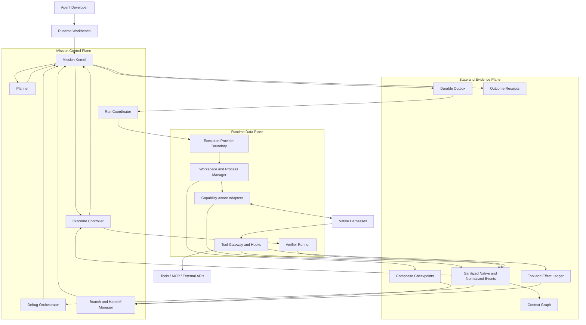

# MissionBraid

**English** | [简体中文](README.zh-CN.md)

**One Mission. Native Runtimes. Inspectable Agent behavior.**

MissionBraid is a local-first **Agent Runtime Workbench** for developers who
build and improve applications with native coding agents. It gives Codex,
Qoder, Claude Code, OpenCode, Hermes, and future Harnesses one durable Mission
and one development loop:

```text
compose → run → inspect → revise → re-run → evaluate → verify
                         ↘ checkpoint / fork / handoff when needed
```

The normal path keeps using the same Harness. Branching, Handoff, adaptive
routing, and CI export are supporting capabilities used when the task actually
needs them.

> **Status:** pre-alpha, local-first, and run from source. The repository
> already implements and locally validates a real Codex-to-Qoder-to-Claude Code
> Mission; a root Branch; Runtime
> Profile Definition, Catalog Observation, immutable Snapshot, and Attempt
> Binding; source-scoped Event IR with sanitized native artifacts; and durable
> command/outbox recovery. Iteration 2 is validated by a same-host real
> Workbench Mission across all three Harnesses, including a verified Receipt
> and stable restart restoration. Live Context Graph debugging, tool gates,
> executable forks, adaptive planning, and the other Iteration 3+ capabilities
> remain target architecture.


[Open the current verified timeline and Receipt](docs/assets/missionbraid-workbench-verified.png).

## The product in one view

|                   | MissionBraid                                                                                                                                                                                                                                                                                                        |
| ----------------- | ------------------------------------------------------------------------------------------------------------------------------------------------------------------------------------------------------------------------------------------------------------------------------------------------------------------- |
| User problem      | Changing a model, Prompt, Skill, tool, memory policy, permission, or Runtime can change Agent behavior, but source diffs and fragmented logs do not explain the effective Agent that actually ran.                                                                                                                  |
| Product           | One Workbench to bind the effective Agent Revision, run a durable Mission, inspect context and tools live, revise supported inputs, re-run from a useful boundary, compare behavior, and verify the outcome.                                                                                                        |
| Core abstraction  | A **Mission** owns intent, execution branches, evidence, effects, and completion. A Harness is a replaceable Runtime.                                                                                                                                                                                               |
| Implemented today | Bilingual local Workbench, Mission Kernel, Codex/Qoder/Claude Code execution adapters, root Branch, resolved Runtime Profiles and bindings, source-scoped Event IR with sanitized native artifacts, durable command/outbox recovery, workspace checkpoint evidence, Handoff Capsule, verifier, and Outcome Receipt. |
| Delivery plan     | **10 major product iterations in total. Iterations 1 and 2 are implemented and validated locally; Iterations 3–10 are planned.**                                                                                                                                                                                    |

## Why this exists

The hard part of Agent application development is not launching another
process. It is preserving and understanding the effective Agent and its real
execution:

- which effective model, instructions, Skills, MCP servers, permissions, and
  tools were active;
- which observable context the Harness exposed before it acted;
- which behavior changed after a Prompt, Skill, tool, memory, model, or Runtime
  revision;
- which tool call or context change caused a failure when one occurs;
- how to retry from a useful boundary without rerunning everything;
- how to continue in another Harness without manually reconstructing the task
  when a Runtime change is justified;
- which external effects already happened and must not be repeated;
- whether the Branch-bound result was actually achieved.

MissionBraid makes this state explicit and keeps it above any vendor session.

> **The Mission outlives every Runtime, session, and execution branch.**

## Target user story

An Agent developer changes a Prompt, Skill, MCP tool, model, context/memory
policy, permission, or orchestration rule in a repository. MissionBraid binds
the effective Agent Revision—not just a source commit or “Codex”/“Qoder”, but
the actual Harness, model, reasoning mode, instructions, Skills, MCP servers,
tools, permissions, policies, environment, and available resource signals—to a
Mission with an objective, constraints, and Outcome Contract.

The developer starts the Mission. The selected native Harness still performs
the work, while MissionBraid records a unified live trace of model turns,
context assembly, tool calls, workspace mutations, and lifecycle events.

The developer can inspect normal behavior without waiting for a failure. When a
Revision behaves unexpectedly, a criterion fails, or a breakpoint fires, they
can inspect the exact observable context and state before the next controlled
action. They can revise a Prompt, Skill, context item, tool result, memory
policy, model, or supported orchestration input; narrow authority; then resume
or create an isolated execution branch from a composite checkpoint.

The same Harness continues by default. MissionBraid uses a Handoff Capsule only
when another Runtime is required or deliberately selected. It compares Agent
Revisions and Branches, explains failure candidates without inventing hidden
reasoning, runs the verifier bound to the selected Branch's immutable Contract
revision, issues an Outcome Receipt, and can save the case as a regression
scenario for later local or CI execution.

## Product architecture



MissionBraid is designed as a modular local application, not a distributed
platform assembled prematurely. Mission Kernel events are the only authority
for control-state transitions. Native Harnesses, Git, and external systems
remain evidence sources for their own real state. Adapters preserve sanitized
native-format evidence and add normalized events without flattening away unique
capabilities.

Kandev may be used through a public provider boundary for mature workspace and
process execution. It is not forked, embedded as MissionBraid's state machine,
or required for direct local adapters.

Read the [final architecture](docs/architecture.md) and
[target product requirements](docs/product-requirements.md).

## Core design decisions

1. **Schedule a Runtime Profile, not a brand name.** Resolve Harness × model ×
   reasoning × instructions × Skills × MCP/tools × permissions × capabilities,
   then bind that snapshot to a Mission, workspace, authority, and budget.
2. **Preserve native fidelity before normalization.** Sanitized native-format
   evidence remains addressable; the common Event IR supports shared product
   behavior.
3. **Debug at real control boundaries.** Adapters declare whether they can
   observe, gate, interrupt, steer, resume, or reconstruct each boundary.
4. **A checkpoint is composite.** It binds Mission revision, event prefix,
   visible context, workspace state, Runtime binding, process/session locator,
   and Effect history.
5. **Replay never rewrites history.** Playback does not execute or branch.
   Cached replay, counterfactual resampling, and execution fork create child
   Branches whenever they produce new evidence.
6. **External effects survive time travel.** A branch must inherit, reconcile,
   compensate, or stop on effects that cannot be undone.
7. **Handoff transfers evidence, not hidden state.** MissionBraid does not claim
   to move KV cache, private chain-of-thought, or identical internal
   understanding.
8. **Models propose; deterministic code controls.** Models may propose
   structured soft requirements or features and explain a result. Once
   accepted, a versioned deterministic policy owns filter, rank, bind,
   authority, state, and final acceptance.
9. **Done is a Receipt, not an Agent claim.** Completion evaluates the exact
   immutable Contract revision bound to the selected Branch using
   controller-run evidence.
10. **Agent development is the product center.** Same-Harness iteration is the
    default. Fork, Handoff, routing, and CI export support development without
    turning MissionBraid into a switching or release-governance product.

The reasoning behind these choices is collected in
[Key Questions](docs/key-questions.md).

## What works today

The implemented foundation already provides:

- a local CLI and a bilingual Workbench with persisted English/Chinese
  selection;
- versioned Missions and immutable Outcome Contracts;
- append-only, hash-linked SQLite events with rebuildable projections;
- direct Codex, Qoder, and Claude Code process adapters;
- a default root Branch for every new Mission;
- separate Runtime Profile Definitions, timestamped Catalog Observations,
  immutable effective Snapshots, and Mission-specific Attempt Bindings;
- explicit Adapter capability declarations and honest unknown/unsupported
  Runtime fields;
- source-scoped normalized Runtime events linked to sanitized,
  content-addressed native-format artifacts;
- a durable command/outbox path whose accepted execution intent survives an
  application restart;
- fixed discovery entries for additional target Harnesses;
- pre-Attempt baselines and workspace checkpoint evidence (digest/delta, not a
  restorable snapshot);
- a budgeted, provenance-bound Handoff Capsule;
- explicit mutable workspace Effect identities;
- out-of-process verification and hash-bound Outcome Receipts;
- restart restoration and recovery of interrupted Missions.

The strongest current public evidence proves one same-host Workbench Mission
across Codex, Qoder, and Claude Code, with a verified Receipt and stable restart
restoration. It does not prove automatic routing, live tool gating, executable
Fork/Replay, cross-host reproduction, production isolation, or third-party
adoption.

## Runtime support today

| Runtime or provider | Discovery support           | Executes Attempts | Current evidence                             |
| ------------------- | --------------------------- | ----------------: | -------------------------------------------- |
| Codex               | Probe/catalog implemented   |               Yes | Same-host three-Harness Mission              |
| Qoder               | Probe/catalog implemented   |               Yes | Same-host three-Harness Mission              |
| Claude Code         | Probe/catalog implemented   |               Yes | Same-host three-Harness Mission              |
| OpenCode            | Probe/catalog implemented   |                No | Discovery support only                       |
| Hermes              | Probe/catalog implemented   |                No | Discovery support only                       |
| DeepSeek Harness    | Bootstrap/catalog signal    |                No | Discovery support only                       |
| Kandev v0.91.0      | Separate compatibility path |                No | Public task/worktree/process interfaces only |

## Ten product iterations

| Iteration | User-visible result                                                                           | Status              |
| --------: | --------------------------------------------------------------------------------------------- | ------------------- |
|         1 | A Mission survives interruption, crosses Codex → Qoder, and closes with a verified Receipt    | Implemented locally |
|         2 | Runtime Profiles and native events become observable through a unified Event IR               | Validated locally   |
|         3 | Developers inspect a live execution, context assembly, tool flow, and workspace changes       | Planned             |
|         4 | Tool calls can stop at supported pre/post boundaries and be changed before continuation       | Planned             |
|         5 | A retained boundary supports honest playback, replay, and executable comparison Branches      | Planned             |
|         6 | A reproducible planner selects Profiles and hands off only when a Runtime change is justified | Planned             |
|         7 | Failures are attributed to observable model/context/tool/Harness/environment evidence         | Planned             |
|         8 | Multi-Agent work becomes a durable Mission graph with revision-aware coordination             | Planned             |
|         9 | Agent Revision comparison, regression scenarios, evaluation, Receipts, and CI export          | Planned             |
|        10 | External developers install, extend, and reproduce the complete Runtime Workbench             | Planned             |

Each iteration ends in one real Workbench workflow, not an isolated schema,
adapter, or test suite. See the [detailed roadmap](docs/roadmap.md).

## Run the current Workbench

Requirements: Node.js 24–26, pnpm, Git, and at least one installed and
authenticated supported Runtime. The real cross-Harness path currently requires
both `codex` and `qodercli`.

MissionBraid is currently run from source; there is no npm package or tagged
release yet.

```sh
pnpm install --frozen-lockfile
pnpm build
node dist/src/cli.js runtimes list --json

MISSIONBRAID_DEMO_ROOT="$(mktemp -d)"
node scripts/prepare-e1-fixture.mjs "$MISSIONBRAID_DEMO_ROOT/workspace"
node dist/src/cli.js app --state-dir "$MISSIONBRAID_DEMO_ROOT/state" --port 4317
```

Open `http://127.0.0.1:4317`. Select locally available model and reasoning
settings, then enter:

The Workbench follows the browser language on first use. Use the `EN | 中文`
control beside the wordmark to switch; the choice is stored only in that
browser.

**Title**

```text
Complete the Effect Ledger across Codex and Qoder
```

**Objective**

```text
Complete the dependency-free JSONL Effect Ledger in this disposable repository. Read AGENTS.md, README.md, and every public test. Implement record, replay, same-payload idempotency, payload-conflict detection, deterministic serialization, incomplete-tail recovery, strict corruption handling, and the CLI. Do not edit tests or install dependencies. Leave node --test passing for the Mission's bound Outcome Contract.
```

- **Workspace:** the absolute path printed by the fixture preparer
- **Route:** Codex to Qoder
- **Verifier executable:** `node`
- **Verifier arguments:** one line containing `--test`

Submit once. The full interruption and lower-level reproduction procedures are
in [Reproducing Evidence](docs/reproducing-evidence.md).

## Evidence

The
[Iteration 2 machine-readable record](evidence/iteration-2-three-harness-local-2026-08-25.json)
binds a clean revision to:

- one Mission submitted through the normal local Workbench API with no
  user-authored Mission YAML or manual cross-Harness context transfer;
- successful real Codex, Qoder, and Claude Code Attempts on one root Branch;
- Profile Definitions, Catalog Observations, immutable Snapshots, and Attempt
  Bindings for the three Runtimes;
- 1,066 source-scoped Runtime events and 1,066 sanitized native artifacts;
- two cooperative Handoff acknowledgements whose native source events precede
  each target's first observed tool-request event; this is ordering evidence,
  not a live tool gate;
- a verified Receipt and stable Mission head, Receipt, source sequences, and
  causal links after Workbench restart.

The earlier
[Codex-to-Qoder record](evidence/unified-workbench-codex-qoder-local-2026-08-24.json)
retains a matching source-checkpoint/target-baseline workspace snapshot and
distinct before/after workspace digests; it is not used to claim an enforced
pre-mutation gate.

All current records are local and same-host. The [evidence
index](evidence/README.md) keeps demonstrated results separate from target
architecture. These records do not prove live tool gating, automatic routing,
executable Fork/Replay, cross-host reproduction, or production readiness.

## Documentation

- [Product requirements](docs/product-requirements.md)
- [Final architecture](docs/architecture.md)
- [Ten-iteration roadmap](docs/roadmap.md)
- [Project tour](docs/project-tour.md)
- [Key product decisions and technical questions](docs/key-questions.md)
- [Evidence and claim boundaries](evidence/README.md)
- [Controlled reproduction](docs/reproducing-evidence.md)
- [Contributing](CONTRIBUTING.md)

## License

MissionBraid is licensed under the [Apache License 2.0](LICENSE).
