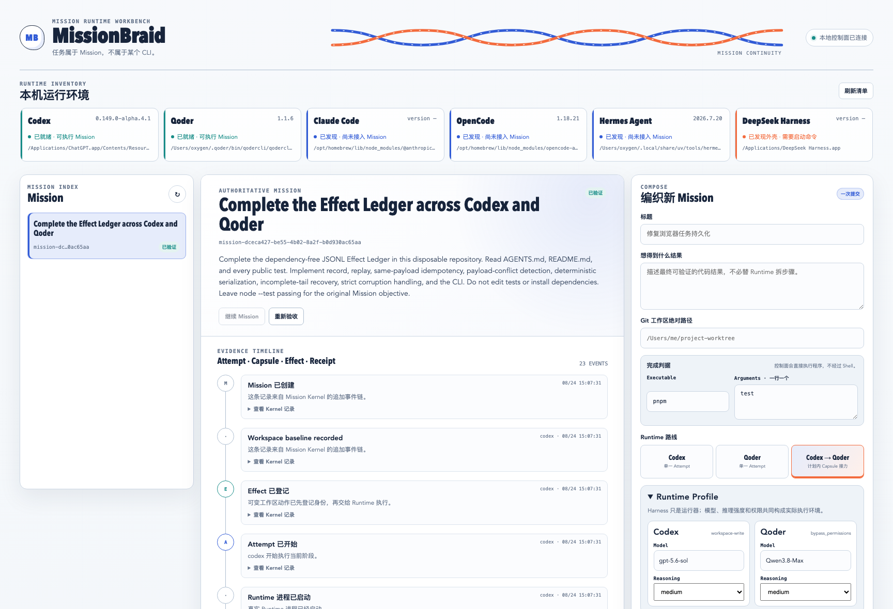
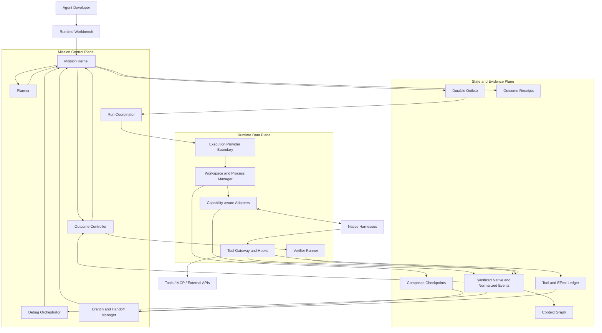

# MissionBraid

**English** | [简体中文](README.zh-CN.md)

**One Mission. Native Runtimes. Inspectable Agent behavior.**

MissionBraid is a local-first **Agent Runtime Workbench** for developers who
build and improve applications with native coding agents. Codex, Qoder, and
Claude Code run through direct Mission Adapters; OpenCode, Hermes, and DeepSeek
Harness remain catalog-only. The Workbench gives supported Runtimes one durable
Mission and one development loop:

```text
compose → run → inspect → revise → re-run → evaluate → verify
                         ↘ checkpoint / fork / handoff when needed
```

The normal path keeps using the same Harness. Branching, Handoff, adaptive
routing, and CI export are supporting capabilities used when the task actually
needs them.

> **Status:** pre-alpha, local-first, and run from source. All ten planned
> product iterations are present at the 1.0 source-candidate implementation
> layer. The current flagship record now connects the main Agent-development
> capabilities in one Mission and one controlled run: real Qoder/Qwen3.8-Max
> hands off to real Claude
> Code/deepseek-v4-pro; the developer controls a native pre-tool boundary;
> deterministic verification exposes stale Context; a queryable external Effect
> survives a controller crash without a second POST; a Composite Checkpoint and
> Context-only Execution Fork confirm the mechanism; the accepted incident runs
> three verified trials on a Planner-selected upgraded Claude Profile and a
> standalone checker accepts the retained result with exit 0 but blocks an
> unresolved required Effect with exit 1; then a live Mission Plan revises only
> affected Claude work, reuses verified Qoder work, consolidates, issues the
> latest-revision Receipt, and reconstructs the same identities after restart.
> The record is bound to a clean worktree at revision `5aac506`. Separate
> per-iteration records and the internal clean-install/package record remain
> available. Package-registry publication, independent third-party
> reproduction, cross-host evidence, production adoption, and general
> reliability evidence remain open.



[Open the current verified timeline and Receipt](docs/assets/missionbraid-workbench-verified.png).

## The product in one view

|                   | MissionBraid                                                                                                                                                                                                                                                                                                                                                                                                                                                                                                                                  |
| ----------------- | --------------------------------------------------------------------------------------------------------------------------------------------------------------------------------------------------------------------------------------------------------------------------------------------------------------------------------------------------------------------------------------------------------------------------------------------------------------------------------------------------------------------------------------------- |
| User problem      | Changing a model, Prompt, Skill, tool, memory policy, permission, or Runtime can change Agent behavior, but source diffs and fragmented logs do not explain the effective Agent that actually ran.                                                                                                                                                                                                                                                                                                                                            |
| Product           | One Workbench to bind the effective Agent Revision, run a durable Mission, inspect context and tools live, revise supported inputs, re-run from a useful boundary, compare behavior, and verify the outcome.                                                                                                                                                                                                                                                                                                                                  |
| Core abstraction  | A **Mission** owns intent, execution branches, evidence, effects, and completion. A Harness is a replaceable Runtime.                                                                                                                                                                                                                                                                                                                                                                                                                         |
| Implemented today | The 1.0 source candidate contains implementation surfaces for all ten planned iterations: the bilingual Workbench, Mission Kernel, direct and public external Adapters, Runtime Profiles, live Event IR/Context Graph, tool and Effect controls, Checkpoint/Replay/Fork, adaptive Handoff, stale-Context diagnosis, Mission Plan coordination, Outcome Studio, verifier, Receipts, and clean-install package/migration path.                                                                                                                  |
| Evidence boundary | One clean-revision, same-host controlled-fixture run now connects real Qoder/Qwen3.8-Max and Claude Code/deepseek-v4-pro, native tool control, crash-reconciled external Effect, diagnostic Fork, three real regression trials, fail-closed standalone CI, live Plan revision/reuse, consolidation, Receipt, and restart under one Mission identity. Per-iteration and package records remain separate. npm publication, independent third-party reproduction, cross-host evidence, production adoption, and general reliability remain open. |

## Why this exists

The hard part of Agent application development is not launching another
process. It is preserving and understanding the effective Agent and its real
execution:

- which effective model, instructions, Skills, MCP servers, permissions, and
  tools were active;
- which observable context the Harness exposed before it acted;
- which behavior changed after a Prompt, Skill, tool, memory, model, or Runtime
  revision;
- which tool call or context change caused a failure when one occurs;
- how to retry from a useful boundary without rerunning everything;
- how to continue in another Harness without manually reconstructing the task
  when a Runtime change is justified;
- which external effects already happened and must not be repeated;
- whether the Branch-bound result was actually achieved.

MissionBraid makes this state explicit and keeps it above any vendor session.

> **The Mission outlives every Runtime, session, and execution branch.**

## Target user story

An Agent developer changes a Prompt, Skill, MCP tool, model, context/memory
policy, permission, or orchestration rule in a repository. MissionBraid binds
the effective Agent Revision—not just a source commit or “Codex”/“Qoder”, but
the actual Harness, model, reasoning mode, instructions, Skills, MCP servers,
tools, permissions, policies, environment, and available resource signals—to a
Mission with an objective, constraints, and Outcome Contract.

The developer starts the Mission. The selected native Harness still performs
the work, while MissionBraid records a unified live trace of model turns,
context assembly, tool calls, workspace mutations, and lifecycle events.

The developer can inspect normal behavior without waiting for a failure. When a
Revision behaves unexpectedly, a criterion fails, or a breakpoint fires, they
can inspect the exact observable context and state before the next controlled
action. They can revise a Prompt, Skill, context item, tool result, memory
policy, model, or supported orchestration input; narrow authority; then resume
or create an isolated execution branch from a composite checkpoint.

The same Harness continues by default. MissionBraid uses a Handoff Capsule only
when another Runtime is required or deliberately selected. It compares Agent
Revisions and Branches, explains failure candidates without inventing hidden
reasoning, runs the verifier bound to the selected Branch's immutable Contract
revision, issues an Outcome Receipt, and can save the case as a regression
scenario for later local or CI execution.

### Current flagship workflow: one Mission from failure to retained outcome

The [unified flagship record](evidence/v1-flagship-local-2026-08-26.json)
captures one controlled run under Mission
`mission-0afa570c-a716-416f-8916-d5e48bdcf0f1`. A real
Qoder/Qwen3.8-Max Attempt reaches a declared Handoff failure; the deterministic
Planner applies a recorded manual target override and binds real Claude
Code/deepseek-v4-pro, and the Handoff Capsule is acknowledged before the
target's first tool boundary. The native Claude Hook
lets the developer modify a Write before dispatch. The Attempt completes its
other criteria, but the bound deterministic Verifier rejects the Receipt
because the Context is stale.

MissionBraid then coordinates one queryable external Effect. The target receives
exactly one POST; after the controller is killed, recovery queries the target by
idempotency key and records the confirmed Effect without dispatching a second
POST. The developer seals a Git-backed Composite Checkpoint, creates a
Context-only Execution Fork, and obtains a verified child Receipt. Failure
Intelligence promotes the stale-Context candidate from inferred to confirmed;
removing the diagnostic outcome lowers it back to inferred, while evidence that
cannot identify a layer remains unknown.

After the controlled fixture records a revised-Branch selection with declared
human authority, Outcome Studio saves the incident and the Planner rebinds it
from the source Claude Profile to a separately declared higher-reasoning Claude
Profile with the same native tool control. Three fresh Runtime trials each
produce a verified Receipt. A standalone CI checker exits 0 for the retained
result and exits 1 when a required Effect is unresolved. The same Mission then
runs a Plan with real Qoder and
Claude work in parallel. A live Contract revision fences only stale Claude
prompt work, reuses the verified Qoder Artifact without rerunning that node,
starts fresh Claude work, independently consolidates the immutable sources, and
issues a Receipt bound to the latest Contract and Plan revisions. Restart
reconstructs the same Mission head and durable identities and adds no Effect
call.

This is one same-host local run against a controlled fixture and a clean source
worktree at revision `5aac506`. The provider termination and failing tool probe
are deliberate observation boundaries. The selection authority is a
fixture-declared field; it does not establish live human interaction or identity
verification. The record does not establish provider-internal Context capture,
a natural-failure reliability rate, independent third-party or cross-host
reproduction, production use, npm publication, or general reliability.

## Product architecture



MissionBraid is designed as a modular local application, not a distributed
platform assembled prematurely. Mission Kernel events are the only authority
for control-state transitions. Native Harnesses, Git, and external systems
remain evidence sources for their own real state. Adapters preserve sanitized
native-format evidence and add normalized events without flattening away unique
capabilities.

Kandev may be used through a public provider boundary for mature workspace and
process execution. It is not forked, embedded as MissionBraid's state machine,
or required for direct local adapters.

Read the [final architecture](docs/architecture.md) and
[target product requirements](docs/product-requirements.md).

## Core design decisions

1. **Schedule a Runtime Profile, not a brand name.** Resolve Harness × model ×
   reasoning × instructions × Skills × MCP/tools × permissions × capabilities,
   then bind that snapshot to a Mission, workspace, authority, and budget.
2. **Preserve native fidelity before normalization.** Sanitized native-format
   evidence remains addressable; the common Event IR supports shared product
   behavior.
3. **Debug at real control boundaries.** Adapters declare whether they can
   observe, gate, interrupt, steer, resume, or reconstruct each boundary.
4. **A checkpoint is composite.** It binds Mission revision, event prefix,
   visible context, workspace state, Runtime binding, process/session locator,
   and Effect history.
5. **Replay never rewrites history.** Playback does not execute or branch.
   Cached replay, counterfactual resampling, and execution fork create child
   Branches whenever they produce new evidence.
6. **External effects survive time travel.** A branch must inherit, reconcile,
   compensate, or stop on effects that cannot be undone.
7. **Handoff transfers evidence, not hidden state.** MissionBraid does not claim
   to move KV cache, private chain-of-thought, or identical internal
   understanding.
8. **Models propose; deterministic code controls.** Models may propose
   structured soft requirements or features and explain a result. Once
   accepted, a versioned deterministic policy owns filter, rank, bind,
   authority, state, and final acceptance.
9. **Done is a Receipt, not an Agent claim.** Completion evaluates the exact
   immutable Contract revision bound to the selected Branch using
   controller-run evidence.
10. **Agent development is the product center.** Same-Harness iteration is the
    default. Fork, Handoff, routing, and CI export support development without
    turning MissionBraid into a switching or release-governance product.

The reasoning behind these choices is collected in
[Key Questions](docs/key-questions.md).

## What works today

The implemented foundation already provides:

- a local CLI and a bilingual Workbench with persisted English/Chinese
  selection;
- versioned Missions and immutable Outcome Contracts;
- append-only, hash-linked SQLite events with rebuildable projections;
- direct Codex, Qoder, and Claude Code process adapters;
- a default root Branch for every new Mission;
- separate Runtime Profile Definitions, timestamped Catalog Observations,
  immutable effective Snapshots, and Mission-specific Attempt Bindings;
- explicit Adapter capability declarations and honest unknown/unsupported
  Runtime fields;
- source-scoped normalized Runtime events linked to sanitized,
  content-addressed native-format artifacts;
- live event transport, Context Graph projections, adjacent context diffs, and
  source-linked model/tool/workspace/test evidence;
- a durable command/outbox path whose accepted execution intent survives an
  application restart;
- Runtime Hub inventory and Mission-form routes for registered external
  Adapters, using each manifest's real Harness identity;
- a real Claude Code native pre-tool gate for supported requests and guarded,
  queryable external Effect reconciliation;
- bounded Claude output compaction that preserves non-telemetry event semantics
  and order while sampling per-token `thinking_tokens` telemetry; process-finish
  accounting records total raw/retained/dropped line counts and a SHA-256 of the
  full raw stream, while dropped per-token payloads are not retained;
- Git-backed Composite Checkpoints whose workspace component references an
  exact restorable commit/tree, with other components explicitly classified;
- immutable parent/child Branch lineage and an Execution Fork that starts a
  fresh native process in an isolated Git worktree;
- a budgeted, provenance-bound Handoff Capsule;
- explicit mutable workspace Effect identities;
- out-of-process verification and hash-bound Outcome Receipts;
- playback, cached replay, counterfactual resampling, and real Execution Fork
  operations with distinct side-effect guarantees;
- deterministic Runtime Profile filtering/ranking with inspectable Handoff
  decisions and a Mission Plan/Contract revision graph;
- branch-scoped Failure Intelligence and diagnostic Fork entry points;
- Outcome Studio projections plus redacted scenario/CI-result save and export
  endpoints;
- an executable saved incident rerun on one Planner-selected upgraded
  Qoder/Qwen3.8-Max Profile, with three new Kernel-persisted trials passing 3/3
  and a standalone outside-repository process rejecting returned or unknown
  results with a nonzero exit;
- a versioned public Adapter SDK with direct, ACP, and provider-backed examples,
  plus an installed consumer Adapter that runs through the CLI, Workbench form,
  and same-Adapter isolated Execution Fork while preserving its Adapter,
  Profile, Attempt, Binding, and Receipt identity chain;
- an installed store migration from schema v1 to v2, plus a separate
  lockfile-bearing source-candidate bundle that passes frozen install,
  typecheck, build, and the full test suite without repository fallback;
- restart restoration and recovery of interrupted Missions.

Current public evidence is classified by the capability it exercises:

- **Unified flagship — one durable product story:** one same-host controlled
  Mission runs real Qoder/Qwen3.8-Max and Claude Code/deepseek-v4-pro through
  Handoff, native tool control, deterministic rejection, crash-reconciled
  Effect, Composite Checkpoint, Context-only diagnostic Fork, explicit Branch
  selection, three real upgraded-Claude regression trials, fail-closed
  standalone CI, live Plan revision, selective Artifact reuse, independent
  consolidation, latest-revision Receipt, and restart reconstruction. The clean
  source revision is `5aac506`.
- **I8 — living multi-Agent Mission:** the Workbench HTTP API runs real local
  Qoder/Qwen3.8-Max and Claude Code/deepseek-v4-pro on separate Plan nodes,
  accepts a prompt-only Contract revision, interrupts only stale prompt work,
  reuses the verified tool Artifact without rerunning Qoder, creates a new
  consolidation Attempt over immutable sources, issues a Receipt for the latest
  revisions, and reconstructs the same state after restart.
- **I9 — retained Agent regression:** one original false-success Qoder case is
  revised, then the saved incident is rerun with the accepted Context
  intervention on a distinct Planner-selected upgraded Qoder/Qwen3.8-Max
  Profile. Three new Runtime trials pass the predeclared 3/3 threshold, restart
  restores the result, and a checker running from outside the repository exits
  nonzero for returned or unknown regressions. This does not isolate the Profile
  as the cause of success.
- **I7 — daily Agent debugging:** real Qoder/Qwen3.8-Max first fails with stale
  cached Context, then a fresh Attempt under the same Runtime Profile passes
  after a Context-only diagnostic Fork in a controlled fixture.
- **I5 — retained-boundary execution:** a real Codex parent result becomes a
  browser-created Composite Checkpoint and an isolated real Codex Execution
  Fork, with separate Branch lineage, verification, no-repeat Effect evidence,
  a child Receipt, restart restoration, and separately recorded Replay
  semantics.
- **I6 — justified Runtime replacement:** deterministic Profile
  filtering/ranking selects and binds a replacement Runtime for a controlled
  Codex→Claude Handoff.

The unified record is one same-host local controlled run, while each iteration
record keeps its own boundary. Together they do not prove native session
fork/resume, portable refreshed Context state, natural Runtime failure recovery,
provider-internal state, general multi-layer diagnosis accuracy, cross-host or
distributed execution, production isolation, independent third-party
reproduction, npm publication, or general reliability.

## Runtime support today

| Runtime or provider | Discovery support           | Executes Attempts | Current evidence                                |
| ------------------- | --------------------------- | ----------------: | ----------------------------------------------- |
| Codex               | Probe/catalog implemented   |               Yes | Same-host three-Harness Mission                 |
| Qoder               | Probe/catalog implemented   |               Yes | Three-Harness, I7/I8, and unified flagship      |
| Claude Code         | Probe/catalog implemented   |               Yes | Three-Harness, I8, and unified flagship         |
| OpenCode            | Probe/catalog implemented   |                No | Discovery support only                          |
| Hermes              | Probe/catalog implemented   |                No | Discovery support only                          |
| DeepSeek Harness    | Bootstrap/catalog signal    |                No | Discovery support only                          |
| Kandev v0.91.0      | Separate compatibility path |                No | Public task/worktree/process interfaces only    |
| Public Adapter      | Startup-loaded manifest     |               Yes | Internal clean-install CLI, Workbench, and Fork |

## Ten product iterations

| Iteration | User-visible result                                                                           | Status                                                |
| --------: | --------------------------------------------------------------------------------------------- | ----------------------------------------------------- |
|         1 | A Mission survives interruption, crosses Codex → Qoder, and closes with a verified Receipt    | Implemented locally                                   |
|         2 | Runtime Profiles and native events become observable through a unified Event IR               | Validated locally                                     |
|         3 | Developers inspect a live execution, context assembly, tool flow, and workspace changes       | Validated locally                                     |
|         4 | A supported tool call can stop before dispatch and be changed before continuation             | Validated locally                                     |
|         5 | A retained boundary creates an isolated executable comparison Branch                          | Completed locally                                     |
|         6 | A reproducible planner selects Profiles and hands off only when a Runtime change is justified | Validated locally (controlled interruption)           |
|         7 | One stale-Context failure is diagnosed from observable Context/workspace evidence             | Real Qoder controlled proof; broader attribution open |
|         8 | Multi-Agent work becomes a durable Mission graph with revision-aware coordination             | Same-host real-Runtime controlled proof               |
|         9 | Agent Revision comparison, regression scenarios, evaluation, Receipts, and CI export          | 3/3 after Context intervention; distinct Profile      |
|        10 | External developers install, extend, and reproduce the complete Runtime Workbench             | Internal clean-install and source bundle validated    |

The 1.0 source candidate contains implementation surfaces for all ten planned
iterations. One clean-revision, same-host controlled flagship now connects the
major product surfaces under a single Mission identity, while the iteration
records deliberately retain their own evidence levels. I8 has a bounded
same-host real-Runtime workflow; I9 has a separate same-host real-Qoder
regression and an outside-repository checker; I10 has an internal clean-install
Workbench, migration, and lockfile-bearing source-bundle reproduction record.
See the [detailed roadmap](docs/roadmap.md) and
[evidence boundaries](evidence/README.md).

## Run the current Workbench

Requirements: Node.js 24–26, pnpm, Git, and either an authenticated built-in
Runtime or a startup-loaded external Adapter. The documented native
Codex→Qoder path requires both `codex` and `qodercli`.

MissionBraid can be built as a locally installable npm tarball, but it has not
been published to a package registry or tagged as a release. The public v1
Adapter surface and clean-install check are documented in the
[1.0 source-candidate release and reproduction guide](docs/source-candidate-1.0.md)
and [Adapter SDK guide](docs/adapter-sdk.md).

```sh
pnpm install --frozen-lockfile
pnpm build
pnpm test:package
node dist/src/cli.js runtimes list --json

MISSIONBRAID_DEMO_ROOT="$(mktemp -d)"
node scripts/prepare-e1-fixture.mjs "$MISSIONBRAID_DEMO_ROOT/workspace"
node dist/src/cli.js app --state-dir "$MISSIONBRAID_DEMO_ROOT/state" --port 4317
```

Open `http://127.0.0.1:4317`. Select locally available model and reasoning
settings, then enter:

The Workbench follows the browser language on first use. Use the `EN | 中文`
control beside the wordmark to switch; the choice is stored only in that
browser.

**Title**

```text
Complete the Effect Ledger across Codex and Qoder
```

**Objective**

```text
Complete the dependency-free JSONL Effect Ledger in this disposable repository. Read AGENTS.md, README.md, and every public test. Implement record, replay, same-payload idempotency, payload-conflict detection, deterministic serialization, incomplete-tail recovery, strict corruption handling, and the CLI. Do not edit tests or install dependencies. Leave node --test passing for the Mission's bound Outcome Contract.
```

- **Workspace:** the absolute path printed by the fixture preparer
- **Route:** Codex to Qoder
- **Verifier executable:** `node`
- **Verifier arguments:** one line containing `--test`

Submit once. The full interruption and lower-level reproduction procedures are
in [Reproducing Evidence](docs/reproducing-evidence.md).

## Evidence

The [unified flagship record](evidence/v1-flagship-local-2026-08-26.json)
binds one Mission, one clean source worktree at revision `5aac506`, and one
same-host controlled-fixture run to:

- a failed real Qoder/Qwen3.8-Max source Attempt, a recorded manual target
  override applied by the deterministic Planner to bind real Claude
  Code/deepseek-v4-pro, and Handoff acknowledgement before the target tool
  boundary;
- a native Claude pre-tool Write modification followed by deterministic
  rejection on the isolated stale-Context criterion;
- exactly one POST to a queryable external Effect target, controller
  termination, and lookup-based recovery without a second POST;
- a Git-backed Composite Checkpoint, Context-only Execution Fork, verified child
  Receipt, confirmed stale-Context mechanism, evidence ablation back to
  inferred, and an honest unknown candidate;
- a revised-Branch selection recorded with declared human authority in the
  controlled fixture, three verified real Runtime trials on a distinct
  Planner-selected higher-reasoning Claude Profile, and a standalone checker
  that exits 0 for the retained result and 1 for a blocked unresolved required
  Effect;
- a live Plan with parallel Qoder and Claude work, a Contract revision that
  fences only affected Claude work, verified Qoder Artifact reuse without a
  rerun, fresh Claude work, independent consolidation, a latest-revision
  Receipt, and restart-stable identities with no added Effect call.

This is one local same-host proof against a controlled fixture. The induced
provider termination and failing tool probe establish observable boundaries,
not a natural-failure reliability rate. The record is not independent
third-party or cross-host reproduction, production adoption, npm publication,
provider-internal Context capture, or evidence of general reliability.

The [Iteration 8 multi-Agent revision record](evidence/iteration-8-multi-agent-revision-local-2026-08-26.json)
binds one controlled Git fixture and same-host Workbench flow to:

- Workbench HTTP creation, Plan start, live Contract revision, status queries,
  and verified completion;
- one real local Qoder/Qwen3.8-Max tool Attempt and one real local Claude
  Code/deepseek-v4-pro prompt Attempt on distinct isolated Plan nodes;
- a prompt-only revision that aborts and fences the stale Claude Attempt while
  preserving and explicitly reusing Qoder's verifier-backed tool Artifact
  without rerunning that node;
- a fresh revised Claude Attempt and a separate consolidation Attempt whose
  source Branch commits remain unchanged;
- deterministic verification, a Receipt bound to the latest Contract and Plan
  revisions, and stable Mission head, Receipt, Plan execution, and event chain
  after Workbench restart.

This is one same-host controlled-fixture result. It does not establish natural
failure handling, provider-internal state capture, distributed or cross-host
execution, independent external reproduction, production reliability, or
adoption.

The [Iteration 7 stale-Context record](evidence/iteration-7-stale-context-2026-08-26.json)
binds one controlled, same-host debugging flow to:

- an initial real Qoder Attempt using Qwen3.8-Max and the cached old Context,
  whose result the Mission-bound deterministic Verifier rejects;
- observable cached/current Context digests and a stale-Context candidate;
- an isolated child Branch whose Intervention declares Context refresh as the
  product variable while retaining the same Contract, Runtime Profile, and
  authority;
- a fresh Qoder process and Attempt under the same Runtime Profile, whose
  refreshed-Context result passes the Verifier and receives a verified Receipt;
- a saved regression scenario and stable restored identities after Workbench
  restart.

The child is a new Attempt and process, not a continuation or resume of the
original Qoder Session. Refreshed Context is assembled for this diagnostic
Attempt only; the record does not prove a portable persistent cache. It proves
one stale-Context mechanism in a controlled fixture, not provider-internal
Context capture, general model/tool/Harness/environment attribution, diagnosis
accuracy or recall, cross-host continuity, or production recovery.

The
[Iteration 5 machine-readable record](evidence/iteration-5-execution-fork-local-2026-08-26.json)
binds one same-host product flow to:

- a real Codex parent Mission whose one-file result passed the bound
  deterministic verifier;
- a parent Git commit created by the local proof controller only after it
  inspected that Codex-produced delta, because the Codex workspace sandbox did
  not write Git metadata;
- a browser-created Git-backed Composite Checkpoint and one declared guidance
  Intervention;
- a fresh real Codex process running only in Branch B's isolated Git worktree,
  while Branch A remained unchanged;
- runtime, model, tool, workspace, and verification evidence, followed by a
  child-Branch Receipt;
- one confirmed queryable external Effect inherited as `inherit-no-repeat`,
  with no second target call during Fork or restart;
- the same Branches, Checkpoint, Fork, Effect state, and Receipt after a new
  Workbench process restored the Mission.

This is an **Execution Fork from an explicit Git-backed boundary**, not a
native Codex session fork or resume. It is same-host evidence, not cross-host,
independent reproduction, production evidence, or proof that Codex authored
the parent Git commit.

The [Iteration 5 replay record](evidence/iteration-5-checkpoint-replay-local-2026-08-26.json)
also retains playback, cached replay, and counterfactual resampling. Playback
does not write a Branch; cached replay creates evidence from persisted future
Artifacts without launching a Runtime; counterfactual resampling launches a
real model-only Claude process with tools disabled and leaves the outcome
unknown. None of these operations claims native session migration or an
undoable external side effect.

The [Iteration 6 adaptive record](evidence/iteration-6-adaptive-handoff-local-2026-08-26.json)
shows deterministic candidate filtering/ranking, Capsule acknowledgement, and
Codex→Claude continuation after a controlled provider interruption without a
user copying context. It is not evidence of a natural Runtime failure,
restorable target workspace, native session migration, cross-host continuity,
or production reliability.

The [Iteration 9 Outcome regression record](evidence/iteration-9-outcome-regression-local-2026-08-26.json)
retains one original false-success and revised verified Branch under the same
Contract and deterministic Suite. It reruns the saved incident with the accepted
Context intervention through three new Kernel-persisted Qoder/Qwen3.8-Max
Attempts on one distinct Planner-selected upgraded Profile; all three pass the
predeclared 3/3 threshold.
A checker copied outside the repository accepts the retained result and exits
nonzero for both returned and unknown regressions. This is same-host controlled
evidence, not cross-host, production, deployment approval, or publication
authority, and it does not isolate the Profile as the cause of success.

The [Iteration 10 package smoke record](https://github.com/Oxygen56/missionbraid/blob/main/evidence/iteration-10-package-smoke-local-2026-08-26.json)
shows a locally packed tarball installing into a clean consumer; an external
Adapter preserving its identity through installed CLI and Workbench Missions
and a same-Adapter isolated Fork; a v1-to-v2 store migration preserving the
Mission event chain; and a separate source-candidate bundle containing the
lockfile whose frozen install, typecheck, build, and full tests pass without a
repository fallback. Registry publication and independent external
reproduction were not performed.

The
[Iteration 2 machine-readable record](evidence/iteration-2-three-harness-local-2026-08-25.json)
binds a clean revision to:

- one Mission submitted through the normal local Workbench API with no
  user-authored Mission YAML or manual cross-Harness context transfer;
- successful real Codex, Qoder, and Claude Code Attempts on one root Branch;
- Profile Definitions, Catalog Observations, immutable Snapshots, and Attempt
  Bindings for the three Runtimes;
- 1,066 source-scoped Runtime events and 1,066 sanitized native artifacts;
- two cooperative Handoff acknowledgements whose native source events precede
  each target's first observed tool-request event; this is ordering evidence,
  not a live tool gate;
- a verified Receipt and stable Mission head, Receipt, source sequences, and
  causal links after Workbench restart.

The earlier
[Codex-to-Qoder record](evidence/unified-workbench-codex-qoder-local-2026-08-24.json)
retains a matching source-checkpoint/target-baseline workspace snapshot and
distinct before/after workspace digests; it is not used to claim an enforced
pre-mutation gate.

All current records are local and same-host unless explicitly labelled
otherwise. The [evidence index](evidence/README.md) keeps the unified flagship,
per-iteration validation, clean-install validation, and stronger target claims
separate. The package smoke record proves a local tarball install, not registry
publication or independent external reproduction.

## Documentation

- [1.0 source-candidate release and reproduction guide](docs/source-candidate-1.0.md)
- [Product requirements](docs/product-requirements.md)
- [Final architecture](docs/architecture.md)
- [Ten-iteration roadmap](docs/roadmap.md)
- [Project tour](docs/project-tour.md)
- [Key product decisions and technical questions](docs/key-questions.md)
- [Evidence and claim boundaries](evidence/README.md)
- [Controlled reproduction](docs/reproducing-evidence.md)
- [Contributing](CONTRIBUTING.md)

## License

MissionBraid is licensed under the [Apache License 2.0](LICENSE).
