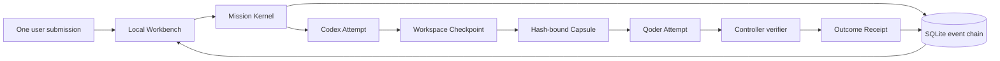

# MissionBraid

**One mission. Many runtimes. Verifiable outcomes.**

MissionBraid keeps a coding task alive when work moves between agent tools. The
user defines the objective and verifier once; MissionBraid preserves durable
workspace evidence across Runtime Attempts and closes the task only when the
original outcome is independently verified.

> **Status:** pre-alpha, local-first, source-only. Codex and Qoder are the two
> execution adapters today. A clean public-clone run proved the complete
> Workbench path; automatic routing, broad Harness support, and production
> readiness are not claimed.


[Open the complete verified timeline and Receipt](docs/assets/missionbraid-workbench-verified.png).

## At a glance

|                  | Current answer                                                                                                                                                                                                                         |
| ---------------- | -------------------------------------------------------------------------------------------------------------------------------------------------------------------------------------------------------------------------------------- |
| User problem     | Switching agent tools during a long task requires manual context transfer, side-effect reconstruction, and a separate judgement of whether the work is actually done.                                                                  |
| Core abstraction | A durable **Mission** owns the objective, Attempt chain, handoff evidence, Effect state, and verified outcome; a Harness is an execution resource.                                                                                     |
| Product today    | A local Workbench discovers the target Runtime catalog, lets the user choose Codex/Qoder profiles, runs ordered Attempts, and projects the authoritative timeline and Receipt.                                                         |
| Strongest proof  | One web-form Mission crossed real Codex and Qoder Attempts; both changed the same disposable workspace, Qoder acknowledged the Capsule before mutation, 12 target tests passed, and the 26-event verified result survived app restart. |
| Not yet          | Automatic profile selection, quota-aware routing, general failure replanning, third-party adapters, multi-host operation, or a packaged release.                                                                                       |

## Why MissionBraid

A long coding task should not belong to one model, one CLI, or one session.
When a runtime exits, becomes unavailable, or stops fitting the task, users
should not have to reconstruct the objective, move context by hand, guess which
external actions already happened, and decide whether the work is actually
done.

MissionBraid is being built around one principle:

> **The mission outlives the runtime.**

The user submits a Mission with an Outcome Contract. A runtime executes one
Attempt. If execution must move, MissionBraid is designed to preserve the
mission's authoritative state, reconcile mutable effects, project a bounded
handoff capsule into the next runtime, and verify the original contract before
issuing an outcome receipt.

```text
Outcome Contract
  → Runtime Profile
  → recorded route decision
  → bounded evidence handoff
  → effect reconciliation
  → verified Outcome Receipt
```

## What makes it different

MissionBraid is not intended to reimplement coding-agent CLIs or become another
agent launcher. Existing projects already provide strong runtime, workspace,
session, and workflow capabilities. MissionBraid focuses on the state that must
remain valid **across** those boundaries:

- the Mission and its acceptance contract;
- the chain of runtime-specific Attempts;
- evidence-backed handoff between Attempts;
- explicit control levels and evidence for repeated mutable actions;
- a recorded route today and an explicit deterministic-planning contract for
  future automation;
- layered failure evidence without upgrading hypotheses to certainty;
- completion verified independently from an agent's own report.

This remains useful even when another product already launches many agents:
MissionBraid does not compete on the launch surface. It owns the cross-runtime
contract, continuity evidence, and completion decision that must remain stable
when the executor changes.

## How the implemented path works



The route is user-selected in the current version. The diagram describes the
real Codex-to-Qoder path, not the future deterministic planner.

## Runtime support

| Runtime or provider | Local discovery                | Executes Mission Attempts | Real public-revision evidence                       |
| ------------------- | ------------------------------ | ------------------------- | --------------------------------------------------- |
| Codex               | Probe implemented              | Yes                       | Single-runtime recovery and Codex-to-Qoder          |
| Qoder               | Probe implemented              | Yes                       | Qoder continuation after Capsule acknowledgement    |
| Claude Code         | Probe implemented              | No                        | Discovery only                                      |
| OpenCode            | Probe implemented              | No                        | Discovery only                                      |
| Hermes              | Probe implemented              | No                        | Discovery only                                      |
| DeepSeek Harness    | Wrapper/bootstrap signal       | No                        | Discovery only                                      |
| Kandev v0.91.0      | Separate compatibility command | No                        | Public task/worktree/custom-process interfaces only |

## Design principles

1. **Mission owns truth.** A runtime is an execution resource, not the owner of
   task state.
2. **Continuity transfers evidence, not chat.** Hidden model state is neither
   portable nor claimed to be portable.
3. **Done is a receipt, not a claim.** Model output alone cannot complete a
   Mission.
4. **Guarantees are explicit.** Enforced, guarded, and advisory controls are
   reported separately.
5. **Unknown is a valid result.** Missing evidence is not converted into false
   certainty.

## Project documents

- [Project tour for first-time readers](docs/project-tour.md)
- [Product architecture](docs/architecture.md)
- [Implementation and evidence roadmap](docs/roadmap.md)
- [Evidence index and claim boundaries](evidence/README.md)
- [Controlled reproduction procedures](docs/reproducing-evidence.md)
- [Key product and technical questions](docs/key-questions.md)
- [Contributing](CONTRIBUTING.md)

## Implemented vertical path

The current local CLI implements the narrow path needed to test the product
contract:

- versioned, Kernel-resident Mission snapshots and immutable Outcome Contracts;
- an append-only SQLite event chain with workspace leases and fencing;
- direct Codex and Qoder process adapters with persisted PIDs;
- persisted pre-Attempt baselines, crash-recovered checkpoints, and complete
  stage provenance;
- budgeted Canonical Capsule projection and structured acknowledgement checks;
- advisory workspace Effect identities;
- out-of-process command verification and hash-bound Outcome Receipts;
- a local Workbench that discovers the target Runtime catalog, creates a
  Mission without user-authored YAML, runs it in the background, and projects
  its authoritative timeline and Receipt;
- `app`, `runtimes list`, `create`, `run`, `resume`, `status`, `list`, and
  `verify` commands.

This is a local vertical slice, not a broad runtime compatibility claim.

## Five-minute Workbench path

Requirements: Node.js 24–26, pnpm, Git, and at least one installed and
authenticated supported Runtime. The real cross-Harness path currently requires
both `codex` and `qodercli`.

MissionBraid is currently run from source; there is no npm package or tagged
release yet.

```sh
pnpm install --frozen-lockfile
pnpm build
node dist/src/cli.js runtimes list --json

MISSIONBRAID_DEMO_ROOT="$(mktemp -d)"
node scripts/prepare-e1-fixture.mjs "$MISSIONBRAID_DEMO_ROOT/workspace"
node dist/src/cli.js app --state-dir "$MISSIONBRAID_DEMO_ROOT/state" --port 4317
```

Open `http://127.0.0.1:4317`. The Workbench shows Codex, Qoder, Claude Code,
OpenCode, Hermes, and DeepSeek Harness with their observed local status. Only a
Runtime marked **ready and supported** can be selected for execution. Choose a
Codex, Qoder, or Codex-to-Qoder route, set the model and reasoning profile,
then use these values for the prepared fixture:

**Title**

```text
Complete the Effect Ledger across Codex and Qoder
```

**Objective**

```text
Complete the dependency-free JSONL Effect Ledger in this disposable repository. Read AGENTS.md, README.md, and every public test. Implement record, replay, same-payload idempotency, payload-conflict detection, deterministic serialization, incomplete-tail recovery, strict corruption handling, and the CLI. Do not edit tests or install dependencies. Leave node --test passing for the original Mission objective.
```

- **Workspace:** the absolute path printed by the fixture preparer
- **Route:** Codex to Qoder
- **Verifier executable:** `node`
- **Verifier arguments:** one line containing `--test`

Submit once after selecting locally available model and reasoning profiles.

The Workbench persists the Mission before starting a Runtime. A restart restores
the Mission, Attempt timeline, Capsule evidence, and Receipt. If it finds a
persisted `running` or `verifying` Mission without a live in-process operation,
it marks the Mission interrupted and offers the existing recovery path.

## Reproduce the deeper paths

The Workbench path above is the product entry. The separate
[reproduction guide](docs/reproducing-evidence.md) contains an E0 Runtime-process
interruption procedure, the interruption-bound E1 Codex-to-Qoder procedure, and
the isolated Kandev v0.91.0 public-interface check. These paths intentionally use
disposable workspaces and keep controller state outside the target repo.

## Flagship evidence

The [unified Workbench evidence](evidence/unified-workbench-codex-qoder-local-2026-08-24.json)
is the fastest way to inspect the strongest current claim. It binds a clean
public clone of `c55dd54` to one real web-form Mission, two successful Runtime
Attempts with distinct workspace changes, acknowledgement before target
mutation, a passing verifier, a Receipt with no unresolved item, and restoration
of the same result in a new app process.

The complete [evidence index](evidence/README.md) separates the flagship result,
interruption-recovery runs, reproductions, provider compatibility checks, and a
retained failed run. All current records are local and same-host. They do not
establish third-party reproduction, hostile-runtime isolation, production
deployment, or broad Runtime compatibility.

## Current scope

The evidence scope is deliberately narrow:

- **E0 gate:** one real Mission survives a runtime or controller interruption,
  resumes without task restatement, and closes with a verified Receipt;
- **E1 gate:** the same real Mission crosses two runtime profiles without manual
  context transfer and closes with a verified Receipt.

E0 and E1 are locally satisfied for the controlled runs bound to commits
`9d5b4d3` and `b16bd0b`. A same-host, task-context-isolated fresh-clone run
bound to `f73bc24` reproduced E1. The product-shaped Workbench path is bound to
public commit `c55dd54`; third-party or cross-host reproduction remains open.

This repository should still be read as a pre-alpha local vertical slice. The
verified Codex-to-Qoder fixture is evidence for that exact path, not a production
system or a claim about arbitrary projects and runtimes.

## License

MissionBraid is licensed under the [Apache License 2.0](LICENSE).
