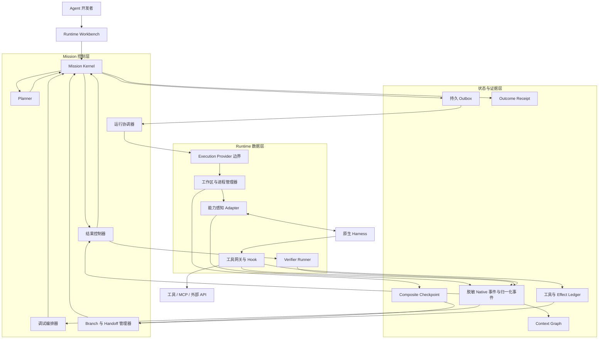

# MissionBraid

[English](README.md) | **简体中文**

**一条 Mission。原生 Runtime。可解释的 Agent 行为。**

MissionBraid 是一个面向原生 Coding Agent 应用开发者的本地优先 **Agent Runtime
Workbench（运行时工作台）**。Codex、Qoder 和 Claude Code 通过直接 Mission Adapter
执行；OpenCode、Hermes 和 DeepSeek Harness 目前只进入清单。Workbench 让受支持的
Runtime 共享一条持久 Mission 与一套开发闭环：

```text
组合 → 运行 → 检查 → 修改 → 重跑 → 评测 → 验收
                         ↘ 需要时使用 Checkpoint / Fork / Handoff
```

正常路径会继续使用同一个 Harness。只有任务确实需要时，才使用 Branch、Handoff、
自适应路由或 CI 导出。

> **状态：** pre-alpha、本地优先、从源码运行。规划的十次产品迭代已全部进入
> 1.0 source-candidate 实现层。当前的统一旗舰记录已将其中主要 Agent 开发能力串在同一条 Mission
> 与同一次受控运行中：真实 Qoder/Qwen3.8-Max Handoff 给真实 Claude
> Code/deepseek-v4-pro；开发者控制原生工具调用前边界；确定性验证器暴露 stale
> Context；一个可查询的外部 Effect 在控制器崩溃后没有重复 POST；Composite Checkpoint
> 和仅刷新 Context 的 Execution Fork 确认了该机制；保存后的 Incident 在 Planner 选择的
> 升级 Claude Profile 上完成三次已验证 trial，独立运行的检查器对保留结果以状态 0
> 通过、对存在未解决必需 Effect 的结果以状态 1 阻断；随后 Mission Plan 只重做受影响的
> Claude 工作、复用已验证的 Qoder 工作、整合并签发最新修订 Receipt，重启后身份不变。
> 该记录绑定于修订 `5aac506` 的干净工作树。分迭代记录和内部 clean-install/package 记录
> 仍保留。npm 发布、独立第三方复现、跨主机证据、生产采用与普遍可靠性仍未建立。


[查看当前已验证的时间线和 Receipt](docs/assets/missionbraid-workbench-verified.png)。

## 一张表了解产品

|              | MissionBraid                                                                                                                                                                                                                                                                                                                                            |
| ------------ | ------------------------------------------------------------------------------------------------------------------------------------------------------------------------------------------------------------------------------------------------------------------------------------------------------------------------------------------------------- |
| 用户问题     | 修改模型、Prompt、Skill、工具、Memory 策略、权限或 Runtime 都可能改变 Agent 行为，但源码差异和零散日志无法说明真正运行的有效 Agent。                                                                                                                                                                                                                    |
| 产品         | 用一个 Workbench 绑定有效 Agent Revision、运行持久 Mission、实时检查上下文和工具、修改受支持的输入、从有价值的边界重跑、对比行为并验收结果。                                                                                                                                                                                                            |
| 核心抽象     | **Mission** 持有目标、执行 Branch、证据、Effect 和完成状态；Harness 只是可替换的 Runtime。                                                                                                                                                                                                                                                              |
| 当前已经实现 | 规划的十次迭代已全部进入 1.0 source candidate：双语 Workbench、Mission Kernel、直接与公开外部 Adapter、Runtime Profile、实时 Event IR/Context Graph、工具与 Effect 控制、Checkpoint/Replay/Fork、自适应 Handoff、stale Context 诊断、Mission Plan、Outcome Studio、Verifier、Receipt，以及 clean-install package/迁移路径。                             |
| 证据边界     | 一次干净修订、同机受控 Fixture 运行已在同一 Mission 中连接真实 Qoder/Qwen3.8-Max 与 Claude Code/deepseek-v4-pro、原生工具控制、崩溃后对账外部 Effect、诊断 Fork、三次真实回归、失败关闭的独立 CI 检查、在线 Plan 修订/复用、整合、Receipt 和重启。分迭代与 package 记录仍独立保留。npm 发布、独立第三方复现、跨主机证据、生产采用与普遍可靠性仍未建立。 |

## 为什么要做 MissionBraid

开发 Agent 应用时，真正困难的并不是再启动一个进程，而是保存并理解真正生效的 Agent 与执行过程：

- 当时实际生效的是哪个模型、指令、Skill、MCP Server、权限和工具；
- Harness 在行动前暴露了哪些可观察上下文；
- 修改 Prompt、Skill、工具、Memory、模型或 Runtime 后，哪些行为发生了变化；
- 出现故障时，是哪一次工具调用或上下文变化造成的；
- 如何从有价值的边界重试，而不是从头重复全部工作；
- 确实需要更换 Runtime 时，如何切换 Harness 继续而不必手工重建任务；
- 哪些外部 Effect 已经发生，不能再次执行；
- 与当前 Branch 绑定的结果是否真的实现。

MissionBraid 将这些状态显式化，并把它们保存在任何厂商 Session 之上。

> **Mission 的生命周期长于任何 Runtime、Session 和执行 Branch。**

## 目标用户故事

Agent 开发者在代码仓库中修改 Prompt、Skill、MCP 工具、模型、Context/Memory
策略、权限或编排规则。MissionBraid 把真正生效的 Agent Revision 绑定到一条包含目标、
约束和 Outcome Contract（结果契约）的 Mission：它不只是源码提交或“Codex”“Qoder”，
而是实际的 Harness、模型、推理模式、指令、Skill、MCP Server、工具、权限、策略、环境和
可用资源信号。

开发者启动 Mission。选中的原生 Harness 仍然负责实际工作，MissionBraid 同时记录一条
统一的实时时间线：模型轮次、上下文组装、工具调用、工作区变更和生命周期事件。

开发者不必等到故障发生才观察行为。当 Revision 表现异常、验收条件失败或断点触发时，
可以在下一个受控动作之前检查准确的可观察上下文和状态，修改 Prompt、Skill、上下文项、
工具结果、Memory 策略、模型或受支持的编排输入，收窄权限，然后继续运行，或者从
Composite Checkpoint（复合检查点）创建一条隔离的执行 Branch。

默认仍由原 Harness 继续。只有另一个 Runtime 确实必要或被主动选择时，MissionBraid 才
编译 Handoff Capsule。它对比 Agent Revision 和 Branch，在不虚构隐藏推理过程的前提下
解释故障候选，运行与所选 Branch 的不可变 Contract 修订绑定的 Verifier，签发 Outcome
Receipt，并可将场景保存为以后在本地或 CI 中重跑的回归用例。

### 当前旗舰流程：一条 Mission 从失败到可保留结果

[统一旗舰记录](evidence/v1-flagship-local-2026-08-26.json)保留了 Mission
`mission-0afa570c-a716-416f-8916-d5e48bdcf0f1` 的一次受控运行。真实
Qoder/Qwen3.8-Max Attempt 到达声明的 Handoff 失败边界；确定性 Planner 应用一条已记录的
人工目标 override 并绑定真实 Claude Code/deepseek-v4-pro，Handoff Capsule 在目标首个工具
边界前完成确认。Claude
的原生 Hook 允许开发者在派发前修改 Write。Attempt 的其他条件通过，但因 Context
过期，绑定的确定性 Verifier 拒绝 Receipt。

MissionBraid 随后协调一个可查询的外部 Effect。目标只收到一次 POST；控制器被终止后，
恢复流程按幂等键查询目标，记录已确认 Effect，没有再派发一次 POST。开发者封存 Git
支撑的 Composite Checkpoint，创建仅刷新 Context 的 Execution Fork，并获得已验证的子
Branch Receipt。Failure Intelligence 将 stale Context 候选从 inferred 提升为 confirmed；移除
诊断结果后，确信度回落为 inferred，无法归层的证据仍保持 unknown。

受控 Fixture 记录了一次声明为 human authority 的修订 Branch 选择后，Outcome Studio 保存
Incident，Planner 将它从源 Claude Profile 重绑定到一个单独声明的更高推理强度 Claude
Profile，并保持相同的原生工具控制能力。三个全新 Runtime trial 分别获得已验证 Receipt。
独立运行的 CI 检查器对保留结果退出 0，对存在未解决必需 Effect 的结果退出 1。同一条 Mission
随后由真实 Qoder 与 Claude 并行执行
Plan。在线 Contract 修订只隔离过期的 Claude Prompt 工作，不重跑 Qoder 节点而复用其已验证
Artifact，再启动新 Claude 工作，独立整合不可变来源，并签发绑定最新 Contract 与 Plan
修订的 Receipt。重启后恢复出相同 Mission Head 与持久身份，也没有增加 Effect 调用。

这是修订 `5aac506` 的干净源码工作树上、针对受控 Fixture 的一次同机本地运行。Provider
终止与失败工具探针是主动设置的观测边界。选择权限只是 Fixture 中声明的字段，不证明本次
运行存在真人交互或完成了身份认证。该记录不证明 Provider 内部 Context 捕获、自然故障可靠率、
独立第三方或跨主机复现、生产使用、npm 发布或普遍可靠性。

## 产品架构



MissionBraid 被设计成一个模块化本地应用，而不是过早拼装出的分布式平台。Mission
Kernel 事件是控制状态变化的唯一权威来源。原生 Harness、Git 和外部系统仍然是各自真实
状态的证据来源。Adapter 保留脱敏后的 Native 格式证据，同时补充归一化事件，不会为了
统一而抹平每个 Harness 的独特能力。

Kandev 可以通过公开的 Provider 边界，为成熟的工作区和进程执行提供能力。MissionBraid
不会 Fork Kandev，不会把它嵌入成自己的状态机，直接本地 Adapter 也不依赖 Kandev。

继续阅读[最终架构](docs/architecture.md)和[目标产品需求](docs/product-requirements.md)。

## 核心设计判断

1. **调度 Runtime Profile，而不是品牌名。** 解析 Harness × 模型 × 推理强度 × 指令 ×
   Skill × MCP/工具 × 权限 × 能力，再把这个快照与 Mission、工作区、权限和预算绑定。
2. **先保留 Native 完整性，再做归一化。** 脱敏后的 Native 格式证据始终可寻址；公共
   Event IR（事件中间表示）负责支撑统一的产品行为。
3. **只在真实控制边界上调试。** Adapter 必须声明它能否观察、拦截、打断、引导、继续或
   重建每一种边界。
4. **Checkpoint 是复合状态。** 它绑定 Mission 修订、事件前缀、可见上下文、工作区状态、
   Runtime Binding、进程/Session 定位信息和 Effect 历史。
5. **Replay 永不重写历史。** Playback（回看）不执行也不分叉。只要 Cached Replay、
   Counterfactual Resampling 或 Execution Fork 产生新证据，就必须创建子 Branch。
6. **外部 Effect 不会随“时间旅行”消失。** Branch 必须继承、对账、补偿，或在遇到无法
   撤销的 Effect 时停止。
7. **Handoff 传递证据，不传递隐藏状态。** MissionBraid 不声称可以搬运 KV Cache、私有
   Chain-of-Thought，或保证两个 Harness 拥有完全相同的内部理解。
8. **模型提出建议，确定性程序掌握控制权。** 模型可以提出结构化软要求、特征或解释。
   建议一旦被接受，版本化的确定性策略负责筛选、排序、绑定、权限、状态和最终验收。
9. **Done 是 Receipt，不是 Agent 的自我声明。** 完成状态使用控制器运行的证据，对所选
   Branch 精确绑定的不可变 Contract 修订进行评估。
10. **Agent 开发是产品中心。** 默认在同一 Harness 中持续迭代；Fork、Handoff、路由和
    CI 导出只提供支撑，不把 MissionBraid 变成切换工具或发布治理产品。

这些判断背后的推理收录在[关键问题](docs/key-questions.md)中。

## 当前可用能力

已经实现的基础包括：

- 本地 CLI 和双语 Workbench，Workbench 的中英文选择会保存在当前浏览器；
- 版本化 Mission 与不可变 Outcome Contract；
- 基于 SQLite、只追加、Hash 链接的事件，以及可重建的 Projection；
- 直接运行 Codex、Qoder 和 Claude Code 的进程 Adapter；
- 每条新 Mission 默认拥有一条 Root Branch；
- 相互分离的 Runtime Profile Definition、带时间的 Catalog Observation、不可变有效
  Snapshot 和 Mission 专属 Attempt Binding；
- 显式 Adapter 能力声明，以及不伪造数据的 unknown/unsupported Runtime 字段；
- 按来源定序的归一化 Runtime 事件，并链接到脱敏、按内容寻址的 Native 格式证据；
- 实时事件传输、Context Graph、相邻上下文差异，以及与来源相连的模型、工具、工作区和测试证据；
- 持久 Command/Outbox 路径，已接受的执行意图不会因应用重启丢失；
- 注册外部 Adapter 在 Runtime Hub 中的清单与 Mission 表单路线，全程保留 manifest
  中的真实 Harness 身份；
- 一条真实 Claude Code 原生工具调用前 Gate，以及受保护、可查询的外部 Effect 对账；
- 有界的 Claude 输出压缩：保留非 telemetry 事件的语义和顺序，对逐 token
  `thinking_tokens` telemetry 取样；进程结束统计记录总 raw/retained/dropped 行数和完整
  raw stream 的 SHA-256，被丢弃的逐 token payload 不会保留；
- Git 支撑的 Composite Checkpoint：工作区组件指向可恢复的准确 commit/tree，其他组件明确分类；
- 不可变父子 Branch 谱系，以及在隔离 Git worktree 中启动全新原生进程的 Execution Fork；
- Playback、Cached Replay、Counterfactual Resampling 和 Execution Fork 四种明确区分的 Replay
  语义；其中只有 Execution Fork 会继续执行真实工作区工具；
- 有预算约束、绑定 Provenance 的 Handoff Capsule；
- 可查询的自适应 Planner、故障情报候选、Mission Plan 节点执行投影，以及 Outcome Studio
  的 Agent Revision/回归场景/CI 结果投影与场景导出接口；
- 可执行的保存 Incident 会在 Planner 选出的升级 Qoder/Qwen3.8-Max Profile 上产生三个
  新的 Kernel 持久 Trial 并达到 3/3；仓库外独立进程会对 returned 或 unknown 结果
  以非零状态失败关闭；
- 显式的可变工作区 Effect Identity；
- 进程外验收和 Hash 绑定的 Outcome Receipt；
- 可安装包的公开 Adapter SDK，direct、ACP 和 provider-backed 示例，以及一条通过
  CLI、Workbench 表单和同 Adapter 隔离 Fork 的内部 clean-install 流程，并保留
  Adapter、Profile、Attempt、Binding 与 Receipt 身份链；
- 已安装产品的 Store schema v1→v2 迁移，以及单独包含 lockfile 的 source-candidate
  bundle；后者不回退到仓库即可完成 frozen install、typecheck、build 与完整测试；
- 重启后的状态恢复，以及中断 Mission 的继续运行。

当前公开证据按所验证的能力分类：

- **统一旗舰——一条持久产品故事：** 一条同机受控 Mission 将真实
  Qoder/Qwen3.8-Max 与 Claude Code/deepseek-v4-pro 串联起来，完成 Handoff、原生
  工具控制、确定性拒绝、崩溃后对账 Effect、Composite Checkpoint、仅刷新 Context
  的诊断 Fork、显式 Branch 选择、三次真实升级 Claude 回归、失败关闭的独立 CI
  检查、在线 Plan 修订、选择性 Artifact 复用、独立整合、最新修订 Receipt 和重启恢复。
  干净源码修订为 `5aac506`。
- **I8——持续变化的多 Agent Mission：** Workbench HTTP API 让真实本地
  Qoder/Qwen3.8-Max 与 Claude Code/deepseek-v4-pro 分别执行两个 Plan 节点；接受只影响
  Prompt 的 Contract 修订；只中止旧 Prompt 工作；复用已验证 Tool Artifact 而不重跑
  Qoder；在不改写来源 Branch 的新 Attempt 中整合；按最新版 Contract/Plan 签发 Receipt；
  并在重启后恢复一致状态。
- **I9——保留的 Agent 回归：** 一条原本虚假报成功的 Qoder Branch 经修订后，保存的
  Incident 使用已接受的 Context Intervention，在 Planner 选出的不同升级
  Qoder/Qwen3.8-Max Profile 上重跑。三个新 Runtime trial
  达到预先声明的 3/3 阈值；重启可恢复结果；仓库外检查器会对 returned 或 unknown
  回归返回非零状态。这不把成功因果归于 Profile 单独变化。
- **I7——日常 Agent 调试：** 真实 Qoder/Qwen3.8-Max 先因旧缓存 Context 失败，再由同一
  Runtime Profile 的全新 Attempt 在受控 Fixture 的 Context-only 诊断 Fork 中成功。
- **I5——从保留边界重新执行：** 真实 Codex 父结果经浏览器创建 Composite Checkpoint，
  再在隔离 Git worktree 中启动真实 Codex Execution Fork；父子 Branch 分离，并保留验证、
  no-repeat Effect、子 Receipt、重启恢复和单独记录的 Replay 语义。
- **I6——有理由地更换 Runtime：** 确定性 Profile 过滤/排序为受控 Codex→Claude Handoff
  选择并绑定替代 Runtime。

统一记录是一次同机本地受控运行，各迭代记录仍保留自己的边界。它们共同也不证明原生
Session fork/resume、可移植的刷新 Context、自然 Harness 故障迁移、Provider 内部状态、通用多层诊断
准确率、跨主机或分布式执行、生产级隔离、独立第三方复现、npm 发布或普遍可靠性。

## 当前 Runtime 支持情况

| Runtime 或 Provider | 发现支持            | 执行 Attempt | 当前证据                              |
| ------------------- | ------------------- | -----------: | ------------------------------------- |
| Codex               | 已实现探测/清单     |           是 | 同机三 Harness Mission                |
| Qoder               | 已实现探测/清单     |           是 | 三 Harness、I7/I8 与统一旗舰          |
| Claude Code         | 已实现探测/清单     |           是 | 三 Harness、I8 与统一旗舰             |
| OpenCode            | 已实现探测/清单     |           否 | 仅支持发现                            |
| Hermes              | 已实现探测/清单     |           否 | 仅支持发现                            |
| DeepSeek Harness    | Bootstrap/清单信号  |           否 | 仅支持发现                            |
| Kandev v0.91.0      | 独立兼容路径        |           否 | 只验证公开 Task/Worktree/Process 接口 |
| 公开 Adapter        | 启动时加载 manifest |           是 | 内部 clean-install CLI/Workbench/Fork |

## 十次产品迭代

| 迭代 | 用户可见结果                                                                        | 状态                                                |
| ---: | ----------------------------------------------------------------------------------- | --------------------------------------------------- |
|    1 | 一条 Mission 能从中断中恢复，完成 Codex → Qoder 接力，并以已验证 Receipt 结束       | 本地已实现                                          |
|    2 | Runtime Profile 和 Native 事件通过统一 Event IR 变得可观察                          | 本地已验证                                          |
|    3 | 开发者可以检查实时执行、上下文组装、工具流和工作区变更                              | 本地已验证                                          |
|    4 | 一条受支持的工具调用可以在发出前停止，并在继续前修改                                | 本地已验证                                          |
|    5 | 从保留的边界创建隔离的 Execution Fork，并提供 Playback/Cached/Counterfactual Replay | 本地已验证                                          |
|    6 | 可复现的 Planner 选择 Profile，并只在受控中断后需要时执行 Handoff                   | 受控本地已验证                                      |
|    7 | 从可观察的 Context/工作区证据诊断一条 stale Context 故障                            | 真实 Qoder 受控证明；更广归因开放                   |
|    8 | Multi-Agent 工作成为持久 Mission Graph，并支持理解修订的协同                        | 同机真实 Runtime 受控证明                           |
|    9 | Agent Revision 对比、Regression Scenario、Eval、Receipt 与 CI 导出                  | 接受 Context Intervention 后于不同 Profile 重跑 3/3 |
|   10 | 外部开发者可以安装、扩展并复现完整 Runtime Workbench                                | 内部 clean-install 与源码包已验证                   |

十次迭代现已全部进入 1.0 source-candidate 实现层。一次干净修订、同机受控旗舰运行已将主要产品能力
串到同一 Mission 身份下，同时各迭代记录仍明确保留自己的证据等级。I8 有同机真实 Runtime
流程；I9 有单独的同机真实 Qoder 回归与仓库外检查器；I10 有内部 clean-install Workbench、迁移
和冻结源码包记录。详见[迭代路线](docs/roadmap.md)和[证据边界](evidence/README.md)。

## 运行当前 Workbench

要求：Node.js 24–26、pnpm、Git，以及一个已认证的内置 Runtime 或启动时加载的外部 Adapter。
文档中的原生 Codex→Qoder 路径需要 `codex` 和 `qodercli`。

MissionBraid 已能构建为可本地安装的 npm 压缩包，但尚未发布到 Package Registry，也没有
创建带 Tag 的 Release。公开的 v1 Adapter 接口与全新目录安装验证见
[1.0 source-candidate 发布与复现指南](docs/source-candidate-1.0.md)和
[Adapter SDK 指南](docs/adapter-sdk.md)。

```sh
pnpm install --frozen-lockfile
pnpm build
pnpm test:package
node dist/src/cli.js runtimes list --json

MISSIONBRAID_DEMO_ROOT="$(mktemp -d)"
node scripts/prepare-e1-fixture.mjs "$MISSIONBRAID_DEMO_ROOT/workspace"
node dist/src/cli.js app --state-dir "$MISSIONBRAID_DEMO_ROOT/state" --port 4317
```

打开 `http://127.0.0.1:4317`。选择本机可用的模型和推理设置，然后输入：

Workbench 首次使用时会跟随浏览器语言。可以通过品牌名称旁的 `EN | 中文` 开关切换语言；
选择结果只保存在当前浏览器中。

**标题**

```text
Complete the Effect Ledger across Codex and Qoder
```

**目标**

```text
Complete the dependency-free JSONL Effect Ledger in this disposable repository. Read AGENTS.md, README.md, and every public test. Implement record, replay, same-payload idempotency, payload-conflict detection, deterministic serialization, incomplete-tail recovery, strict corruption handling, and the CLI. Do not edit tests or install dependencies. Leave node --test passing for the Mission's bound Outcome Contract.
```

- **工作区：** Fixture 准备程序打印的绝对路径
- **路线：** Codex to Qoder
- **Verifier 执行程序：** `node`
- **Verifier 参数：** 单独一行填写 `--test`

只需提交一次。完整的中断流程和更底层的复现步骤见[复现证据](docs/reproducing-evidence.md)。

## 证据

[统一旗舰记录](evidence/v1-flagship-local-2026-08-26.json)将一条 Mission、修订 `5aac506`
的干净源码工作树和一次同机受控 Fixture 运行绑定到：

- 失败的真实 Qoder/Qwen3.8-Max 源 Attempt、由确定性 Planner 应用已记录的人工目标
  override 并绑定真实 Claude Code/deepseek-v4-pro，以及在目标工具边界前完成的 Handoff
  确认；
- Claude 原生工具调用前 Write 修改，以及只因隔离出的 stale Context 条件而发生的确定性拒绝；
- 可查询外部 Effect 目标只接收一次 POST、控制器终止，以及不产生第二次 POST 的查询式恢复；
- Git 支撑的 Composite Checkpoint、仅刷新 Context 的 Execution Fork、已验证子 Receipt、已确认
  stale Context 机制、去掉诊断结果后回落到 inferred，以及如实保持的 unknown 候选；
- 受控 Fixture 记录一次声明为 human authority 的修订 Branch 选择、在 Planner 选择的不同
  高推理强度 Claude Profile 上完成三次真实 Runtime trial，以及对保留结果退出 0、对存在
  未解决必需 Effect 的阻断结果退出 1 的独立运行检查器；
- 真实 Qoder 与 Claude 并行执行的 Plan；Contract 在线修订只隔离受影响的 Claude 工作；不重跑
  Qoder 而复用已验证 Artifact；新 Claude 工作、独立整合、最新修订 Receipt，以及重启后身份不变且
  没有新增 Effect 调用。

这是针对受控 Fixture 的一次本地同机证明。主动设置的 Provider 终止与失败工具探针证明了可观测边界，
而不是自然故障可靠率。该记录不是独立第三方或跨主机复现，也不证明生产采用、npm 发布、Provider 内部
Context 捕获或普遍可靠性。

[第 8 次迭代多 Agent 在线修订记录](evidence/iteration-8-multi-agent-revision-local-2026-08-26.json)
证明了一条同机、受控 Git Fixture 上的真实本地流程：Workbench HTTP API 创建、启动、在线修订、
查询并完成 Mission；Qoder/Qwen3.8-Max 与 Claude Code/deepseek-v4-pro 分工执行。修订只中止受
影响工作，未受影响且经确定性 Verifier 验证的 Artifact 被复用，Qoder 没有重跑；随后由全新
Claude Attempt 和独立整合 Attempt 收口，Receipt 绑定最新版 Contract 与 Plan，重启后结果一致。
该记录不证明生产使用、跨主机或分布式执行、独立外部复现、Provider 内部状态或自然故障。

[第 7 次迭代 stale Context 记录](evidence/iteration-7-stale-context-2026-08-26.json)
将一条受控、同机的日常调试流程绑定到：

- 使用 Qwen3.8-Max 与旧缓存 Context 的首个真实 Qoder Attempt，其结果被 Mission 绑定的
  确定性 Verifier 拒绝；
- 可观察的缓存/当前 Context Digest 和 stale Context 候选；
- 将 Context 刷新声明为产品变量、同时保持 Contract、Runtime Profile 与权限不变的隔离子 Branch Intervention；
- 同一 Runtime Profile 下的全新 Qoder 进程与 Attempt，其刷新 Context 结果通过 Verifier
  并获得已验证 Receipt；
- 保存的回归场景，以及 Workbench 重启后保持稳定的身份。

这个子 Branch 是全新的 Attempt 和进程，不是原 Qoder Session 的继续或恢复。刷新 Context
只为本次诊断 Attempt 组装；该记录不证明可移植的持久缓存。它只证明受控 Fixture 中的一种
stale Context 机制，不证明 Provider 内部 Context 捕获、通用的模型/工具/Harness/环境归因、
诊断准确率或召回率、跨主机连续性或生产恢复。

[第 5 次迭代机器可读记录](evidence/iteration-5-execution-fork-local-2026-08-26.json)
将一条同机产品流程绑定到：

- 一条真实 Codex 父 Mission，其单文件修改结果通过绑定的确定性 Verifier；
- 本地证明控制器检查该 Codex 产生的差异后创建父 Git commit；Codex 工作区沙箱没有写入 Git 元数据；
- 浏览器创建的 Git 支撑 Composite Checkpoint 和一项明确的 Guidance Intervention；
- 只在 Branch B 隔离 Git worktree 中运行的全新真实 Codex 进程，Branch A 保持不变；
- Runtime、模型、工具、工作区和验证证据，以及绑定子 Branch 的 Receipt；
- 一个已确认、可查询的外部 Effect 以 `inherit-no-repeat` 继承，Fork 和重启期间没有再次调用目标；
- 新 Workbench 进程恢复出相同的 Branch、Checkpoint、Fork、Effect 状态和 Receipt。

这是从明确 Git 边界创建的 **Execution Fork**，不是原生 Codex Session fork 或 resume。
它是同机证据，不是跨主机、独立复现、生产证据，也不证明父 Git commit 由 Codex 创建。

[第 5 次迭代 Replay 记录](evidence/iteration-5-checkpoint-replay-local-2026-08-26.json)
另外证明了同一 Composite Checkpoint 的三种非执行 Replay：Playback 不写入 Branch 或
Kernel；Cached Replay 只复用已经持久化的未来 Artifact 并创建证据 Branch；
Counterfactual Resampling 在隔离的模型安全模式中只产生模型证据，Outcome 保持 unknown。
三种 Replay 都不启动工作区工具，也不声称能迁移原生 Session。

[第 6 次迭代自适应 Handoff 记录](evidence/iteration-6-adaptive-handoff-local-2026-08-26.json)
证明受控 Codex 中断后，Planner 会确定性地过滤/排序本机 Profile，绑定 Qoder 或 Claude
目标，要求 Capsule 在首个工具请求前确认，并以 no-repeat Effect、Verifier 和 Receipt
收口。这里的中断是证明控制边界的受控 Provider 行为，不是自然的模型、额度或网络故障。

[第 9 次迭代 Outcome 回归记录](evidence/iteration-9-outcome-regression-local-2026-08-26.json)
保留同一 Contract 与确定性 Suite 下的一条原始虚假成功和一条修订后已验证 Branch。保存的
Incident 使用已接受的 Context Intervention，在 Planner 选择的不同升级
Qoder/Qwen3.8-Max Profile 上产生三个新的 Kernel
持久 Attempt，全部达到预先声明的 3/3 阈值。复制到仓库外运行的检查器接受保留结果，
并对 returned 与 unknown 回归返回非零状态。这是同机受控证据，不是跨主机、生产、部署
批准或发布权限证据，也不证明 Profile 单独变化导致成功。

[第 10 次迭代 package smoke 记录](https://github.com/Oxygen56/missionbraid/blob/main/evidence/iteration-10-package-smoke-local-2026-08-26.json)
覆盖本地 tarball 在干净消费者中的安装；外部 Adapter 在已安装 CLI、Workbench Mission
和同 Adapter 隔离 Fork 中保持身份链；Store v1→v2 迁移保持 Mission 事件链；以及一个
包含 lockfile 的独立 source-candidate bundle 在不回退仓库的情况下通过 frozen install、
typecheck、build 和完整测试。它不证明 npm 发布或独立外部复现。

[第 2 次迭代机器可读记录](evidence/iteration-2-three-harness-local-2026-08-25.json)
将一个干净修订绑定到：

- 通过正常本地 Workbench API 提交的一条 Mission，没有手写 Mission YAML 或手工跨 Harness 搬运上下文；
- 同一条 Root Branch 上成功运行的真实 Codex、Qoder 和 Claude Code Attempt；
- 三个 Runtime 的 Profile Definition、Catalog Observation、不可变 Snapshot 和 Attempt Binding；
- 1,066 个按来源定序的 Runtime 事件和 1,066 个脱敏 Native Artifact；
- 两次协作式 Handoff 确认，其 Native 来源事件都早于对应目标的第一个已观察 Tool Request 事件；这是顺序证据，不是实时工具拦截；
- 已验证 Receipt，以及 Workbench 重启后稳定的 Mission Head、Receipt、来源序列和因果链接。

早期的 [Codex-to-Qoder 记录](evidence/unified-workbench-codex-qoder-local-2026-08-24.json)
保留了相匹配的源 Checkpoint/目标 Baseline 工作区快照，以及不同的前后工作区 Digest；本项目不用它声称已实现受强制的修改前拦截。

目前所有运行记录都是本地同机结果。[证据索引](evidence/README.md)严格区分统一旗舰、分迭代验证、
clean-install 验证与更强的目标声明。
第 8 次迭代已有真实 Qoder 与 Claude Code 的同机受控 Git Fixture 记录；第 9 次已有真实
Qoder 升级 Profile 3/3 与仓库外失败关闭检查器；第 10 次是内部 clean-install 与含 lockfile 源码包
记录。现有记录不证明原生 Session 迁移、自然 Harness 故障迁移、Provider 内部状态、
跨主机或独立第三方复现、生产就绪或采用。

## 文档

- [1.0 source-candidate 发布与复现指南](docs/source-candidate-1.0.md)
- [产品需求](docs/product-requirements.md)
- [最终架构](docs/architecture.md)
- [十次迭代路线](docs/roadmap.md)
- [项目导览](docs/project-tour.md)
- [产品关键决策与技术问题](docs/key-questions.md)
- [证据与声明边界](evidence/README.md)
- [受控复现](docs/reproducing-evidence.md)
- [贡献指南](CONTRIBUTING.md)

## 许可证

MissionBraid 使用 [Apache License 2.0](LICENSE)。
