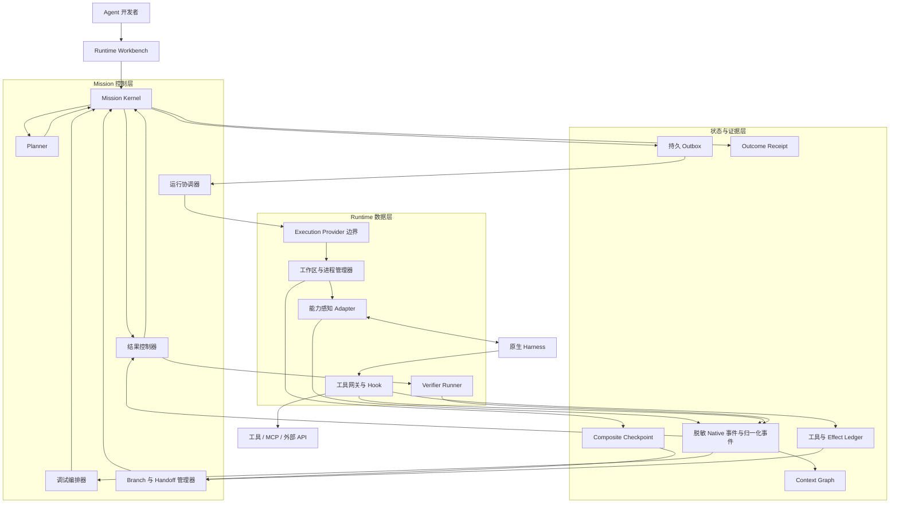

# MissionBraid

[English](README.md) | **简体中文**

**一条 Mission。多种 Runtime。可调试的执行过程。**

MissionBraid 是一个面向原生 Coding Agent 开发者的本地优先 **Agent Runtime
Workbench（运行时工作台）**。它把 Codex、Qoder、Claude Code、OpenCode、Hermes
和未来的 Harness 变成同一条持久 Mission 背后可替换的执行 Runtime：

```text
配置 → 规划 → 运行 → 观察 → 调试 → 分叉 → 接力 → 对比 → 验收
```

> **状态：** pre-alpha、本地优先、从源码运行。仓库目前已经实现一条真实的
> Codex-to-Qoder-to-Claude Code Mission；Root Branch；Runtime Profile Definition、Catalog
> Observation、不可变 Snapshot 和 Attempt Binding；按来源定序的 Event IR
> 与脱敏 Native Artifact；以及可在重启后继续的持久 Command/Outbox。
> 第 2 次迭代已经通过一条跨越三个 Harness 的同机真实 Workbench Mission
> 验证，包括已验证 Receipt 和重启后的稳定恢复。Context Graph 实时调试、工具拦截、
> 可执行 Fork、自适应规划和其他第 3 次以后的能力仍是目标架构。


[查看当前已验证的时间线和 Receipt](docs/assets/missionbraid-workbench-verified.png)。

## 一张表了解产品

|              | MissionBraid                                                                                                                                                                                                                                                               |
| ------------ | -------------------------------------------------------------------------------------------------------------------------------------------------------------------------------------------------------------------------------------------------------------------------- |
| 用户问题     | 原生 Coding Agent 很强，但彼此割裂且执行过程不透明。开发者切换工具时会丢失执行状态，而且经常要等昂贵的运行失败后才能开始调试。                                                                                                                                             |
| 产品         | 用一个 Workbench 配置 Runtime Profile、运行持久 Mission、实时检查上下文和工具、在支持的边界暂停、从 Checkpoint 分叉、切换 Harness、对比 Branch，并验收结果。                                                                                                               |
| 核心抽象     | **Mission** 持有目标、执行 Branch、证据、Effect 和完成状态；Harness 只是可替换的 Runtime。                                                                                                                                                                                 |
| 当前已经实现 | 双语本地 Workbench、Mission Kernel、Codex/Qoder/Claude Code 执行 Adapter、Root Branch、已解析的 Runtime Profile 与 Binding、按来源定序的 Event IR 与脱敏 Native Artifact、持久 Command/Outbox 恢复、工作区 Checkpoint 证据、Handoff Capsule、Verifier 和 Outcome Receipt。 |
| 交付计划     | **共 10 次主要产品迭代。第 1、2 次已在本地实现并验证；第 3–10 次已规划。**                                                                                                                                                                                                 |

## 为什么要做 MissionBraid

使用多个 Agent 工具时，真正困难的并不是再启动一个进程，而是保存并理解整个执行过程：

- 当时实际生效的是哪个模型、指令、Skill、MCP Server、权限和工具；
- Harness 在行动前暴露了哪些可观察上下文；
- 哪一次工具调用或上下文变化导致了故障；
- 如何从有价值的边界重试，而不是从头重复全部工作；
- 如何切换到另一个 Harness 继续，而不必手工重建任务；
- 哪些外部 Effect 已经发生，不能再次执行；
- 与当前 Branch 绑定的结果是否真的实现。

MissionBraid 将这些状态显式化，并把它们保存在任何厂商 Session 之上。

> **Mission 的生命周期长于任何 Runtime、Session 和执行 Branch。**

## 目标用户故事

Agent 开发者打开一个代码仓库，创建一条包含目标、约束和 Outcome Contract
（结果契约）的 Mission。MissionBraid 发现本机真正生效的 Runtime Profile——不只是
“Codex”或“Qoder”，而是实际的 Harness、模型、推理模式、指令、Skill、MCP Server、
工具、权限和可用资源信号。

开发者启动 Mission。选中的原生 Harness 仍然负责实际工作，MissionBraid 同时记录一条
统一的实时时间线：模型轮次、上下文组装、工具调用、工作区变更和生命周期事件。

大多数运行不需要人工介入。如果异常或语义断点触发，开发者可以在下一个受控动作之前，
检查准确的可观察上下文和状态。他们可以修改 Prompt、上下文项、工具结果、模型或
Harness；收窄权限；或者明确批准新的 Grant/Contract 修订。随后可以继续运行，或者从
Composite Checkpoint（复合检查点）创建一条隔离的执行 Branch。

MissionBraid 对比不同 Branch，在不虚构隐藏推理过程的前提下解释故障候选，运行与所选
Branch 的不可变 Contract 修订绑定的 Verifier，并签发 Outcome Receipt。开发者调试的是
Agent 执行本身，而不是等到仓库最终状态出错后再猜测原因。

## 产品架构



MissionBraid 被设计成一个模块化本地应用，而不是过早拼装出的分布式平台。Mission
Kernel 事件是控制状态变化的唯一权威来源。原生 Harness、Git 和外部系统仍然是各自真实
状态的证据来源。Adapter 保留脱敏后的 Native 格式证据，同时补充归一化事件，不会为了
统一而抹平每个 Harness 的独特能力。

Kandev 可以通过公开的 Provider 边界，为成熟的工作区和进程执行提供能力。MissionBraid
不会 Fork Kandev，不会把它嵌入成自己的状态机，直接本地 Adapter 也不依赖 Kandev。

继续阅读[最终架构](docs/architecture.md)和[目标产品需求](docs/product-requirements.md)。

## 核心设计判断

1. **调度 Runtime Profile，而不是品牌名。** 解析 Harness × 模型 × 推理强度 × 指令 ×
   Skill × MCP/工具 × 权限 × 能力，再把这个快照与 Mission、工作区、权限和预算绑定。
2. **先保留 Native 完整性，再做归一化。** 脱敏后的 Native 格式证据始终可寻址；公共
   Event IR（事件中间表示）负责支撑统一的产品行为。
3. **只在真实控制边界上调试。** Adapter 必须声明它能否观察、拦截、打断、引导、继续或
   重建每一种边界。
4. **Checkpoint 是复合状态。** 它绑定 Mission 修订、事件前缀、可见上下文、工作区状态、
   Runtime Binding、进程/Session 定位信息和 Effect 历史。
5. **Replay 永不重写历史。** Playback（回看）不执行也不分叉。只要 Cached Replay、
   Counterfactual Resampling 或 Execution Fork 产生新证据，就必须创建子 Branch。
6. **外部 Effect 不会随“时间旅行”消失。** Branch 必须继承、对账、补偿，或在遇到无法
   撤销的 Effect 时停止。
7. **Handoff 传递证据，不传递隐藏状态。** MissionBraid 不声称可以搬运 KV Cache、私有
   Chain-of-Thought，或保证两个 Harness 拥有完全相同的内部理解。
8. **模型提出建议，确定性程序掌握控制权。** 模型可以提出结构化软要求、特征或解释。
   建议一旦被接受，版本化的确定性策略负责筛选、排序、绑定、权限、状态和最终验收。
9. **Done 是 Receipt，不是 Agent 的自我声明。** 完成状态使用控制器运行的证据，对所选
   Branch 精确绑定的不可变 Contract 修订进行评估。

这些判断背后的推理收录在[关键问题](docs/key-questions.md)中。

## 当前可用能力

已经实现的基础包括：

- 本地 CLI 和双语 Workbench，Workbench 的中英文选择会保存在当前浏览器；
- 版本化 Mission 与不可变 Outcome Contract；
- 基于 SQLite、只追加、Hash 链接的事件，以及可重建的 Projection；
- 直接运行 Codex、Qoder 和 Claude Code 的进程 Adapter；
- 每条新 Mission 默认拥有一条 Root Branch；
- 相互分离的 Runtime Profile Definition、带时间的 Catalog Observation、不可变有效
  Snapshot 和 Mission 专属 Attempt Binding；
- 显式 Adapter 能力声明，以及不伪造数据的 unknown/unsupported Runtime 字段；
- 按来源定序的归一化 Runtime 事件，并链接到脱敏、按内容寻址的 Native 格式证据；
- 持久 Command/Outbox 路径，已接受的执行意图不会因应用重启丢失；
- 额外目标 Harness 的固定发现条目；
- Attempt 前基线和工作区 Checkpoint 证据（digest/delta，不是可恢复快照）；
- 有预算约束、绑定 Provenance 的 Handoff Capsule；
- 显式的可变工作区 Effect Identity；
- 进程外验收和 Hash 绑定的 Outcome Receipt；
- 重启后的状态恢复，以及中断 Mission 的继续运行。

当前最强的公开证据证明了一条同机 Workbench Mission 跨越 Codex、Qoder 和
Claude Code，得到已验证 Receipt，并在重启后稳定恢复。它不证明自动路由、实时工具拦截、
可执行 Fork/Replay、跨主机复现、生产级隔离或第三方采用。

## 当前 Runtime 支持情况

| Runtime 或 Provider | 发现支持           | 执行 Attempt | 当前证据                              |
| ------------------- | ------------------ | -----------: | ------------------------------------- |
| Codex               | 已实现探测/清单    |           是 | 同机三 Harness Mission                |
| Qoder               | 已实现探测/清单    |           是 | 同机三 Harness Mission                |
| Claude Code         | 已实现探测/清单    |           是 | 同机三 Harness Mission                |
| OpenCode            | 已实现探测/清单    |           否 | 仅支持发现                            |
| Hermes              | 已实现探测/清单    |           否 | 仅支持发现                            |
| DeepSeek Harness    | Bootstrap/清单信号 |           否 | 仅支持发现                            |
| Kandev v0.91.0      | 独立兼容路径       |           否 | 只验证公开 Task/Worktree/Process 接口 |

## 十次产品迭代

| 迭代 | 用户可见结果                                                                  | 状态       |
| ---: | ----------------------------------------------------------------------------- | ---------- |
|    1 | 一条 Mission 能从中断中恢复，完成 Codex → Qoder 接力，并以已验证 Receipt 结束 | 本地已实现 |
|    2 | Runtime Profile 和 Native 事件通过统一 Event IR 变得可观察                    | 本地已验证 |
|    3 | 开发者可以检查实时执行、上下文组装、工具流和工作区变更                        | 已规划     |
|    4 | 工具调用可以在支持的前/后边界停止，并在继续前修改                             | 已规划     |
|    5 | Composite Checkpoint 支持诚实的 Playback、Replay 和可执行 Branch              | 已规划     |
|    6 | 可复现的 Planner 选择 Runtime、重新规划，并让 Mission 跨 Harness 接力         | 已规划     |
|    7 | 使用可观察的模型/上下文/工具/Harness/环境证据归因故障                         | 已规划     |
|    8 | Multi-Agent 工作成为持久 Mission Graph，并支持理解修订的协同                  | 已规划     |
|    9 | Branch 对比、Regression Case、Eval 和 Outcome Receipt 组成 Incident Studio    | 已规划     |
|   10 | 外部开发者可以安装、扩展并复现完整 Runtime Workbench                          | 已规划     |

每次迭代都必须结束于一条真实的 Workbench 用户流程，而不是孤立的 Schema、Adapter 或测试套件。
详见[迭代路线](docs/roadmap.md)。

## 运行当前 Workbench

要求：Node.js 24–26、pnpm、Git，以及至少一个已安装并完成认证的受支持 Runtime。真实的跨
Harness 路径目前同时需要 `codex` 和 `qodercli`。

MissionBraid 目前从源码运行；尚未发布 npm Package 或带 Tag 的 Release。

```sh
pnpm install --frozen-lockfile
pnpm build
node dist/src/cli.js runtimes list --json

MISSIONBRAID_DEMO_ROOT="$(mktemp -d)"
node scripts/prepare-e1-fixture.mjs "$MISSIONBRAID_DEMO_ROOT/workspace"
node dist/src/cli.js app --state-dir "$MISSIONBRAID_DEMO_ROOT/state" --port 4317
```

打开 `http://127.0.0.1:4317`。选择本机可用的模型和推理设置，然后输入：

Workbench 首次使用时会跟随浏览器语言。可以通过品牌名称旁的 `EN | 中文` 开关切换语言；
选择结果只保存在当前浏览器中。

**标题**

```text
Complete the Effect Ledger across Codex and Qoder
```

**目标**

```text
Complete the dependency-free JSONL Effect Ledger in this disposable repository. Read AGENTS.md, README.md, and every public test. Implement record, replay, same-payload idempotency, payload-conflict detection, deterministic serialization, incomplete-tail recovery, strict corruption handling, and the CLI. Do not edit tests or install dependencies. Leave node --test passing for the Mission's bound Outcome Contract.
```

- **工作区：** Fixture 准备程序打印的绝对路径
- **路线：** Codex to Qoder
- **Verifier 执行程序：** `node`
- **Verifier 参数：** 单独一行填写 `--test`

只需提交一次。完整的中断流程和更底层的复现步骤见[复现证据](docs/reproducing-evidence.md)。

## 证据

[第 2 次迭代机器可读记录](evidence/iteration-2-three-harness-local-2026-08-25.json)
将一个干净修订绑定到：

- 通过正常本地 Workbench API 提交的一条 Mission，没有手写 Mission YAML 或手工跨 Harness 搬运上下文；
- 同一条 Root Branch 上成功运行的真实 Codex、Qoder 和 Claude Code Attempt；
- 三个 Runtime 的 Profile Definition、Catalog Observation、不可变 Snapshot 和 Attempt Binding；
- 1,066 个按来源定序的 Runtime 事件和 1,066 个脱敏 Native Artifact；
- 两次协作式 Handoff 确认，其 Native 来源事件都早于对应目标的第一个已观察 Tool Request 事件；这是顺序证据，不是实时工具拦截；
- 已验证 Receipt，以及 Workbench 重启后稳定的 Mission Head、Receipt、来源序列和因果链接。

早期的 [Codex-to-Qoder 记录](evidence/unified-workbench-codex-qoder-local-2026-08-24.json)
保留了相匹配的源 Checkpoint/目标 Baseline 工作区快照，以及不同的前后工作区 Digest；本项目不用它声称已实现受强制的修改前拦截。

目前所有记录都是本地同机结果。[证据索引](evidence/README.md)严格区分已经演示的结果与目标架构。这些记录不证明实时工具拦截、自动路由、可执行 Fork/Replay、跨主机复现或生产就绪。

## 文档

- [产品需求](docs/product-requirements.md)
- [最终架构](docs/architecture.md)
- [十次迭代路线](docs/roadmap.md)
- [项目导览](docs/project-tour.md)
- [产品与技术关键问题](docs/key-questions.md)
- [证据与声明边界](evidence/README.md)
- [受控复现](docs/reproducing-evidence.md)
- [贡献指南](CONTRIBUTING.md)

## 许可证

MissionBraid 使用 [Apache License 2.0](LICENSE)。
