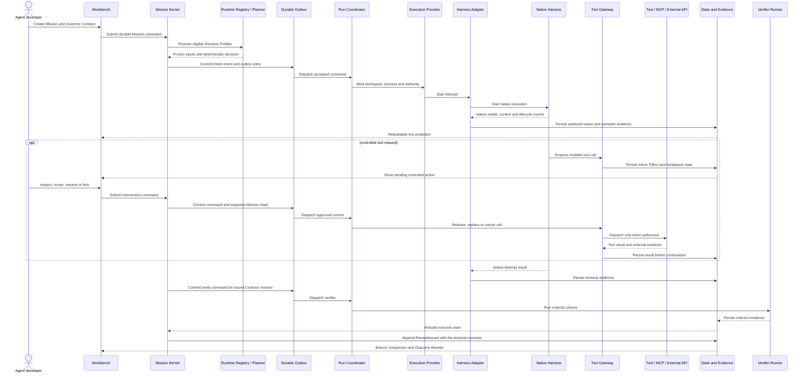
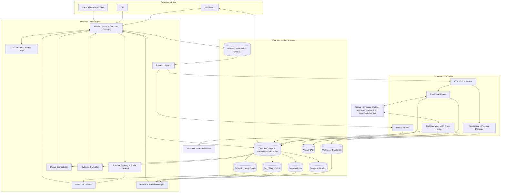

# MissionBraid Architecture

> **Status:** final target architecture with a working 1.0 source candidate.
> The repository already implements the Mission Kernel, bilingual local
> Workbench, append-only event state, direct Codex/Qoder/Claude Code execution,
> the four-part Runtime Profile model, source-scoped Event IR with sanitized
> native artifacts, live Context Graph inspection, one validated Claude
> pre-tool path, one queryable external Effect recovery path, Git-backed
> Composite Checkpoints, immutable parent/child Branch lineage, isolated
> Execution Fork worktrees, adaptive Profile planning, the four Replay
> semantics, Failure Intelligence, executable Mission Plan coordination,
> Outcome Studio scenario export, controller-run out-of-process verification,
> and Outcome Receipts. A retained
> [unified flagship](../evidence/v1-flagship-local-2026-08-26.json) now connects
> the main Iteration 1–9 runtime path under one Mission identity; earlier
> iteration records remain historical capability slices. Iteration 10 retains a
> separate internal clean-install, migration, and lockfile-bearing source-bundle
> record. This is project-operated, same-host or internal clean-install evidence.
> npm publication, cross-host proof, independent external reproduction, and
> production adoption remain open.

## Product definition

MissionBraid is a local-first **Agent Runtime Workbench** for developers who
build and improve applications with native coding agents. Codex, Qoder, and
Claude Code are direct Mission execution Adapters. OpenCode, Hermes, and
DeepSeek Harness are catalog-only until an execution Adapter exists. Supported
Runtimes enter one Mission lifecycle:

```text
compose → run → inspect → revise → re-run → evaluate → verify
                         ↘ checkpoint / fork / handoff when needed
```

The product is deliberately broader than an agent launcher, trace viewer, or
workflow engine. It combines runtime discovery, long-running Mission state,
context and tool observability, live intervention, time travel, multi-Harness
continuation, failure intelligence, and outcome verification in one coherent
developer workflow. Its primary path is everyday Agent application iteration;
continuity, Branching, Handoff, routing, and CI export support that path.

The central invariant remains:

> **The Mission outlives every Runtime, session, and execution branch.**

### Product boundary

The architecture preserves three different concerns without turning them into
three competing products:

- **core development loop:** compose the effective Agent, execute a real
  Mission, inspect context and tools, revise behavior inputs, and evaluate the
  result;
- **runtime continuity:** checkpoint, resume, Branch, Replay, Handoff, and
  multi-Agent coordination preserve useful execution state;
- **continuous verification:** incident scenarios, Revision comparison,
  Outcome Receipts, and optional CI export retain evidence from the development
  loop.

MissionBraid is not a general CI/CD, deployment, organizational approval, or
release-governance platform. The same Harness normally continues the Mission.
A Runtime switch is conditional on availability, capability, deliberate
comparison, or explicit user choice.

## Primary user loop

1. The developer opens a project and inspects the effective Agent Revision:
   model, instructions, Skills, tools, context/memory policy, permissions,
   orchestration, Runtime, and environment evidence.
2. The developer creates a Mission with an objective, constraints, workspace,
   and Outcome Contract.
3. MissionBraid snapshots available Runtime Profiles and either records the
   developer's choice or plans an execution. The selected Profile remains the
   default for subsequent Attempts.
4. A native Harness executes while MissionBraid persists sanitized
   native-format and normalized model, context, tool, workspace, and lifecycle
   events before projecting them live.
5. The developer inspects normal behavior, a deliberate Revision change, an
   anomaly, or a failed criterion. A supported breakpoint can pause execution
   at an observable safe point.
6. The developer changes one or more supported behavior inputs and continues
   from the current head or creates an isolated Branch from a Checkpoint.
7. The Branch continues in the same Harness by default. A Handoff Capsule is
   compiled only when another Runtime is justified.
8. MissionBraid compares Agent Revisions and Branches, attributes failures
   within the available evidence boundary, evaluates the immutable Contract
   revision, issues an Outcome Receipt, and can save the case as a regression
   scenario for later local or CI execution.

### Retained flagship instantiation

The abstract loop above is exercised by one retained Mission rather than only
by isolated feature fixtures:

```text
controlled Qoder failure → planned/manual-override Handoff to Claude
→ native pre-tool Write modification → deterministic stale-Context rejection
→ one external Effect reconciled after controller crash
→ Composite Checkpoint → Context-only Execution Fork
→ confirmed mechanism + honest unknown + evidence ablation
→ fixture-declared Branch selection → 3 real upgraded-Profile trials
→ fail-closed standalone CI → parallel Qoder/Claude Mission Plan
→ live Contract revision → selective fence + Artifact reuse
→ independent consolidation → latest Receipt → stable restart
```

The [record](../evidence/v1-flagship-local-2026-08-26.json) binds the chain to
Mission `mission-0afa570c-a716-416f-8916-d5e48bdcf0f1`, real installed
Qoder/Qwen3.8-Max and Claude Code/deepseek-v4-pro processes, deterministic
verifiers, Git worktrees, a native Claude pre-tool Hook, a queryable local HTTP
target, and a standalone CI process. The provider termination and tool-error
probe are deliberately induced, and the fallback target uses a recorded manual
planner override. Its Branch-selection authority is a fixture-declared field,
not evidence of live human interaction or identity verification. The run
establishes only this same-host controlled fixture; it is not evidence of
natural-failure recovery, provider-internal Context, Profile-only causality,
cross-host execution, independent operation, general reliability, or production
use.



## Architectural principles

1. **Mission state is above Harness state.** A vendor session is useful, but it
   is never the sole owner of user intent or completion.
2. **Preserve native fidelity before normalizing.** Every normalized event
   retains its raw source reference and native extension fields. A common IR
   must not erase provider-specific semantics.
3. **Persist before projecting.** Runtime events are deduplicated and persisted
   before they update the UI, breakpoint engine, or Mission state.
4. **Debug at explicit safe points.** MissionBraid does not claim arbitrary
   process snapshots. It pauses at boundaries an adapter can actually observe
   or control, such as pre-tool, post-tool, turn, idle, or process exit.
5. **New execution never rewrites history.** Playback and projection rebuild do
   not create a Branch. Any replay, resample, or fork that produces new
   evidence creates a child Branch from an immutable base checkpoint.
6. **External effects survive time travel.** Rewind cannot unsend a message,
   undo a deployment, or erase a network side effect. Those effects must be
   inherited, reconciled, compensated, or block replay.
7. **Capabilities are explicit.** Each Runtime binding declares whether it can
   observe, interrupt, gate, steer, resume, fork, or reconstruct a state.
8. **Models propose; deterministic code controls.** Models may propose
   structured requirements or ranking features and explain traces. Once
   accepted, versioned deterministic policy owns filter, rank, bind, authority,
   state transitions, effect identity, budgets, and final acceptance.

## Architecture overview



## Plane responsibilities

### Experience Plane

The Workbench, CLI, and local API expose one product rather than separate state
machines. The Workbench contains seven connected views:

- **Runtime Hub:** installed Harnesses and effective Runtime Profiles;
- **Mission Canvas:** objective, Outcome Contract, plan graph, branches, and
  assigned Runtimes;
- **Live Trace:** model turns, context changes, tools, files, tests, subagents,
  cost, and latency;
- **Debug Console:** breakpoints, pending tool calls, context and state
  inspection, interventions, pause, resume, and steer;
- **Time Travel:** checkpoints, replay modes, forks, and portability reports;
- **Branch and Revision Compare:** effective Agent inputs, trajectory,
  workspace, cost, failure, and verifier diffs;
- **Outcome View:** criterion results, unresolved Effects, and Receipt.

The Incident and Regression surface extends comparison and outcome evidence.
It can export a scenario result to CI, but it does not own deployment or
organizational approval.

The UI is a projection of authoritative Kernel and evidence state. Refreshing or
restarting it must not alter execution truth.

The current Workbench can be switched between English and Chinese, with the
choice persisted in the local browser. Retained local records cover the live
trace and Context Graph, one native tool intervention, and the Composite
Checkpoint plus Execution Fork A/B slice. The complete seven-view surface,
including the remaining replay and comparison operations, remains the target.

### Mission Control Plane

The Mission Control Plane owns user intent and execution coordination:

- **Mission Kernel:** versioned Mission state and Outcome Contract authority;
- **Mission Plan:** dependency graph for stages, tasks, subagents, branches, and
  joins;
- **Runtime Registry:** effective Profile discovery and capability snapshots;
- **Execution Planner:** manual or automatic Profile selection and replanning;
- **Run Coordinator:** Attempt ownership, lifecycle, budgets, and process
  fencing;
- **Debug Orchestrator:** breakpoint evaluation and intervention commands;
- **Branch and Handoff Manager:** checkpoint forks and cross-Harness
  continuation;
- **Outcome Controller:** requests controller-run out-of-process criterion
  checks and asks the Mission Kernel to issue a terminal Receipt whose outcome
  is determined by the
  bound policy. The Runtime Data Plane's Verifier Runner returns evidence but
  cannot issue a Receipt.

### Runtime Data Plane

The Runtime Data Plane attaches to native coding agents without pretending that
all Harnesses expose the same controls:

- direct CLI or SDK adapters;
- ACP or another public protocol when fidelity is sufficient;
- an external execution provider such as Kandev or Sandbox Agent;
- model-traffic proxies for visible request and context capture;
- Harness hooks for lifecycle and pre-tool events;
- an MCP/tool gateway for enforceable interception;
- workspace, worktree, sandbox, PTY, and process-group management.

Kandev is a candidate mature execution provider behind this plane. MissionBraid
remains an independent repository and does not fork Kandev or share its private
state.

### State and Evidence Plane

Kernel events are the sole authority for Mission control transitions. That does
not make the Kernel the owner of every fact in the outside world. Native
Harnesses, Git, tools, and external systems remain authoritative sources for
their own real state; MissionBraid captures evidence from those sources and
records what it can establish.

| Fact                                                        | Control record or evidence source                                                              |
| ----------------------------------------------------------- | ---------------------------------------------------------------------------------------------- |
| Objective, constraints, plan, Branch, Attempt and authority | Mission Kernel events                                                                          |
| Accepted execution intent                                   | Kernel intent event; transactional outbox is the delivery mechanism                            |
| Runtime-native session state                                | Native Harness evidence referenced through an Adapter                                          |
| Ordered observations                                        | Append-only Event Store with source sequence, ingest sequence, and causal links                |
| Native-format prompts, payloads, logs and large state       | Sanitized content-addressed artifacts with a redaction manifest                                |
| Observable model context                                    | Captured request/session evidence; Context Graph is a rebuildable projection                   |
| Repository contents                                         | Git/worktree evidence and content hashes                                                       |
| Tool or external side effects                               | External-system evidence plus the rebuildable Effect Ledger projection                         |
| Failure analysis                                            | Evidence references; Failure Graph is a rebuildable projection                                 |
| Completion                                                  | Kernel `ReceiptIssued` event based on verifier evidence for the Branch-bound Contract revision |

The Context Graph, Failure Graph, Workbench views, and Receipt view can be
rebuilt. The content-addressed store preserves sanitized evidence; the outbox
ensures delivery; neither can independently change Mission truth.

## Core domain model

### Mission and Outcome Contract

A Mission is the durable unit of user intent. Its Outcome Contract contains the
objective, constraints, non-goals, criterion definitions, allowed authority,
and evidence requirements. The Contract is versioned rather than silently
mutated. A later user change creates a new Mission revision and an explicit
impact set over the plan and existing branches.

### Mission Plan

The Mission Plan is a graph rather than a fixed list of prompts. A node records
required capabilities, dependencies, expected artifacts, acceptance criteria,
and the Attempt or subagent that owns it. The graph supports sequential work,
parallel branches, joins, diagnostic forks, and invalidation after a Mission
revision.

Branch histories never merge in place. A join creates a new consolidation
Attempt that consumes provenance-bound artifacts or Checkpoints from its input
Branches. Workspace integration is an explicit new Effect; conflicts, selected
inputs, and verifier evidence remain recorded.

The current executable path accepts an explicit Plan through the Mission spec,
runs independent ready nodes concurrently in isolated Git worktrees, binds each
Attempt to its Contract revision, Plan revision, and node version, and records a
node Artifact only after its deterministic verifier passes. A live Contract
revision fences affected active work, adopts only unaffected verifier-backed
Artifacts into the new Plan revision, and runs a new consolidation Attempt over
the selected source commits. The final Receipt names the current Contract and
Plan revisions. The unified flagship retains this complete path with real Qoder
and Claude Code Attempts: the Claude Attempt for Contract revision 1 is
selectively fenced, Qoder's verified Artifact is adopted into the revised Plan,
the Claude Attempt for revision 2 runs, and an independent consolidation Attempt
reaches the latest-revision Receipt. The earlier Iteration 8 record remains a
focused historical slice.

### Runtime inventory, Profile, and Attempt Binding

The product separates four objects that change at different rates:

- **Runtime Catalog Observation:** a timestamped observation of installation,
  health, version, authentication readiness, quota, price, and availability;
- **Runtime Profile Definition:** a reusable user or project template that
  selects a provider, Harness, model, reasoning configuration, instruction and
  tool policy, and permission ceiling;
- **Runtime Profile Snapshot:** the immutable effective environment resolved
  for an Attempt, including actual versions, active instructions, Skills,
  MCP/tools, context limits, capabilities, and unknown fields;
- **Attempt Binding:** the Profile Snapshot bound to a Mission and Contract
  revision, plan node, Branch, workspace, authority, budget, and native
  session/process locator.

Catalog observations inform planning but are not silently folded into Profile
identity. Workspace ownership and session identity belong to the Attempt
Binding. Credentials never enter a Profile Snapshot. The adapter capability
snapshot declares fidelity for:

```text
observe | context_capture | steer | interrupt | pre_tool_gate
resume | native_fork | workspace_restore | external_effect_control
```

### Agent Revision

An Agent Revision is a content-addressed view of the behavior-affecting inputs
that actually governed an Attempt:

```text
model/provider/reasoning
+ instructions and Skills
+ MCP/tools and their implementations
+ context, retrieval, memory and compaction policy
+ planner, retry, session and Handoff behavior
+ permissions, guardrails and Effect policy
+ Runtime, Adapter, provider, dependency and environment identity
```

It is composed from the Profile Snapshot, Attempt Binding, referenced content,
policy versions, Adapter evidence, and environment observations. It is not a
new authority or state machine beside the Mission. Unknown inputs remain
unknown and are included in the Revision's fidelity record.

Evaluation suites, verifiers, baselines, thresholds, and qualification policies
are independent control artifacts. They are versioned separately so a
candidate Revision cannot modify its own judge without invalidating the prior
qualification. Ordinary project code authored by an Agent is not an Agent
Revision unless that code implements or configures the Agent application.

### Attempt and Branch

An Attempt is one Runtime Profile executing one Mission Plan node on one
Branch. A Branch has an immutable parent and base Checkpoint. Its history is
append-only, while its head and status can advance through new Attempts and
events. Branches may share content-addressed history while keeping their future
workspace and events isolated.

Ordinary resume or Handoff from the current head may append another Attempt to
the same Branch. Starting from a historical point or changing an execution
input creates a child Branch. The initial Mission receives a default root
Branch even before Fork is available.

### Agent Event IR

The Agent Event IR provides a common envelope while retaining sanitized
native-format evidence:

```text
event identity, source sequence and Mission ingest sequence
mission / plan node / branch / attempt identity
source Harness and native event type
event kind and normalized payload reference
causal parents and correlation identifiers
context / workspace / tool-effect references
observed time, native time, fidelity, and schema version
raw source artifact reference and native extensions
```

Core event families include runtime, session, turn, model, context, tool,
workspace, subagent, breakpoint, checkpoint, branch, handoff, failure,
verification, and Receipt events.

Different sources do not share a fictional global native order. The ingest
sequence provides one durable controller order, while source sequences and
causal parents preserve concurrency and provider ordering. An Adapter only
claims semantic families it can prove; unsupported context, subagent, tool, or
session fields remain unavailable or native extensions.

“Raw” means **sanitized native-format evidence**, not unfiltered bytes.
Credentials are removed before any persistence. Each artifact records its
redaction and fidelity metadata. Other sensitive local content follows an
explicit storage, encryption, retention, and export policy; public and incident
exports are redacted by default.

### Context Graph

The Context Graph records what the model could observably receive and where it
came from:

- system, user, organization, and project instructions;
- AGENTS.md, CLAUDE.md, Skills, MCP tool schemas, and adapter injections;
- messages, visible reasoning summaries, tool results, files, memory, and
  compaction summaries;
- declared Context-source fingerprints, cached/bound versus current freshness,
  and the evidence used to refresh a diagnostic Attempt;
- token and context-window observations;
- activation, eviction, replacement, and provenance edges.

MissionBraid does not claim access to hidden chain-of-thought, opaque KV cache,
or encrypted provider state. Such data is recorded as unavailable or opaque,
not reconstructed.

### Tool Effect

Every mutable action that MissionBraid controls or observes receives an Effect
identity. An unobservable Runtime boundary remains `unknown` and reduces the
recovery guarantee. When MissionBraid controls the boundary, the identity is
created before dispatch. Control fidelity is explicit:

- **enforced:** MissionBraid owns the tool boundary and can gate execution;
- **guarded:** a Harness hook or upstream idempotency/postcondition provides a
  bounded control;
- **advisory:** the action is observed or predeclared, but the Runtime can
  bypass MissionBraid's control;
- **unknown:** the available Runtime surface cannot establish whether an action
  happened.

Each Effect also declares a scope: `branch_local_workspace`,
`shared_resource`, or `mission_global_external`. A descendant Branch owns only
its new Effects while referencing the inherited external Effect frontier.

Effects progress through intended, authorized, started, executed, confirmed,
failed, ambiguous, and compensated states. Replaying a Branch never silently
repeats a confirmed or ambiguous external Effect.

### Checkpoint and Intervention

A Checkpoint is created only at a declared safe point. It can reference:

- Mission and plan revision;
- event prefix and pending action;
- Runtime Profile and native session reference;
- visible Context Graph snapshot;
- Git/worktree snapshot and process status;
- Tool Effect frontier;
- permissions, budgets, and adapter capabilities.

Every state component is classified as `portable`, `rebindable`,
`reconstructable`, `runtime_native`, `external`, or `unavailable`. An
Intervention records exactly what changes after the Checkpoint: context,
visible assistant text, tool result, permission narrowing, model, Profile,
workspace, or new user guidance. Expanding authority requires an explicitly
authorized Grant or Contract revision; an Agent, resume, Handoff, or inherited
Branch cannot expand it implicitly.

### Handoff Capsule

The Handoff Capsule is the target-specific projection of a Checkpoint and
Mission state for another Runtime Profile. It contains a non-compressible core,
content-addressed evidence references, the remaining plan frontier, Effect
state, permissions, and an explicit compatibility report:

```text
exactly mapped | emulated | summarized | rebound | unavailable | blocks handoff
```

The target cooperatively acknowledges critical identifiers. MissionBraid
records the acknowledgement's native source order against the first observed
tool request; only an Adapter with an enforced gate may claim that mutation was
prevented before acknowledgement. This is semantic continuation, not lossless
migration of hidden model state.

### Failure Case

A Failure Case is an evidence graph across six layers:

```text
model | context | tool | Harness | environment | MissionBraid
```

It separates observed symptoms, candidate mechanisms, discriminating probes,
and conclusions. Conclusions are `observed`, `inferred`, `confirmed`, or
`unknown`. An LLM may summarize evidence or propose a probe, but it cannot
promote its own hypothesis to confirmed.

The unified flagship confirms one stale-Context mechanism with a Context-only
Execution Fork, preserves a distinct tool-layer observation and an honest
unknown, and downgrades the conclusion from `confirmed` to `inferred` when the
decisive diagnostic outcome is removed. This establishes the evidence semantics
for one controlled fixture; it does not establish calibrated attribution across
the other layers or general diagnosis accuracy. The Iteration 7 record remains
a focused historical slice.

### Outcome Receipt

The Verifier Runner only returns criterion evidence. After verification reaches
a terminal state, the Mission Kernel applies the versioned outcome policy and
appends `ReceiptIssued` with a `verified` or `rejected` outcome and unresolved
details. The Receipt binds the selected Branch's exact immutable Contract
revision to criterion-level evidence, Attempts, Profiles, Capsules, Effects,
unresolved state, and event hashes.

A Branch cannot be `verified` when any required criterion is `failed` or
`unknown`, or when a required Effect is blocking or ambiguous. Completion
signals remain independent:

- `agent_reported` — a Runtime claims completion; this is an observation;
- `verified` — the Kernel's declared verification policy passed;
- `accepted` — an authorized human or external authority accepted the result,
  regardless of whether it was technically verified.

## Runtime adapter contract

Adapters share a typed capability contract but may implement different
subsets:

```text
discover and inspect effective Profile
start / resume / interrupt / terminate a session
stream native events and export sanitized native-format artifacts
capture visible model requests and context
gate or observe tool calls
steer or inject new user/context input
export native session references
create or restore native forks when supported
bind a workspace and report process ownership
```

Unsupported operations return explicit capability errors. MissionBraid does
not simulate a strong debugger feature by relabeling transcript playback or
process termination.

The current built-in support boundary is explicit: Codex, Qoder, and Claude
Code execute through direct process Adapters; Claude also has one
request-scoped native pre-tool gate. OpenCode, Hermes, and DeepSeek Harness are
catalog-only. The Claude direct Adapter preserves the semantics and ordering of
non-telemetry events while compacting only `system/thinking_tokens` telemetry.
Process-finish accounting retains total raw, retained, and dropped line counts,
the compaction strategy, and a SHA-256 of the full raw stream. Dropped telemetry
payloads are not retained; this does not claim private-thinking capture,
provider token accuracy, or production performance.

## Durable execution command path

Long-running execution cannot depend on an in-memory UI operation. Every
start, pause, intervention, resume, fork, handoff, verify, and terminate command
uses the same durable path:

```text
command accepted
→ intent event and outbox entry committed together
→ supervisor dispatches to the bound Runtime
→ native response is deduplicated and persisted
→ semantic and domain events update projections
→ restart reconciles incomplete dispatch or observation
```

The idempotency key, expected Mission head, Branch, Attempt Binding, authority,
and deadline are part of the command. A stale UI or supervisor cannot advance a
newer Mission state.

## Debugging model

MissionBraid is exception-driven by default; developers should not have to
watch every token. Breakpoints fall into three groups:

- **structural:** tool name, file path, event kind, permission request, budget,
  or process boundary;
- **behavioral:** repeated failure, tool loop, excessive churn, stale context,
  or scope drift detected from deterministic evidence;
- **semantic:** a model-assisted judgement about a Mission constraint or likely
  intent conflict, clearly marked as advisory unless an enforceable tool gate
  applies.

At a breakpoint the developer can inspect sanitized native-format and normalized
evidence, change execution conditions, resume, fork, terminate, or hand off.
`SIGSTOP` alone is
not a complete pause guarantee; adapter documentation must state what happens
to child processes, in-flight network requests, and already-dispatched tools.

## Replay model

Projection rebuild is an internal deterministic recovery operation: it derives
views from persisted events and does not create a Branch. The UI and API name
four user operations explicitly:

1. **Playback:** render recorded events without executing anything.
2. **Cached replay:** create a child Branch and reuse eligible recorded model or
   pure-tool results as explicitly marked new branch evidence.
3. **Counterfactual resample:** change visible context, model configuration, or
   a tool result, create a child Branch, and request a new model continuation.
4. **Execution fork:** restore an isolated workspace at a safe point and run
   real subsequent tools on a new Branch.

This vocabulary prevents a visual replay or cached HTTP response from being
presented as restoration of a complete native Runtime. Ordinary resume or
Handoff from the current Branch head can add an Attempt to that Branch; replay
from a historical point or with changed inputs cannot.

## Revision and evaluation path

Agent behavior and release authority use separate evidence paths:

```text
Agent Revision + Mission scenario + Outcome Contract
→ deterministic checks and real Runtime trials
→ retained criterion, trajectory and Effect evidence
→ versioned comparison and Outcome Receipt
→ optional machine-readable CI result
```

Deterministic checks own structural validity, dependencies, permissions,
Effect invariants, executable tests, and objective environment outcomes. Model
behavior remains stochastic, so behavior evaluation uses repeated trials and
predeclared thresholds where one run is insufficient. Model-based graders can
assess open-ended qualities, but their rubric, version, outputs, and human
calibration boundary remain visible.

The same immutable evidence and evaluation policy must produce the same
qualification conclusion. Re-running a stochastic Agent may produce different
evidence and therefore a different conclusion; MissionBraid does not disguise
that as deterministic model behavior. External CI consumes this result. It
does not become a second Mission authority or a deployment controller.

## Planner and adaptive execution

Planning follows `extract → filter → rank → bind → observe → adapt`:

1. Structured Mission requirements are derived from the Contract and may be
   proposed by a model, but the accepted stored requirements are explicit.
2. Hard constraints filter Profiles by capabilities, permission, workspace,
   context, control fidelity, and availability.
3. A versioned deterministic policy ranks eligible Profiles using frozen user
   preferences, cost, quota freshness, latency, and historical outcomes when
   those observations exist.
4. The accepted requirements, Catalog observations, candidate set, rejection
   reasons, rank vector, selected Profile, policy version, and decision hash are
   recorded. Equal frozen inputs and policy must produce the same decision
   hash.
5. Failures, budget changes, or Mission revisions can trigger replanning.
6. Manual selection and override remain first-class and are recorded rather
   than hidden.

Quota and subscription data often have different fidelity. Every observation
records whether it came from an official API, local CLI output, a derived
estimate, or manual input.

## Multi-agent and living Mission semantics

Multiple Agents are useful when they own distinct plan nodes, diagnostic
branches, or review roles. Agent count is not a product metric. Concurrent
Attempts receive isolated workspaces or declared shared-resource coordination,
and every subagent is attached to the Mission Plan and event graph.

When the user changes the Mission, MissionBraid creates a new Contract revision,
computes which plan nodes and artifacts are affected, stops work that is now
stale, preserves unaffected results, and replans the invalidated frontier. The
original revision and its branches remain inspectable.

## Current implementation and stronger boundaries

| Capability                   | Current 1.0 source candidate                                                                                                            | Stronger boundary still open                                                   |
| ---------------------------- | --------------------------------------------------------------------------------------------------------------------------------------- | ------------------------------------------------------------------------------ |
| Mission and Outcome Contract | Versioned Contract and Plan revisions, selective impact analysis, latest-revision Receipt                                               | Broader plan roles and distributed policy                                      |
| Local Workbench              | English/Chinese Mission, Runtime, trace, tool-gate, Checkpoint/Fork, failure, Plan, and Outcome surfaces                                | Broader interaction and independently operated validation                      |
| Branch                       | Root and immutable child lineage, isolated Execution Fork, comparison and saved incidents                                               | Native-session Fork where a Harness can prove it                               |
| Runtime Profiles             | Definition, Catalog Observation, immutable Snapshot, Attempt Binding, deterministic planning and Profile-Rebound                        | Broader official quota/cost inputs and calibrated outcome learning             |
| Agent Revision               | Content-addressed effective Revision projection and dimension comparison                                                                | Broader native configuration capture                                           |
| Execution                    | Direct Codex/Qoder/Claude plus public direct, ACP, and provider-backed Adapter contracts                                                | More real execution Adapters and cross-host providers                          |
| Commands and events          | Durable command/outbox recovery; live source-scoped Event IR and sanitized native artifacts                                             | Wider native semantic and control coverage                                     |
| Context and debugging        | Live Context Graph, native Claude pre-tool gate, freshness evidence, Context-only diagnostic Fork                                       | More provider-native gates and multi-layer probes                              |
| Effects                      | Scoped Effect identities, no-repeat inheritance, and query-before-retry reconciliation after controller crash                           | More external-system adapters; no universal exactly-once claim                 |
| Checkpoint/Replay/Fork       | Git-backed Composite Checkpoint; Playback, Cached Replay, model-only Resample, isolated Execution Fork                                  | Broader restorable environment and native session state                        |
| Handoff                      | Deterministic planner, compatibility projection, Capsule and acknowledgement across real Qoder/Claude                                   | Natural-failure and cross-host continuity                                      |
| Failure attribution          | Evidence graph with confirmed, observed, inferred, unknown, and ablation behavior for one real stale-Context case                       | Calibrated coverage across more failure layers                                 |
| Mission Plan runtime         | Parallel isolated real-Agent nodes, live selective fencing, verified Artifact reuse, independent consolidation, latest-revision Receipt | Distributed coordination and richer shared-resource policy                     |
| Verification                 | Out-of-process verifier, Outcome Studio, executable incident, three real Profile-Rebound trials, fail-closed standalone checker         | Hosted/independent CI and broader regression calibration                       |
| Packaging and extension      | Public Adapter SDK; internal clean-install CLI/Workbench/Fork chain; v1→v2 migration; lockfile-bearing source bundle                    | npm publication, independent Adapter/operator reproduction, cross-host install |

### Evidence organization

The [unified flagship record](../evidence/v1-flagship-local-2026-08-26.json) is
the primary product evidence. It shows that the architecture's control and data
planes cooperate through one Mission: planner and Handoff, native tool gate,
Kernel rejection, external Effect recovery, Checkpoint and Fork, Failure
Intelligence, Outcome Studio, Mission Plan revision and consolidation, Receipt,
and restart.

The Iteration 5–10 records remain historical capability slices rather than the
main product story:

- Iteration 5 isolates all four Replay semantics and the Execution Fork state
  boundary;
- Iteration 6 isolates adaptive filtering, ranking, Handoff, and acknowledgement;
- Iteration 7 isolates the earlier Qoder stale-Context mechanism;
- Iteration 8 isolates real Qoder/Claude selective revision and consolidation;
- Iteration 9 isolates a Qoder 3/3 incident regression and fail-closed checker;
- Iteration 10 isolates internal clean installation, migration, Adapter
  extension, and source-bundle reproduction.

The flagship is one same-host controlled-fixture run. The historical records
are likewise local or internal clean-install evidence. None establishes native
session migration, natural-failure recovery, provider-internal state,
Profile-only causality, cross-host or distributed execution, independent
external reproduction, npm publication, general reliability, or production
readiness.

## Integration and claim boundaries

- MissionBraid remains an independent project. Third-party projects may be
  dependencies, protocol providers, or design references only under their
  public licenses and interfaces.
- Kandev may supply mature workspace and execution capabilities without owning
  Mission truth or requiring a fork.
- Native Harness credentials remain behind adapters and are filtered before
  any event or artifact persistence. “Raw” artifacts preserve sanitized native
  format plus redaction metadata, never credentials.
- Claude per-token thinking telemetry may be compacted before Kernel ingestion.
  Non-telemetry semantics remain ordered, while raw-stream accounting retains
  counts and a whole-stream hash rather than the dropped per-token payloads.
- Architecture, source code, fixture tests, real local Runtime execution,
  third-party reproduction, and production adoption are separate evidence
  levels.
- MissionBraid does not claim hidden-state migration, arbitrary process
  snapshotting, universal exactly-once external actions, perfect causal
  attribution, or globally optimal scheduling.

The [product requirements](product-requirements.md) define the complete user
surface. The [roadmap](roadmap.md) turns this architecture into ten
user-visible product iterations.
