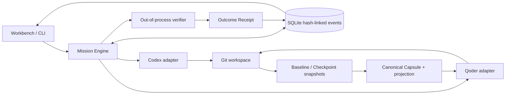
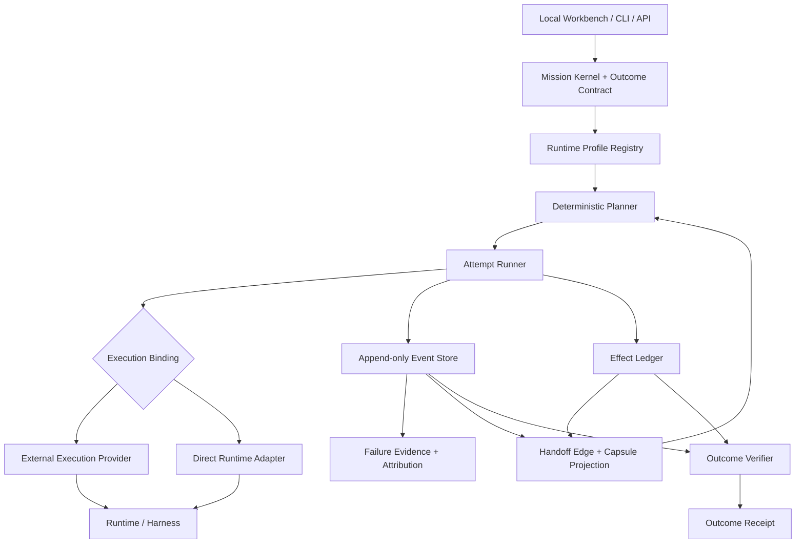

# MissionBraid Architecture

> **Status:** accepted target architecture with a pre-alpha local product
> slice. The unified Workbench, Mission Kernel, direct Codex/Qoder adapters,
> Capsule handoff, verifier, and Receipt path are implemented at `c55dd54`. A
> clean public-clone run submitted the Mission through the Workbench, exercised
> both real Runtime Profiles, and restored the verified result after restart.
> Deterministic automatic planning, additional execution adapters, and
> Kandev-backed Mission execution remain target semantics rather than current
> capabilities.

## Product contract

MissionBraid is a mission-centric control plane for coding-agent runtimes. Its
central invariant is:

> **The mission outlives the runtime.**

A Mission owns the objective, constraints, acceptance criteria, Attempt chain,
mutable-effect history, and completion state. Codex, Qoder, Claude Code, or any
other harness may execute an Attempt, but none of them owns the Mission.

Three rules follow:

- **Mission owns truth.** Runtime transcripts are evidence inputs, not the
  authoritative state machine.
- **Continuity transfers evidence, not chat.** MissionBraid does not claim to
  move hidden model state, KV cache, or identical internal understanding.
- **Done is a receipt, not a claim.** Completion returns to the original
  acceptance criteria and a controller-run verifier.

## Implemented product surface

The local Workbench is a projection over the Mission Kernel, not a second state
machine. It currently provides:

- a fixed target catalog for Codex, Qoder, Claude Code, OpenCode, Hermes, and
  DeepSeek Harness with explicit installed/supported/readiness states;
- editable Runtime Profiles for the supported Codex and Qoder adapters;
- one-form Mission creation with a Git workspace and direct verifier command;
- ordered Codex, Qoder, or Codex-to-Qoder execution;
- a durable Attempt, Checkpoint, Capsule, Effect, verification, and Receipt
  timeline;
- restart restoration and a visible recovery action for interrupted
  `running`/`verifying` Missions.

The Workbench does not yet choose an optimal Runtime, read quota balances,
replan after failure, or execute the four visible unsupported Harnesses.

## Current running architecture

This diagram contains only the path implemented and exercised by the current
public Workbench evidence:



| Implemented responsibility                                      | Source                                                                                                   |
| --------------------------------------------------------------- | -------------------------------------------------------------------------------------------------------- |
| Local HTTP entry, background operations, and restart projection | [`src/app.ts`](../src/app.ts), [`src/app-page.ts`](../src/app-page.ts)                                   |
| Versioned Mission creation and validation                       | [`src/mission-draft.ts`](../src/mission-draft.ts), [`src/spec.ts`](../src/spec.ts)                       |
| Attempt execution, recovery, handoff, and Receipt orchestration | [`src/engine.ts`](../src/engine.ts)                                                                      |
| Append-only events, projections, leases, and fencing            | [`src/store.ts`](../src/store.ts)                                                                        |
| Workspace evidence                                              | [`src/workspace.ts`](../src/workspace.ts)                                                                |
| Capsule projection and acknowledgement validation               | [`src/capsule.ts`](../src/capsule.ts)                                                                    |
| Direct Runtime processes                                        | [`src/adapters/codex.ts`](../src/adapters/codex.ts), [`src/adapters/qoder.ts`](../src/adapters/qoder.ts) |
| Independent acceptance command                                  | [`src/verifier.ts`](../src/verifier.ts)                                                                  |

The [project tour](project-tour.md) connects these modules to the full user
journey and focused tests.

## Target architecture



The Mission Kernel is the sole authority for Mission, Attempt, Effect,
verification, and Receipt state. Projection tables, timelines, consoles, and
runtime transcripts must remain rebuildable views.

## Core objects

### Mission and Outcome Contract

An Outcome Contract freezes the objective before execution begins. It contains:

- machine- or human-verifiable acceptance criteria;
- constraints and explicit non-goals;
- required evidence kinds;
- a canonical content hash and revision.

A Mission references one contract revision, a permission grant, a cost
envelope, and an ordered chain of Attempts. An executing model cannot edit the
contract, grant itself authority, or mark the Mission verified.

### Runtime Profile

The scheduling unit is not a bare harness. It is an immutable snapshot of the
full execution environment:

```text
Execution provider × Harness × Model × Reasoning configuration
× Instructions × Skills × MCP tools × Permissions
× Workspace × Availability
```

The snapshot records versions, capability identifiers, instruction and tool
digests, context and injection limits, permission ceilings, availability, and
observation freshness. Credentials never enter the snapshot.

Unknown limits stay unknown. A profile with an unknown guaranteed injection
budget may run an initial Attempt, but it is not eligible for an automatic
handoff that requires a provable context budget.

### Deterministic Planner

Planning follows `filter → rank → record`:

1. Filter profiles by authentication, health, capability, workspace,
   permission, availability, and handoff-budget requirements.
2. Rank eligible profiles using a versioned lexicographic policy.
3. Persist the complete input snapshot, rejection reasons, rank vectors, policy
   version, and decision hash.

Prices and historical outcomes may affect ranking only when captured in
immutable snapshots included in the decision hash. The same input and policy
must produce the same decision. An LLM may explain a decision, but it does not
override hard constraints.

Effective permissions can only narrow during handoff:

```text
Next permissions = Mission grant
                 ∩ current owner grant
                 ∩ source Attempt permissions
                 ∩ target Profile ceiling
                 ∩ execution Provider ceiling
```

### Attempt and execution binding

An Attempt binds one Mission to one Runtime Profile and one execution provider.
One runtime session cannot be controlled simultaneously by both an external
provider and a direct adapter.

The initial implementation uses local execution. Kandev remains a candidate
mature execution provider through versioned public boundaries; MissionBraid
does not fork it or share its internal database. The checked v0.91.0 HTTP
surface can prepare and reconcile a task worktree and control a preconfigured
custom process. It does not expose versioned public Session or Agent stop, so
that check is not sufficient to describe Kandev-backed Mission execution as
supported.

### Append-only events and ownership

The first storage target is local SQLite in WAL mode. Runtime events are
persisted and deduplicated before acknowledgement or projection. Every state
write is guarded by a workspace lease and a monotonic fencing token so a stale
controller cannot continue writing after ownership changes.

Database fencing cannot stop an already-running process from changing files.
Before another Attempt receives the same worktree, the old process group must
be confirmed stopped and the workspace state rechecked; otherwise the next
Attempt receives an isolated worktree.

All persisted contracts and events are versioned. Historical events are
append-only and are migrated through upcasters rather than rewritten in place.

## Handoff Capsule

A Capsule belongs to the edge between two Attempts, not to either runtime.
MissionBraid separates:

- a **Canonical Capsule**, containing complete sourced facts; and
- a target-specific **Projection**, rendered for one Runtime Profile under a
  measured injection budget.

The non-compressible core includes the objective, Outcome Contract, constraints,
accepted and rejected decisions, remaining work, confirmed or ambiguous
effects, blockers, permission boundaries, and workspace checkpoint hash.
Workspace files, diffs, and full logs normally travel as content-addressed
references when the target can deterministically read them.

The projection budget is:

```text
available = min(
  context window
    - system/project instructions
    - tools and protocol overhead
    - native history
    - work reserve
    - estimation guard,
  adapter-guaranteed injection limit
)
```

Optional items degrade deterministically from `full` to `summary` to
`reference`. Core facts are never silently truncated. If the core does not fit,
handoff fails with a structured error; recovery is limited to choosing a larger
profile, explicitly partitioning the contract, or aborting the handoff.

The target returns a structured acknowledgement containing contract, remaining
work, do-not-repeat effect, permission, and checkpoint identifiers. That proves
the identifiers were read and matched; it does not prove identical internal
understanding or future compliance.

## Effect Ledger

Every mutable action receives an Effect identity before dispatch. MissionBraid
does not promise universal exactly-once execution. It exposes three control
levels:

- **enforced:** credentials and tools pass through a broker that can enforce
  authority, identity, and fencing;
- **guarded:** native idempotency, unique object identity, or a queryable
  postcondition can prevent or detect repetition;
- **advisory:** the runtime can bypass controls, so MissionBraid can only warn,
  observe, reconcile, or stop.

Effects move through:

```text
intended → dispatch_started → executed → confirmed
                             ↘ failed / ambiguous / conflict
```

Process success or an agent report establishes `executed`, not `confirmed`.
Confirmation requires an independent postcondition query. After a crash,
MissionBraid reconciles external state before retrying. An irreversible action
with no native idempotency and no queryable postcondition remains `ambiguous`
and is not automatically repeated.

Timeline rewind cannot erase an external action. Forks inherit confirmed
mission-global effects; compensation is always a new Effect.

## Failure evidence and attribution

Failure handling separates observation from inference. Evidence captures raw,
hashed observations from the model boundary, harness protocol, tool, workspace,
execution provider, MissionBraid, and external dependencies.

Attribution output uses four states:

- `observed`: the failure surface is directly visible;
- `inferred`: evidence supports a leading mechanism but is not decisive;
- `confirmed`: authoritative unique evidence or a discriminating probe isolates
  the mechanism;
- `unknown`: available evidence cannot justify a stronger conclusion.

Versioned signatures provide deterministic candidate ordering. Optional probes
may change one declared dimension—for example harness, model, tool boundary, or
workspace—while holding the remaining observable inputs fixed. Probes consume a
separate diagnostic budget and stop when they are unsafe, non-discriminating,
or too expensive.

An LLM may summarize evidence, but it cannot turn a hypothesis into a confirmed
root cause.

## Outcome Receipt

An Outcome Receipt binds results to the exact Outcome Contract. For every
criterion it records the verifier, evidence references, and one of `passed`,
`failed`, or `unknown`. It also discloses Attempt and handoff identifiers,
effect status and control level, unresolved items, and content hashes.

Completion levels are deliberately separate:

- `agent_reported`: the runtime says the task is done;
- `verified`: every required criterion passed its predeclared verifier;
- `accepted`: an authorized human or external authority accepted the result.

Verification runs as a separate controller process. The controlled fixtures keep
the verifier outside the runtime-writable target workspace; the current slice
does not claim hostile-runtime isolation. A receipt proves the recorded
acceptance chain, not absolute correctness.

## Integration boundaries

MissionBraid remains an independent project:

- external providers run as separately installed processes behind versioned
  public adapters;
- runtime-specific credentials remain inside adapters;
- third-party source, internal types, databases, private protocols, and UI are
  not copied;
- any intentional reuse must pin a source revision and preserve its license and
  attribution.

Kandev v0.91.0 has locally demonstrated the checked public task, worktree, and
custom-process lifecycle endpoints. A complete Kandev-backed Attempt remains a
target because its versioned public API does not control the full Session or
Agent lifecycle. An agentctl-compatible bridge may inform native Claude/Codex
session projection. Smithers may inform or provide timeline mechanics. Multica
is a product-space reference, not a source-code baseline. None is a source-code
base for MissionBraid.

## Evidence boundary

Architecture, local tests, real-runtime trials, published code, and production
adoption are different evidence levels. A [single controlled E0 run](../evidence/e0-local-2026-08-24.json)
closed against its original Contract and is bound to implementation commit
`9d5b4d3`. A [single controlled E1 run](../evidence/e1-local-2026-08-24.json)
then crossed from an interrupted Codex Attempt to a Qoder Attempt, received a
Capsule acknowledgement while the controller still observed the workspace
digest matching the recorded handoff baseline, and closed against its original
Contract with a verified Receipt bound to commit `b16bd0b`. A [second E1
run](../evidence/e1-context-isolated-reproduction-local-2026-08-24.json) used a
clean public clone and fresh state/workspace in a separate task context on the
same host, then explicitly replayed the verifier to issue another verified
Receipt against `f73bc24`. Host-level Harness instructions, Skills, MCP, and
other configuration may have been reused. These are local results, not
third-party or cross-host reproduction, hostile-runtime isolation, production
adoption, or broad runtime compatibility evidence.

A separate [Kandev v0.91.0 check](../evidence/kandev-v0.91.0-provider-check-local-2026-08-24.json)
ran from a clean clone against one isolated official container. Its first run
created a fresh Kandev task, session, and worktree; its rerun reconciled the same
identities. Both started distinct preconfigured custom processes and observed
accepted stop plus exact public-process retirement. It did not bind a Mission
Attempt, control the full Kandev Session or Agent lifecycle, or issue an Outcome
Receipt.

The [unified Workbench run](../evidence/unified-workbench-codex-qoder-local-2026-08-24.json)
is bound to public commit `c55dd54`. It used a clean public clone and fresh
state/workspace, submitted through the web form, let both Codex and Qoder make
distinct changes, observed Capsule acknowledgement before Qoder mutation,
issued a verified Receipt, and restored the same 26-event Mission in a new app
process. It remains a same-host local result, not automatic routing, broad
adapter support, third-party reproduction, or production adoption.
