# Agent Engineering Capability Map

MissionBraid is a Mission-centric runtime development layer around native
coding agents. It does not replace a model's reasoning or a Harness's native
tool loop. It owns the durable Mission identity, the observable execution
boundary, controlled interventions, continuity, and outcome verification that
must remain stable while Runtime implementations change.

This map connects each Agent-engineering problem to the implemented mechanism,
its primary source entry points, retained evidence, and the strongest claim the
current evidence supports.

## System path

```mermaid
flowchart LR
    U[Mission goal and Outcome Contract] --> K[Mission Kernel]
    K --> P[Runtime Profile and Execution Planner]
    P --> A[Native or external Adapter]
    A --> R[Codex, Qoder, or Claude Code]
    R --> E[Event IR and Context Graph]
    E --> G[Tool Gate and Effect coordination]
    G --> C[Checkpoint, Fork, or Handoff]
    C --> M[Mission Plan revision and consolidation]
    M --> V[Out-of-process Verifier]
    V --> O[Hash-bound Outcome Receipt]
    O --> K
```

The arrows describe the product path, not independent authorities. Mission
Kernel events are authoritative for Mission control state. Native Harnesses,
Git, tools, and external systems remain authoritative for their own observable
real state. A transcript, projection, or model completion claim is evidence
input, not permission to mark a Mission verified.

## Capability map

| Agent-engineering problem                                                                                                                                                            | MissionBraid mechanism                                                                                                                                                                                                                                                                                                                                                                                          | Primary source entry points                                                                                                                                                                                                                     | Retained evidence                                                                                                                                                                                                                                                                                                                                                                                                                                                                 | Current evidence boundary                                                                                                                                                                                                                                                  |
| ------------------------------------------------------------------------------------------------------------------------------------------------------------------------------------ | --------------------------------------------------------------------------------------------------------------------------------------------------------------------------------------------------------------------------------------------------------------------------------------------------------------------------------------------------------------------------------------------------------------- | ----------------------------------------------------------------------------------------------------------------------------------------------------------------------------------------------------------------------------------------------- | --------------------------------------------------------------------------------------------------------------------------------------------------------------------------------------------------------------------------------------------------------------------------------------------------------------------------------------------------------------------------------------------------------------------------------------------------------------------------------- | -------------------------------------------------------------------------------------------------------------------------------------------------------------------------------------------------------------------------------------------------------------------------- |
| A long-running Agent controller must recover without letting a transcript, UI projection, or retry become the source of truth.                                                       | **Mission Kernel** persists append-only Mission events, projects Mission/Branch/Attempt/Effect/Receipt state, deduplicates event identities, and protects workspaces with leases and fencing tokens.                                                                                                                                                                                                            | [`domain.ts`](../src/domain.ts), [`store.ts`](../src/store.ts), [`engine.ts`](../src/engine.ts)                                                                                                                                                 | [E0 controller recovery](../evidence/e0-local-2026-08-24.json) retains one controller-termination recovery; the [unified flagship](../evidence/v1-flagship-local-2026-08-26.json) retains restart-stable Mission identities after the full controlled flow.                                                                                                                                                                                                                       | These are local controlled runs. Kernel authority covers Mission control state only; it does not make MissionBraid authoritative for unobserved Harness, Git, tool, or external-system state.                                                                              |
| A Harness name is too coarse to explain which Agent actually ran: model, reasoning configuration, instructions, Skills, tools, permissions, Adapter, and environment can all differ. | **Runtime Profile + Execution Planner** records definition, catalog observation, effective snapshot, and Attempt binding. Deterministic filter/rank logic checks hard capabilities, evidence freshness, authority, Effect frontier, and Handoff compatibility before binding a Profile; recorded overrides remain visible.                                                                                      | [`domain.ts`](../src/domain.ts), [`execution-planner.ts`](../src/execution-planner.ts), [`runtime-catalog.ts`](../src/runtime-catalog.ts)                                                                                                       | [Iteration 2](../evidence/iteration-2-three-harness-local-2026-08-25.json) retains three native Runtime identities and effective Profile records. [Iteration 6](../evidence/iteration-6-adaptive-handoff-local-2026-08-26.json) retains deterministic selection after a controlled interruption.                                                                                                                                                                                  | A Profile contains declared or observed fields and their provenance; it cannot infer hidden provider configuration. The adaptive result is a controlled-interruption proof, not a natural quota, network, or model-failure benchmark.                                      |
| Native Runtime streams use incompatible event shapes, while Agent developers need one trace that preserves provenance and shows what observable Context reached each step.           | **Native Event IR + Context Graph** stores source-scoped, deduplicated native evidence before projection, normalizes shared semantic kinds, preserves native artifact references, derives causal relations and adjacent observable-Context diffs, and records unavailable boundaries rather than inventing hidden state.                                                                                        | [`runtime-events.ts`](../src/runtime-events.ts), [`context-graph.ts`](../src/context-graph.ts), [`provenance.ts`](../src/provenance.ts)                                                                                                         | [Iteration 3](../evidence/iteration-3-flight-recorder-local-2026-08-26.json) retains live Codex/Claude events, a causal failed-test path, redaction, latency, and restart ordering. [Iteration 7](../evidence/iteration-7-stale-context-2026-08-26.json) retains one stale-Context diagnosis and isolated refresh.                                                                                                                                                                | The graph reconstructs observable evidence only. It does not expose private reasoning, provider-internal Context, or prove general failure-attribution accuracy.                                                                                                           |
| An Agent can request a dangerous or incorrect tool action, and a controller crash can otherwise repeat an external side effect.                                                      | **Tool Gate + Effect coordination** assigns an Effect identity to mutable actions, persists approve/reject/modify decisions before release, and requires external Effects to carry authority, scope, reconciliation evidence, and idempotency support when available. Queryable targets are looked up before retry.                                                                                             | [`tool-gateway.ts`](../src/tool-gateway.ts), [`claude-tool-gate.ts`](../src/claude-tool-gate.ts), [`external-effect.ts`](../src/external-effect.ts)                                                                                             | [Iteration 4 Tool Gateway](../evidence/iteration-4-tool-gateway-local-2026-08-26.json) retains a native Claude pre-dispatch block and modification. [Iteration 4 external Effect recovery](../evidence/iteration-4-external-effect-local-2026-08-26.json) retains one POST, controller termination, and lookup-based recovery without a second POST.                                                                                                                              | Native interception is established for one supported Claude hook path, not universal Harness containment. The Effect result uses a queryable controlled HTTP target and does not establish universal exactly-once delivery.                                                |
| Replaying a trace is not the same as continuing work, and a Git digest alone is not enough state to continue safely.                                                                 | **Composite Checkpoint + Replay + Execution Fork** classifies workspace, event prefix, visible Context, permissions, stopped process, native Session, and Effect frontier components. Playback and cached/model-only replay preserve their no-tool boundaries; an Execution Fork creates immutable parent/child lineage, an isolated worktree, and a fresh native process from an explicit restorable boundary. | [`composite-checkpoint.ts`](../src/composite-checkpoint.ts), [`checkpoint-replay.ts`](../src/checkpoint-replay.ts), [`execution-fork.ts`](../src/execution-fork.ts)                                                                             | [Iteration 5 Checkpoint/Replay](../evidence/iteration-5-checkpoint-replay-local-2026-08-26.json) retains all four replay semantics. [Iteration 5 Execution Fork](../evidence/iteration-5-execution-fork-local-2026-08-26.json) retains a Git-backed parent boundary, isolated fresh-Codex child worktree, both Receipts, no-repeat Effect inheritance, and restart.                                                                                                               | This is an Execution Fork from an explicit Git boundary, not native Session continuation, fork, or migration. It is same-host evidence, not cross-host restoration or hostile-Runtime isolation.                                                                           |
| Sometimes the current Runtime cannot continue, but copying a summary into another Agent loses identity, authority, pending Effects, and the exact verification target.               | **Handoff Capsule + Runtime continuation** transfers bounded evidence: Mission/Branch/Attempt references, checkpoint, remaining criteria, Runtime and workspace bindings, Effect frontier, provenance, authority, and acknowledgement. The target must acknowledge the Capsule before its first controlled tool boundary.                                                                                       | [`capsule.ts`](../src/capsule.ts), [`runtime-continuation.ts`](../src/runtime-continuation.ts), [`execution-planner.ts`](../src/execution-planner.ts)                                                                                           | [Iteration 6 adaptive Handoff](../evidence/iteration-6-adaptive-handoff-local-2026-08-26.json) retains Planner selection, Capsule acknowledgement, native continuation, verification, and restart. The [unified flagship](../evidence/v1-flagship-local-2026-08-26.json) connects real Qoder to real Claude under one Mission.                                                                                                                                                    | Handoff transfers observable evidence, not KV cache, hidden reasoning, or a private native Session. The flagship target used a recorded manual Planner override and a controlled failure boundary; it is not a natural-failure reliability result.                         |
| A multi-Agent task changes while work is in flight; restarting every branch wastes verified work, while keeping every branch risks accepting stale output.                           | **Mission Plan + Contract revision + selective invalidation** models an immutable plan DAG, node workspace isolation, shared-resource coordination, verifier-backed Artifacts, stale-Attempt fences, downstream invalidation, explicit reuse, and independent consolidation against the latest Contract/Plan revision.                                                                                          | [`mission-plan.ts`](../src/mission-plan.ts), [`mission-plan-runtime.ts`](../src/mission-plan-runtime.ts), [`engine.ts`](../src/engine.ts)                                                                                                       | [Iteration 8](../evidence/iteration-8-multi-agent-revision-local-2026-08-26.json) retains parallel real Qoder/Claude work, a live Contract revision, selective Claude interruption, verified Qoder Artifact reuse, fresh work, independent consolidation, latest-revision Receipt, and restart.                                                                                                                                                                                   | This is one same-host controlled Git fixture. It does not establish distributed scheduling, conflict-free arbitrary code merges, natural failure handling, or production coordination.                                                                                     |
| Model self-reports such as “done” are not sufficient acceptance evidence, and an Agent change needs a reproducible regression decision.                                              | **Out-of-process Verifier + Outcome Studio + hash-bound Receipt** binds criteria to deterministic or explicitly typed evaluators, treats model reports as non-authoritative evidence, records Agent Revisions and incident scenarios, runs trials, fails closed on failed/unknown required outcomes, and issues the accepted result against exact Contract, Branch, Profile, Effect, and evidence identities.   | [`verifier.ts`](../src/verifier.ts), [`outcome-studio.ts`](../src/outcome-studio.ts), [`domain.ts`](../src/domain.ts)                                                                                                                           | [Iteration 9](../evidence/iteration-9-outcome-regression-local-2026-08-26.json) retains three fresh real-Qoder trials passing a predeclared 3/3 threshold; its [exported result](../evidence/iteration-9-outcome-ci-result.json) is accepted by a standalone checker and fails closed when a required Effect remains unresolved. The [flagship](../evidence/v1-flagship-local-2026-08-26.json) retains rejection before repair and a latest-revision Receipt after consolidation. | The 3/3 result is a same-host controlled regression, not a reliability rate or proof that the Profile alone caused success. The retained checker is outside the Runtime process but is not evidence of deployment approval or production use.                              |
| A unified Workbench becomes closed and brittle if every new Harness or execution provider requires changes to Kernel state machines.                                                 | **Adapter SDK + Adapter Host** defines versioned direct, ACP-over-stdio, and provider-backed transports; capability declarations include fidelity and unknown states; conformance checks probe behavior; the Host retains authority over Mission, Branch, Effect, failure, permission, and Receipt state.                                                                                                       | [`adapter-sdk.ts`](../src/adapter-sdk.ts), [`adapter-host.ts`](../src/adapter-host.ts), [`adapter-conformance.ts`](../src/adapter-conformance.ts), [`process-provider.ts`](../src/process-provider.ts), [`public-api.ts`](../src/public-api.ts) | [Iteration 10 package smoke](../evidence/iteration-10-package-smoke-local-2026-08-26.json) retains clean tarball installation, direct/ACP/provider examples, a consumer-style external Adapter through installed CLI and Workbench Missions, a same-Adapter Fork, identity continuity, store migration, and source-bundle frozen install/typecheck/build/tests.                                                                                                                   | This is an internal clean-install result. The package is not published to npm, no independent external Adapter/operator is established, ACP coverage is not universal interoperability, and provider compatibility does not by itself establish a provider-backed Mission. |

## Current integration surface

- **Direct Mission execution Adapters:** Codex, Qoder, and Claude Code.
- **Public external Adapter transports:** direct, ACP over stdio, and
  provider-backed execution.
- **Catalog-only entries:** OpenCode, Hermes, and DeepSeek Harness. They are not
  presented as working Mission execution Adapters.
- **Kandev boundary:** the retained v0.91.0 check covers selected public task,
  worktree, and custom-process interfaces. It does not establish a Kandev-backed
  Mission or copy Kandev internals. See the [compatibility
  record](../evidence/kandev-v0.91.0-provider-check-local-2026-08-24.json).

## Evidence ladder

Read each claim at its recorded level:

1. **Source and tests** show that a mechanism is implemented and its local
   contracts hold.
2. **Controlled fixture evidence** shows the mechanism on an intentionally
   constructed boundary.
3. **Same-host real-Runtime evidence** shows installed native Agent processes
   participated in that bounded run.
4. **Clean-install evidence** shows a recorded package artifact can be consumed
   without repository-private imports.
5. **Independent, cross-host, and production evidence** remain separate levels
   and are not established by the current records.

Start with the [unified flagship record](../evidence/v1-flagship-local-2026-08-26.json)
for the connected product story, then use the [evidence index](../evidence/README.md)
for per-mechanism boundaries and [reproduction guide](reproducing-evidence.md)
for runnable paths.
