# Flagship case study: one Mission across failure, diagnosis, regression, and revision

MissionBraid's flagship record follows one Agent-development Mission through a
controlled Runtime failure, cross-Harness Handoff, tool intervention, outcome
rejection, crash-safe external Effect recovery, diagnostic Fork, regression
trials, and a live multi-Agent Plan revision.

The important product choice is that the Mission remains the durable unit of
work. Qoder and Claude Code are execution resources attached to that Mission;
neither Harness owns its history, authority, Effects, or final outcome.

> **Evidence level:** one project-operated, same-host, real-multi-Runtime,
> controlled-fixture run. The retained record is
> [`evidence/v1-flagship-local-2026-08-26.json`](../evidence/v1-flagship-local-2026-08-26.json),
> bound to Mission `mission-0afa570c-a716-416f-8916-d5e48bdcf0f1` and source
> revision `5aac506a609bc32b301d47b753597c8ed5344224`.

## The developer problem

A long-running Agent task can outlive the Runtime that started it. While the
task is running, an Agent developer may also need to answer questions that a
single transcript cannot settle:

- Which exact Runtime Profile, Context, instructions, tools, and authority were
  effective for this Attempt?
- Can another Harness continue from a declared Mission frontier without
  pretending that its native session is portable?
- Did a tool request actually run, was it changed before dispatch, and did an
  external side effect happen once or more than once?
- Did the result fail because of stale Context, a tool problem, or an
  unobservable cause?
- After changing the Agent configuration, does the same incident pass under a
  new declared Profile, and can a machine-checkable outcome reject ambiguity?
- If a requirement changes during parallel Agent work, what should be stopped,
  retained, rerun, and consolidated?

MissionBraid models those questions as durable Mission state instead of asking
each Harness transcript to be the authority.

## The retained Mission

```mermaid
flowchart LR
  A[Real Qoder process<br/>controlled termination] --> B[Planner decision<br/>recorded target override]
  B --> C[Hash-bound Handoff Capsule<br/>Claude acknowledges]
  C --> D[Native Claude pre-tool gate<br/>Write modified before dispatch]
  D --> E[Deterministic verification<br/>stale Context rejected]
  E --> F[External Effect<br/>one POST, crash, lookup reconciliation]
  F --> G[Composite Checkpoint<br/>Context-only Execution Fork]
  G --> H[Failure Intelligence<br/>confirmed, unknown, ablated]
  H --> I[Saved incident<br/>three real Profile-Rebound trials]
  I --> J[Standalone checker<br/>accepts retained, fails closed]
  J --> K[Parallel Qoder + Claude Plan]
  K --> L[Live Contract revision<br/>selective fence + Artifact reuse]
  L --> M[Independent consolidation<br/>latest Receipt]
  M --> N[Restart<br/>stable identities, no repeated Effect]
```

### 1. Continue the Mission without claiming native session migration

A real Qoder/Qwen3.8-Max process was deliberately terminated to create the
controlled source failure. The Execution Planner recorded the trigger and a
manual target override, selected the declared Claude Tool-Gateway Profile, and
created a hash-bound Handoff Capsule. Real Claude Code/deepseek-v4-pro
acknowledged that Capsule before its first observed tool request.

The Capsule carries a declared Mission frontier and continuation material. It
does **not** claim to copy provider-internal model state or migrate a native
Qoder session into Claude.

### 2. Intervene at a real tool boundary

Claude proposed a `Write`. Its supported native pre-tool Hook paused the request
at MissionBraid's Tool Gateway. The recorded decision changed the input before
dispatch: the original path remained absent and the approved path was written.

This is a real request-scoped Claude tool-control path. It is not universal
containment for every tool or Harness.

### 3. Reject an attractive but incomplete result

The tool, prompt, and final-output criteria passed, but the current-Context
criterion failed. The process-external deterministic verifier therefore
produced evidence for a rejected Receipt. Passing signals could not override
the required failed criterion, and the model could not mark the Mission
verified by reporting that it was done.

### 4. Recover an external Effect after a controller crash

The proof sent one POST to a local queryable HTTP target, then killed the
controller before the result was durably recorded. On restart, MissionBraid
looked up the Effect by its idempotency key, reconciled the observed result, and
did not send a second POST.

This demonstrates crash reconciliation for one queryable controlled target. It
does not claim universal exactly-once delivery.

### 5. Diagnose one causal mechanism with an isolated Fork

A Composite Checkpoint captured the Mission frontier. MissionBraid created an
isolated Execution Fork that changed only `agent-config.json`, leaving inherited
tool and Effect evidence intact. The child Receipt verified, and the inherited
external Effect was not repeated.

Failure Intelligence retained three different conclusions instead of forcing a
single answer: stale Context was confirmed in the full evidence set, a separate
tool-layer observation remained, and an unobservable candidate stayed unknown.
Removing decisive diagnostic evidence downgraded the stale-Context conclusion
from confirmed to inferred.

This is an Execution Fork from a Composite Checkpoint, not transcript playback,
cached replay, or native Session forking.

### 6. Turn the incident into an executable regression

The controlled fixture recorded selection of the verified Branch, saved the
incident as an executable scenario, and asked the Planner to rebound from the
source Claude Profile to a separately declared higher-reasoning Claude Profile
with the same native tool-control capability. Three new real Runtime trials
applied the accepted Context intervention and all three passed the predeclared
`3/3` threshold.

A standalone checker copied outside the repository accepted the retained
result. A negative run with an unresolved required Effect exited nonzero. This
was a local standalone checker, not a hosted CI deployment.

The Branch-selection authority was a fixture-declared `human` field. It is
evidence that the authority value was recorded and enforced, not evidence of a
live human interaction or identity verification.

### 7. Revise a running multi-Agent Plan without discarding good work

Real Qoder and Claude nodes reached a parallel Plan frontier. A live Contract
revision changed one requirement. MissionBraid fenced the affected Claude work,
retained and reused the independently verified Qoder Artifact without rerunning
it, started fresh Claude work for the new revision, and ran an independent
consolidation Attempt.

The final Receipt was bound to the latest Contract and Plan revisions rather
than to a stale node or a model's completion message.

### 8. Reconstruct the durable result

After restart, the Mission head, Receipt, Checkpoint, Fork, Plan, saved scenario,
rerun identities, and external Effect call count remained unchanged. Restart
reconstructed durable Mission state; it did not recover hidden provider state.

## What each mechanism contributes

| Agent-engineering problem                                       | MissionBraid mechanism                                                    | Observed flagship result                                                                                     | Main implementation entry                                                                                                                             |
| --------------------------------------------------------------- | ------------------------------------------------------------------------- | ------------------------------------------------------------------------------------------------------------ | ----------------------------------------------------------------------------------------------------------------------------------------------------- |
| A task must survive a Runtime boundary                          | Runtime Profile, Planner, Handoff Capsule, acknowledgement                | One Mission continued from a controlled Qoder failure into real Claude before the first observed target tool | [`execution-planner.ts`](../src/execution-planner.ts), [`capsule.ts`](../src/capsule.ts), [`runtime-continuation.ts`](../src/runtime-continuation.ts) |
| Tool use needs an enforceable control point                     | Effect identity, Tool Gateway, native Claude pre-tool Hook                | A proposed `Write` was modified before dispatch and retained with its original and updated inputs            | [`tool-gateway.ts`](../src/tool-gateway.ts), [`claude-tool-gate.ts`](../src/claude-tool-gate.ts)                                                      |
| External actions must not be inferred from a crashed controller | Durable Effect intent, idempotency key, lookup reconciliation             | One POST, one lookup after restart, no second POST                                                           | [`external-effect.ts`](../src/external-effect.ts), [`mission-external-effect.ts`](../src/mission-external-effect.ts)                                  |
| A diagnosis needs a comparable frontier                         | Composite Checkpoint, Context-only Intervention, isolated Execution Fork  | Only the declared Context source changed; inherited Effect was not repeated; the child verified              | [`composite-checkpoint.ts`](../src/composite-checkpoint.ts), [`execution-fork.ts`](../src/execution-fork.ts)                                          |
| Attribution must preserve uncertainty                           | Context Graph and Failure Intelligence                                    | One confirmed stale-Context candidate, one tool observation, one unknown; ablation lowered confidence        | [`context-graph.ts`](../src/context-graph.ts), [`failure-intelligence.ts`](../src/failure-intelligence.ts)                                            |
| Agent changes need incident-based evaluation                    | Saved scenario, Profile-Rebound, new Runtime trials, deterministic policy | Three new real Claude trials passed `3/3`; the checker rejected ambiguous required Effects                   | [`outcome-studio.ts`](../src/outcome-studio.ts), [`mission-outcome-studio.ts`](../src/mission-outcome-studio.ts), [`verifier.ts`](../src/verifier.ts) |
| A changed requirement should invalidate only affected work      | Versioned Mission Plan, dependency-aware fence, verified Artifact reuse   | Claude revision-1 work was abandoned; verified Qoder work was reused; fresh Claude work was consolidated     | [`mission-plan.ts`](../src/mission-plan.ts), [`mission-plan-runtime.ts`](../src/mission-plan-runtime.ts)                                              |
| “Done” must be bound to durable facts                           | Process-external verifier and hash-bound Outcome Receipt                  | Required stale Context rejected the first result; the final Receipt referenced the latest Contract and Plan  | [`verifier.ts`](../src/verifier.ts), [`outcome-studio.ts`](../src/outcome-studio.ts)                                                                  |
| Restart must not silently invent or repeat state                | Append-only Mission events and deterministic projection                   | Stable Mission identities and zero additional external Effect calls after restart                            | [`engine.ts`](../src/engine.ts), [`store.ts`](../src/store.ts)                                                                                        |

## Trace the claim to source and evidence

- **Primary machine-readable record:**
  [`evidence/v1-flagship-local-2026-08-26.json`](../evidence/v1-flagship-local-2026-08-26.json)
- **Exact proof operator:**
  [`scripts/run-v1-flagship-proof.mjs`](../scripts/run-v1-flagship-proof.mjs)
- **Fixture preparation:**
  [`scripts/prepare-v1-flagship-fixture.mjs`](../scripts/prepare-v1-flagship-fixture.mjs)
- **Evidence classification:**
  [`evidence/README.md`](../evidence/README.md)
- **Architecture and state authority:**
  [`docs/architecture.md`](architecture.md)
- **Reproduction instructions:**
  [`docs/source-candidate-1.0.md`](source-candidate-1.0.md#reproduce-the-unified-flagship-locally)

The JSON record contains the exact Mission and Attempt identities, Profile and
Planner selections, tool-gate decisions, Effect calls, Checkpoint and Fork
identities, trial bindings, Plan revisions, Receipt identifiers, restart
assertions, environment versions, source digest, and its claim boundary.

## Exact claim boundary

The retained run uses real installed Qoder/Qwen3.8-Max and Claude
Code/deepseek-v4-pro processes, a real native Claude pre-tool Hook,
deterministic verifiers, disposable Git worktrees, a local queryable HTTP
target, a controller `SIGKILL`, and a standalone checker. It proves that the
listed workflow was connected once under one Mission identity in this
controlled same-host fixture.

It does **not** establish:

- recovery rates for natural model, quota, network, or provider failures;
- provider-internal Context capture or equality of hidden model state;
- native Session migration, continuation, or fork across Harnesses;
- universal tool interception or universal exactly-once external delivery;
- that the Profile change alone caused the regression result;
- live human approval, identity verification, or organizational authorization;
- cross-host execution, independent third-party reproduction, general
  reliability, production adoption, publication, or npm release.

Those are open evidence levels, not conclusions implied by this case study.
