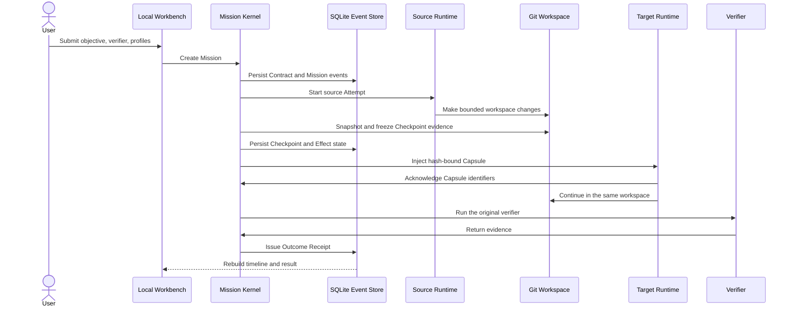

# MissionBraid Project Tour

This document explains the product and its engineering choices without assuming
prior knowledge of MissionBraid or any particular coding-agent CLI.

## The problem

Long coding tasks increasingly span more than one agent tool, model, or process.
The difficult part is not starting another agent. It is preserving the task's
meaning and state when the executor changes:

- the objective and acceptance conditions are often restated from memory;
- useful workspace changes and remaining work are mixed into chat history;
- an external action may already have happened before a process stopped;
- the next agent may repeat work or act on a stale workspace;
- “done” is usually the executing agent's own assertion.

MissionBraid treats these as control-plane problems rather than prompt-writing
problems.

## The product idea

> A Mission outlives the Runtime that executes it.

The user defines one Mission: an objective, constraints, a Git workspace, and a
direct verifier. A Runtime Profile describes one concrete execution environment,
including the Harness, model, reasoning configuration, permissions, and
injection budget. Each execution is an Attempt owned by the Mission.

If another Runtime continues the task, MissionBraid freezes the observed
workspace boundary, creates a hash-bound Handoff Capsule, and requires the target
Runtime to acknowledge the critical identifiers before its mutation is accepted
as a valid continuation. The controller then reruns the original verifier and
issues an Outcome Receipt.

The current Workbench makes this flow local and visible. It does not yet choose
the route automatically.

## User journey today

1. Open the local Workbench and inspect the observed Runtime catalog.
2. Enter the result to achieve, a Git worktree, and a direct verifier command.
3. Choose a Codex, Qoder, or ordered Codex-to-Qoder Runtime route, including the
   model and reasoning profile.
4. Submit once. MissionBraid persists the Mission before starting a Runtime.
5. Inspect the durable Attempt, Checkpoint, Capsule, Effect, verification, and
   Receipt timeline.
6. Restart the Workbench without losing the Mission or its verified result. A
   persisted non-terminal Mission is exposed as interrupted and can use the
   recovery path.

## The implemented control loop

## What is authoritative?

MissionBraid deliberately uses layered sources of truth instead of pretending
that one database can own every fact.

| Fact                                                            | Authority                                        | Why                                                                            |
| --------------------------------------------------------------- | ------------------------------------------------ | ------------------------------------------------------------------------------ |
| Objective, constraints, and acceptance criteria                 | Versioned Outcome Contract in the Mission Kernel | A Runtime cannot rewrite the task it is being judged against.                  |
| Mission, Attempt, Effect, verification, and Receipt transitions | Append-only Kernel event chain                   | Control-plane state must survive process and Runtime changes.                  |
| Actual repository files at a boundary                           | Git workspace snapshot and content hashes        | A transcript cannot prove what is on disk.                                     |
| Runtime statements and logs                                     | Evidence input only                              | They are useful observations but are produced by the executor being evaluated. |
| Whether the declared outcome passed                             | Controller-run verifier and Outcome Receipt      | Model output alone cannot complete a Mission.                                  |

When the live workspace digest differs from the latest Checkpoint, the current
engine records workspace divergence and waits instead of handing stale evidence
to the next Runtime.

## Core objects

### Mission and Outcome Contract

The durable unit of user intent. The Contract freezes the objective and
acceptance criteria before execution. Only controller evidence can close it.

### Runtime Profile

The scheduling unit is not merely “Codex” or “Qoder”. It is the observed
combination of Harness, model, reasoning configuration, permissions, Runtime
version, capabilities, and injection budget. The current route is user-selected;
the target planner will filter and rank immutable Profile snapshots.

### Attempt and Checkpoint

An Attempt is one Runtime Profile working on one Mission stage. MissionBraid
records a pre-Attempt baseline and a post-Attempt workspace delta. The resulting
Checkpoint binds changed paths and content hashes to that Attempt.

### Handoff Capsule

The Canonical Capsule contains sourced continuity facts: Contract identity,
constraints, source and target Attempts, Checkpoint digest, remaining criteria,
and confirmed Effect identities that must not be repeated. A deterministic
Projection fits the target Profile's declared injection budget. If the required
core does not fit, the handoff fails rather than silently truncating it.

Acknowledgement proves that the target emitted the expected identifiers while
the controller still observed the pre-mutation workspace. It does not prove
identical hidden reasoning or lossless session migration.

### Effect

Every mutable workspace stage receives an Effect identity before execution.
The current direct Runtime path records workspace Effects at an advisory control
level because the Runtime can act directly. MissionBraid therefore does not
claim universal exactly-once execution. Stronger enforced or guarded guarantees
require controlled tools, native idempotency keys, or queryable postconditions.

### Outcome Receipt

The Receipt binds the original Contract to Attempt, Capsule, Effect, verifier,
event-sequence, and event-hash evidence. `succeeded` is a projection of a
verified Receipt, not a status that a Runtime can write directly.

## Important architecture choices

### Mission state instead of session state

Harness sessions are useful Runtime-native execution contexts, but they are
opaque, tool-specific, and not a stable owner for a cross-Runtime objective.
MissionBraid keeps them behind adapters and owns only portable, observable
control facts.

### Evidence Capsule instead of transcript copying

Copying chat preserves a narrative, not a trustworthy execution boundary. A
Capsule references the original Contract, exact workspace Checkpoint, Effect
state, and remaining acceptance criteria under a measured budget.

### Append-only events plus rebuildable projections

The Kernel records ordered, hash-linked events in SQLite and derives the current
Mission view. Workspace leases and monotonic fencing tokens prevent a stale
controller from continuing to write authoritative state after ownership moves.
Database fencing cannot stop an arbitrary external process from editing files,
so process identity and workspace rechecks remain separate controls.

### Direct adapters now, provider boundary later

Codex and Qoder currently run through direct local process adapters. Kandev is
kept as a separately installed provider candidate rather than a fork or second
Mission state machine. The checked Kandev v0.91.0 interface is sufficient for a
narrow compatibility result, not for a complete provider-backed Mission.

## Verified vertical slice

The flagship evidence is bound to a clean public clone of implementation commit
`c55dd54`:

- one Mission was submitted through the Workbench without user-authored YAML;
- real Codex and Qoder Runtime Profiles ran ordered Attempts;
- Codex changed `src/effect-core.mjs` and `src/ledger.mjs`;
- Qoder acknowledged the Capsule before mutation, then changed `src/cli.mjs`
  and `src/ledger.mjs`;
- the declared `node --test` verifier passed 12 target tests;
- the 26-event chain produced a verified Receipt with no unresolved item;
- a new Workbench process restored the same Mission and Receipt.

See the [machine-readable record](../evidence/unified-workbench-codex-qoder-local-2026-08-24.json)
and the [complete evidence index](../evidence/README.md).

This is same-host local evidence. It is not third-party reproduction, automatic
optimal routing, arbitrary Harness compatibility, production isolation, or
adoption.

## Code map

| Responsibility                                   | Primary implementation                                                                                   | Focused tests                                                                                                                |
| ------------------------------------------------ | -------------------------------------------------------------------------------------------------------- | ---------------------------------------------------------------------------------------------------------------------------- |
| Workbench HTTP entry and background operations   | [`src/app.ts`](../src/app.ts), [`src/app-page.ts`](../src/app-page.ts)                                   | [`src/app.test.ts`](../src/app.test.ts)                                                                                      |
| Form input to versioned Mission document         | [`src/mission-draft.ts`](../src/mission-draft.ts), [`src/spec.ts`](../src/spec.ts)                       | [`src/mission-draft.test.ts`](../src/mission-draft.test.ts), [`src/spec.test.ts`](../src/spec.test.ts)                       |
| Mission/Attempt execution and recovery           | [`src/engine.ts`](../src/engine.ts)                                                                      | [`src/engine.test.ts`](../src/engine.test.ts)                                                                                |
| Event chain, projection, leases, and fencing     | [`src/store.ts`](../src/store.ts)                                                                        | [`src/store.test.ts`](../src/store.test.ts)                                                                                  |
| Workspace snapshots and deltas                   | [`src/workspace.ts`](../src/workspace.ts)                                                                | [`src/workspace.test.ts`](../src/workspace.test.ts)                                                                          |
| Canonical Capsule and acknowledgement validation | [`src/capsule.ts`](../src/capsule.ts)                                                                    | [`src/capsule.test.ts`](../src/capsule.test.ts)                                                                              |
| Direct Runtime execution                         | [`src/adapters/codex.ts`](../src/adapters/codex.ts), [`src/adapters/qoder.ts`](../src/adapters/qoder.ts) | [`src/adapters/codex.test.ts`](../src/adapters/codex.test.ts), [`src/adapters/qoder.test.ts`](../src/adapters/qoder.test.ts) |
| Independent command verification                 | [`src/verifier.ts`](../src/verifier.ts)                                                                  | [`src/verifier.test.ts`](../src/verifier.test.ts)                                                                            |
| Fixed target Runtime inventory                   | [`src/runtime-catalog.ts`](../src/runtime-catalog.ts)                                                    | [`src/runtime-catalog.test.ts`](../src/runtime-catalog.test.ts)                                                              |

## Current boundary and next proof

Only Codex and Qoder execute Mission Attempts. Claude Code, OpenCode, Hermes,
and DeepSeek Harness are visible catalog targets but unsupported executors. The
next product proof is not a larger list: it is a deterministic
`filter → rank → record` planner over Runtime Profiles, followed by one new real
adapter and evidence-triggered replan/replay/fork semantics.

The detailed design and claim boundaries live in the
[architecture](architecture.md), [roadmap](roadmap.md), and
[key questions](key-questions.md).
