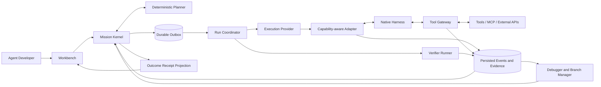
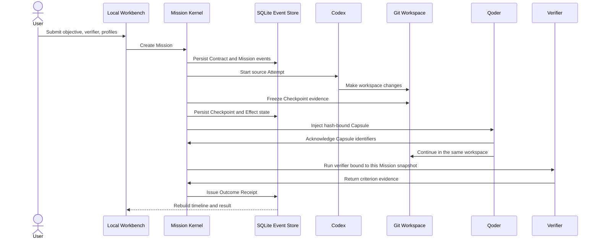

# MissionBraid Project Tour

This tour explains the target product and the working foundation without
assuming prior knowledge of MissionBraid or any coding-agent CLI.

## The problem

Developers increasingly use several coding Agents, models, tools, and local
configurations. Each Harness can be capable on its own, but the overall
execution remains fragmented:

- the effective model, reasoning mode, instructions, Skills, MCP servers, and
  permissions are hard to compare;
- context assembly and tool decisions are often opaque until the final result;
- Agent behavior can change after a Prompt, Skill, tool, memory, model, or
  Runtime revision without a sourced explanation;
- a long run is expensive to understand and repeat, whether it fails or merely
  behaves differently;
- switching Harnesses, when required, needs manual context reconstruction;
- external actions may be repeated after a retry;
- “done” is usually the executor's own statement.

MissionBraid treats these as one Agent runtime and debugging problem rather than
a collection of prompt templates.

## The product idea

> **A Mission outlives every Runtime, session, and execution branch.**

A Mission owns the user's objective, constraints, workspace, evolving plan,
execution branches, mutable effects, and Outcome Contract. Codex, Qoder, and
Claude Code currently run through direct Mission Adapters. OpenCode, Hermes,
and DeepSeek Harness are catalog-only; future Harnesses must enter through an
honest capability-aware Adapter before they can execute an Attempt.

The final Workbench supports one connected loop:

```text
compose → run → inspect → revise → re-run → evaluate → verify
                         ↘ checkpoint / fork / handoff when needed
```

This is deliberately more than a launcher. The product remains useful after an
Agent starts because it exposes what happened, lets the developer intervene at
real control boundaries, preserves executable state, and judges the outcome
against the immutable Contract revision bound to the selected Branch.

## The target journey

1. **Compose.** MissionBraid identifies the effective Agent Revision, including
   the Harness, model, reasoning mode, instructions, Skills, MCP/tools,
   context/memory, permissions, orchestration, environment, and available
   resource signals.
2. **Plan.** The developer selects a Profile or accepts a recorded planner
   decision over eligible Profiles. The same Profile remains the default.
3. **Run.** A native Harness executes an Attempt. MissionBraid persists
   sanitized native-format and normalized model, context, tool, workspace, and
   lifecycle events before projecting them live.
4. **Observe.** A live trace explains the active branch, visible context,
   pending action, workspace changes, and acceptance progress.
5. **Revise.** The developer can inspect normal behavior, a semantic
   breakpoint, an anomaly, or a failed criterion, then change supported Agent
   inputs at a real control boundary.
6. **Re-run or Fork.** Continue from the current head, or create an isolated
   execution Branch from a composite Checkpoint when a controlled comparison
   is useful.
7. **Hand off when justified.** A Branch continues in the same Harness by
   default and uses a provenance-bound Handoff Capsule only when another
   Runtime is needed or deliberately selected.
8. **Compare.** MissionBraid compares Agent Revisions, Branches, and failure
   hypotheses using observable evidence rather than invented hidden reasoning.
9. **Verify and retain.** The Mission Kernel evaluates the exact immutable
   Contract revision, issues an Outcome Receipt, and can save the scenario for
   later local or CI regression runs.

## The architecture at a glance



The Workbench, CLI, and local API project one Mission state machine. Provider
adapters and optional execution providers do not own Mission truth.

## The core objects

### Mission and Outcome Contract

The durable unit of user intent. A Contract binds acceptance criteria to a
Mission revision. A later user change creates a new revision rather than
silently changing the standard applied to earlier work.

### Runtime Profile and Attempt Binding

The scheduling unit is the effective execution environment, not a Harness
brand:

```text
Harness × model × reasoning × instructions × Skills × MCP/tools
× permissions × capabilities
```

A reusable Profile Definition is resolved into an immutable Profile Snapshot.
Availability, quota, and price remain timestamped Catalog Observations. The
snapshot becomes an Attempt Binding when it is attached to a Mission revision,
Branch, workspace, authority, budget, and native session/process. This keeps a
saved Profile stable while making each real execution explainable.

### Agent Revision

The effective behavior view for one Attempt. It content-addresses the model,
instructions, Skills, MCP/tools, context/memory policy, orchestration,
permissions, Runtime, Adapter, dependencies, and environment evidence that
actually governed the run. It is composed from existing Profile and Attempt
objects rather than becoming a second state machine beside the Mission.

Evaluation suites, verifiers, baselines, and thresholds are independently
versioned control artifacts. Ordinary code authored by an Agent is not an
Agent Revision unless it changes the Agent application itself.

### Attempt and Branch

An Attempt is one Runtime Profile executing one part of a Mission. A Branch is
anchored by an immutable parent and base Checkpoint. Its history is append-only,
while its head can advance through new Attempts and events. Resume or Handoff
from the current head may remain on the same Branch; changed inputs or execution
from a historical point create a child Branch.

### Agent Event IR and Context Graph

The Event IR provides shared concepts for model, context, tool, artifact,
lifecycle, and outcome events. Sanitized native-format artifacts, source
sequence, ingest sequence, causal parents, and redaction metadata remain linked
so provider-specific meaning is not erased.

The Context Graph records the observable instructions, messages, retrieved
artifacts, Skills, MCP definitions, tool results, summaries, and truncation
decisions that shaped a turn. For declared Context sources it can also compare
cached/bound and current fingerprints, record freshness, and source a
diagnostic refresh. It does not claim access to private chain-of-thought.

### Composite Checkpoint

A checkpoint binds the Mission revision, event prefix, context state, workspace
snapshot, Runtime binding, session/process locator, environment fingerprint,
and Effect history needed to reconstruct an execution boundary. Unsupported or
missing state is explicit.

### Tool Effect

Every mutable action MissionBraid controls or observes receives an Effect
identity; an unobservable boundary remains unknown. The system records
enforced, guarded, advisory, or unknown control and branch-local workspace,
shared-resource, or mission-global external scope. A child Branch owns its new
Effects and references its inherited external frontier. Rewinding local state
does not pretend to undo the outside world.

### Handoff Capsule

The Capsule projects provenance-bound Mission, checkpoint, remaining-work,
artifact, decision, failure, and Effect evidence into a target Runtime's
declared budget. It transfers observable state, not hidden model state.

### Outcome Receipt

The Verifier Runner returns criterion evidence but cannot issue a Receipt. The
Mission Kernel applies the outcome policy and binds the selected Branch's exact
Contract revision, Attempts, Effects, verifier evidence, and event head. A model
report alone cannot create it; required failed/unknown criteria or
blocking/ambiguous required Effects prevent `verified`.
Terminal failure or unknown still produces a rejected Receipt with unresolved
details.

## What works in this repository today

Iteration 1 implements and has retained real evidence for the continuity
foundation:

1. Open the local Workbench and inspect the discovered Runtime catalog.
2. Create a Mission with an objective, Git workspace, and verifier.
3. Select Codex, Qoder, or an ordered Codex-to-Qoder route.
4. Run real native Runtime processes against a disposable workspace.
5. Persist Attempt, workspace baseline/checkpoint evidence, Effect, Capsule,
   verification, and Receipt events. The original continuity record used a Git
   digest/delta boundary; the later Iteration 5 path adds a Git-backed
   restorable Composite Checkpoint for Execution Fork and Replay.
6. Restart the Workbench and restore the same Mission result.

The current implemented control loop is:



The Iteration 1 flow above proves the Mission can outlive a process and cross
one real Runtime boundary. The later slices add live observation, executable
branches, Replay semantics, adaptive Handoff, failure intelligence, executable
Mission Plan coordination, and Outcome Studio; their evidence levels are
stated below rather than inferred from the original continuity run.

Iteration 2 is now implemented in source:

- Codex, Qoder, and Claude Code are execution Adapters with explicit capability
  declarations;
- Claude Code has one request-scoped native pre-tool gate. Its direct Adapter
  preserves non-telemetry event semantics and order while compacting per-token
  `thinking_tokens` telemetry; process-finish accounting records total
  raw/retained/dropped line counts and a SHA-256 of the full raw stream, while
  dropped per-token payloads are not retained;
- every new Mission receives a default root Branch;
- Runtime Profile Definition, Catalog Observation, immutable effective
  Snapshot, and Attempt Binding are distinct persisted objects;
- Runtime events retain per-source sequence and causal links while Mission
  ingest order remains controller-specific;
- every normalized Runtime event links to a sanitized, content-addressed native
  artifact;
- accepted execution intent uses a durable command/outbox path and can be
  recovered by the Workbench supervisor after restart;
- the Workbench can switch between English and Chinese and remembers the local
  browser choice.

The [retained Iteration 2 record](../evidence/iteration-2-three-harness-local-2026-08-25.json)
validates this slice at the same-host local level. Codex, Qoder, and Claude Code
all completed successful real Attempts; 1,066 source-linked Runtime events and
sanitized native artifacts were retained; the Receipt was verified; and the
Mission head, Receipt, source sequences, and causal links remained stable after
restart. The two Handoff acknowledgements precede their target's first observed
tool-request event in the native source stream. This is cooperative ordering
evidence, not an enforced live tool gate.

## Current implementation and evidence by iteration

The repository now contains the following later product slices:

- **Iteration 3 — live flight recorder.** The Workbench projects live Runtime
  events and a Context Graph with source-linked native evidence, redaction,
  latency, and restart-stable ordering. The retained record is same-host local.
- **Iteration 4 — controlled tools and Effects.** A supported Claude Code tool
  request can be gated before dispatch, and a queryable external Effect can be
  reconciled after controller interruption. These are capability-specific local
  proofs, not universal Harness control or exactly-once execution.
- **Iteration 5 — Checkpoint and Replay.** Playback, Cached Replay,
  Counterfactual Resampling, and Execution Fork are separate implemented
  semantics. Playback does not write history; Cached Replay reuses persisted
  future Artifacts without Runtime/tools/workspace mutation; Counterfactual
  Resampling runs a model-only safe mode with unknown outcome; Execution Fork is
  the only mode that continues a real future in an isolated Git worktree. The
  [Replay record](../evidence/iteration-5-checkpoint-replay-local-2026-08-26.json)
  exercises all four, while the [Execution Fork record](../evidence/iteration-5-execution-fork-local-2026-08-26.json)
  is the real-workspace continuation proof.
- **Iteration 6 — adaptive Handoff.** After a deliberately controlled Codex
  provider interruption, deterministic filtering/ranking selects a fresh local
  Profile, binds a Handoff Capsule, requires acknowledgement before the target's
  first tool request, and closes with a verifier and Receipt. The record is not
  a natural-failure, native-session-migration, cross-host, or production proof.
- **Iteration 7 — failure intelligence.** The implementation and API project
  observable runtime, context, tool, workspace, verification, checkpoint, and
  diagnostic-candidate evidence. In one controlled fixture, a real Qoder
  Attempt uses stale Context, an isolated new Attempt/process keeps the same
  Harness/Profile, Contract, and authority with a declared Context refresh, and
  the out-of-process verifier changes from rejected to verified. This is not
  original-Session continuation; broader layer attribution, diagnosis accuracy,
  and provider-internal Context capture remain open.
- **Iteration 8 — executable Mission Plan coordination.** The Workbench/API can
  start independent ready nodes concurrently in isolated worktrees and accept a
  Contract revision while they run. Attempts are revision-bound; affected work
  is fenced, an unaffected verifier-backed Artifact can be adopted into the new
  Plan, and a separate consolidation Attempt verifies the integrated workspace
  before issuing a Receipt for the latest revisions. A controlled
  process-boundary integration test covers this sequence. The retained
  [same-host real-Runtime record](../evidence/iteration-8-multi-agent-revision-local-2026-08-26.json)
  uses real local Qoder/Qwen3.8-Max and Claude Code/deepseek-v4-pro through
  Workbench HTTP and also verifies restart consistency. No planner-quality
  benchmark is claimed.
- **Iteration 9 — Outcome Studio.** Agent Revision dimensions, evaluation and
  incident projections, CI result views, and regression scenario save/export
  APIs are implemented. The retained same-host record reruns one saved incident
  with the accepted Context intervention on a distinct Planner-selected
  high-reasoning Qoder/Qwen3.8-Max Profile; three new Kernel-persisted trials
  pass the predeclared 3/3 threshold. A checker copied outside the repository
  accepts the retained result and fails closed for returned or unknown results.
  This is not a hosted CI pipeline, cross-host, or third-party evidence, and it
  does not isolate the Profile as the cause of success.
- **Iteration 10 — package contract.** One retained internal clean-install smoke
  covers public exports; an external Adapter identity chain through installed
  CLI and Workbench Missions; a same-Adapter isolated Fork; schema-v1-to-v2
  store migration; and a separate lockfile-bearing source bundle whose frozen
  install, typecheck, build, and full tests pass without repository fallback.
  It has not been published to a registry or independently reproduced by a
  third party.

## What is authoritative?

Kernel events are the only authority for control-state transitions. Native
Harnesses, Git, tools, and external systems remain evidence sources for their
own real state; MissionBraid does not pretend its database can rewrite them.

| Fact                                                          | Control record or evidence source                                                                     | Reason                                                                |
| ------------------------------------------------------------- | ----------------------------------------------------------------------------------------------------- | --------------------------------------------------------------------- |
| Objective, constraints, Contract revision, Branch and Attempt | Mission Kernel events                                                                                 | A Runtime cannot rewrite the standard or control state.               |
| Accepted command                                              | Kernel intent event; the outbox only delivers it                                                      | Delivery state cannot create business authority.                      |
| Provider-native behavior                                      | Sanitized native-format Adapter evidence                                                              | Normalization must not erase unique semantics or persist credentials. |
| Observable context and tool flow                              | Captured evidence; Context Graph and Event IR projections                                             | Debugging requires sourced inputs, outputs, and transformations.      |
| Repository state at a boundary                                | Git digest/delta evidence in older records; Git-backed restorable Composite Checkpoint in Iteration 5 | A transcript cannot prove what is on disk.                            |
| External side effects                                         | External-system evidence plus Effect projection                                                       | Rewinding Mission state cannot undo the outside world.                |
| Whether the result passed                                     | Kernel `ReceiptIssued` event based on Branch-bound verifier evidence                                  | The executor and Verifier Runner cannot approve their own work.       |

## Why the architecture uses these boundaries

### Mission state instead of session state

Vendor sessions are useful native execution contexts but are not portable,
complete, or stable enough to own a cross-Harness objective. MissionBraid
stores portable Mission truth and keeps native session handles behind adapters.

### Native-format evidence plus a common IR

A lowest-common-denominator schema would erase the exact controls that make one
Harness valuable. MissionBraid retains sanitized native-format artifacts and
maps only shared semantics into a versioned IR. Credentials are removed before
persistence, and unsupported controls stay visible as capability gaps.

### Safe-point debugging instead of arbitrary snapshots

MissionBraid can only pause or change an execution where the adapter or
controlled tool boundary permits it. “Observe”, “interrupt”, “gate”, “steer”,
and “reconstruct” are separate capabilities.

### Branching instead of history mutation

Projection rebuild and playback create no Branch. Cached replay and
counterfactual resampling create child Branches when they produce evidence;
execution fork creates a child Branch and runs real subsequent tools. This
makes comparison possible and prevents a convenient UI label from overstating
determinism.

### Kandev as a provider, not a parent project

Kandev can provide workspace and process infrastructure through public
interfaces. MissionBraid remains an independent project with its own Mission
Kernel, Event IR, debugger, Handoff Capsule, Effect model, and Outcome Receipt.
Direct local adapters remain supported.

## Verified foundation and boundaries

Three records cover different product paths: [Iteration 7 daily stale-Context
debugging](../evidence/iteration-7-stale-context-2026-08-26.json), [Iteration 5
Execution Fork](../evidence/iteration-5-execution-fork-local-2026-08-26.json),
and [Iteration 6 conditional Handoff](../evidence/iteration-6-adaptive-handoff-local-2026-08-26.json).
Together with the retained Iterations 2–4 records they show, on one host, that:

- real Codex, Qoder, and Claude Code Attempts can be observed through the local
  Workbench with source-linked native artifacts and a verified Receipt;
- a Git-backed Composite Checkpoint can seed an isolated Execution Fork, while
  the three non-executing Replay modes preserve their distinct no-write or
  no-tool semantics;
- a controlled Codex interruption can trigger deterministic Profile selection,
  Capsule acknowledgement before the target's first tool request, no-repeat
  Effect inheritance, verification, and restart reconstruction.
- one controlled stale-Context mechanism can be identified by freshness
  evidence, probed in an isolated new Qoder Attempt/process with the same
  Harness/Profile, Contract, and authority plus a declared Context refresh,
  verified out of process, and saved as a regression.

These are bounded same-host records. They do not prove native session
migration/resume, natural Harness failure recovery, cross-host or independent
external reproduction, production isolation, or adoption. The Iteration 7
record is a controlled fixture, not an original-Session resume or evidence that
every hidden or unobserved input was equal. Its Context refresh applies only to
that diagnostic Attempt; multi-layer attribution and diagnosis accuracy remain
open. Iteration 8 now has an executable local path and a retained same-host
controlled-Git-fixture real-Runtime record. Iteration 9 has a retained
same-host real-Qoder 3/3 upgraded-Profile regression and an outside-repository
fail-closed checker. Iteration 10 has one internal clean-install, migration, and
lockfile-bearing source-bundle record rather than a registry, cross-host, or
independent external result.
See the [evidence index](../evidence/README.md) for each claim boundary.

## Code map for the current foundation

| Responsibility                                                    | Primary implementation                                                                                                                                          | Focused tests                                                                                                                                                                                                       |
| ----------------------------------------------------------------- | --------------------------------------------------------------------------------------------------------------------------------------------------------------- | ------------------------------------------------------------------------------------------------------------------------------------------------------------------------------------------------------------------- |
| Workbench, bilingual copy, and background command supervisor      | [`src/app.ts`](../src/app.ts), [`src/app-page.ts`](../src/app-page.ts), [`src/app-copy.ts`](../src/app-copy.ts)                                                 | [`src/app.test.ts`](../src/app.test.ts), [`src/app-copy.test.ts`](../src/app-copy.test.ts)                                                                                                                          |
| Mission document construction                                     | [`src/mission-draft.ts`](../src/mission-draft.ts), [`src/spec.ts`](../src/spec.ts)                                                                              | [`src/mission-draft.test.ts`](../src/mission-draft.test.ts), [`src/spec.test.ts`](../src/spec.test.ts)                                                                                                              |
| Mission, Branch, Profile, Binding, and event domain               | [`src/domain.ts`](../src/domain.ts)                                                                                                                             | Engine and store tests below                                                                                                                                                                                        |
| Execution, recovery, and handoff                                  | [`src/engine.ts`](../src/engine.ts)                                                                                                                             | [`src/engine.test.ts`](../src/engine.test.ts)                                                                                                                                                                       |
| Events, projections, durable commands/outbox, leases, and fencing | [`src/store.ts`](../src/store.ts)                                                                                                                               | [`src/store.test.ts`](../src/store.test.ts)                                                                                                                                                                         |
| Runtime Event IR and sanitized native artifacts                   | [`src/runtime-events.ts`](../src/runtime-events.ts), [`src/artifact-store.ts`](../src/artifact-store.ts)                                                        | [`src/runtime-events.test.ts`](../src/runtime-events.test.ts) and engine tests                                                                                                                                      |
| Workspace boundary evidence                                       | [`src/workspace.ts`](../src/workspace.ts)                                                                                                                       | [`src/workspace.test.ts`](../src/workspace.test.ts)                                                                                                                                                                 |
| Capsule projection and acknowledgement                            | [`src/capsule.ts`](../src/capsule.ts)                                                                                                                           | [`src/capsule.test.ts`](../src/capsule.test.ts)                                                                                                                                                                     |
| Direct Runtime execution                                          | [`src/adapters/codex.ts`](../src/adapters/codex.ts), [`src/adapters/qoder.ts`](../src/adapters/qoder.ts), [`src/adapters/claude.ts`](../src/adapters/claude.ts) | Adapter tests beside each implementation                                                                                                                                                                            |
| Controller-run out-of-process verification                        | [`src/verifier.ts`](../src/verifier.ts)                                                                                                                         | [`src/verifier.test.ts`](../src/verifier.test.ts)                                                                                                                                                                   |
| Context binding, freshness, and diagnostic refresh                | [`src/context-binding.ts`](../src/context-binding.ts), [`src/engine.ts`](../src/engine.ts)                                                                      | [`src/context-binding.test.ts`](../src/context-binding.test.ts), runtime-continuation and failure-intelligence tests                                                                                                |
| Checkpoint Replay and Fork                                        | [`src/checkpoint-replay.ts`](../src/checkpoint-replay.ts), [`src/engine.ts`](../src/engine.ts)                                                                  | Replay and engine tests                                                                                                                                                                                             |
| Adaptive planning and Handoff                                     | [`src/execution-planner.ts`](../src/execution-planner.ts), [`src/engine.ts`](../src/engine.ts)                                                                  | [`src/execution-planner.test.ts`](../src/execution-planner.test.ts) and engine tests                                                                                                                                |
| Failure intelligence                                              | [`src/mission-failure-intelligence.ts`](../src/mission-failure-intelligence.ts)                                                                                 | [`src/mission-failure-intelligence.test.ts`](../src/mission-failure-intelligence.test.ts)                                                                                                                           |
| Mission Plan execution, revision, consolidation, and projection   | [`src/mission-plan.ts`](../src/mission-plan.ts), [`src/mission-plan-runtime.ts`](../src/mission-plan-runtime.ts), [`src/engine.ts`](../src/engine.ts)           | [`src/mission-plan.test.ts`](../src/mission-plan.test.ts), [`src/mission-plan-runtime.test.ts`](../src/mission-plan-runtime.test.ts), [`src/mission-plan-execution.test.ts`](../src/mission-plan-execution.test.ts) |
| Outcome Studio and scenario export                                | [`src/mission-outcome-studio.ts`](../src/mission-outcome-studio.ts), [`src/engine.ts`](../src/engine.ts)                                                        | [`src/mission-outcome-studio.test.ts`](../src/mission-outcome-studio.test.ts), [`src/outcome-studio-app.test.ts`](../src/outcome-studio-app.test.ts)                                                                |
| Runtime inventory                                                 | [`src/runtime-catalog.ts`](../src/runtime-catalog.ts)                                                                                                           | [`src/runtime-catalog.test.ts`](../src/runtime-catalog.test.ts)                                                                                                                                                     |

## How to read the roadmap

MissionBraid's 1.0 source candidate contains implementation surfaces for all
**ten major product iterations**, but “implemented” and “proven with a real
Runtime” are deliberately separate labels. Iterations 1–5
have same-host local evidence, Iteration 6 has a controlled-interruption
adaptive-Handoff record, Iteration 7 has one same-host stale-Context record,
Iteration 8 has an executable local path and a retained same-host real-Runtime
controlled-fixture record. Iteration 9 has a same-host real-Qoder regression and
outside-repository checker, and Iteration 10 has an internal clean-install and
source-bundle package smoke.

The remaining evidence upgrades are natural-failure handling, native-session or
cross-host continuity where adapters can honestly support it, independent
external reproduction, and production hardening. They are not silently implied
by local tests or package startup.

Continue with the [product requirements](product-requirements.md),
[architecture](architecture.md), [roadmap](roadmap.md), and
[key questions](key-questions.md). The machine-readable claim boundaries live
in the [evidence index](../evidence/README.md).
