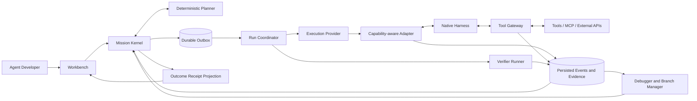
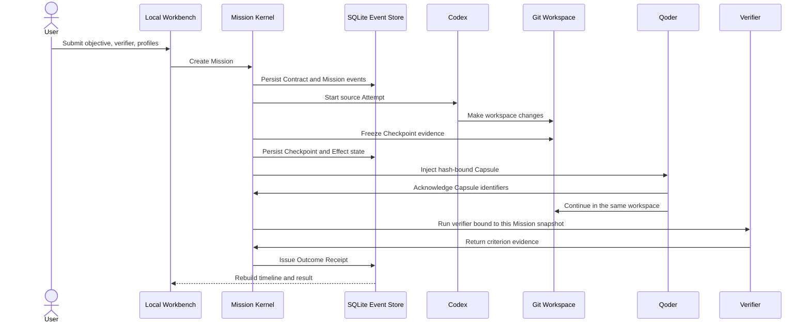

# MissionBraid Project Tour

This tour explains the target product and the working foundation without
assuming prior knowledge of MissionBraid or any coding-agent CLI.

## The problem

Developers increasingly use several coding Agents, models, tools, and local
configurations. Each Harness can be capable on its own, but the overall
execution remains fragmented:

- the effective model, reasoning mode, instructions, Skills, MCP servers, and
  permissions are hard to compare;
- context assembly and tool decisions are often opaque until the final result;
- a failed long run is expensive to understand and repeat;
- switching Harnesses requires manual context reconstruction;
- external actions may be repeated after a retry;
- “done” is usually the executor's own statement.

MissionBraid treats these as one Agent runtime and debugging problem rather than
a collection of prompt templates.

## The product idea

> **A Mission outlives every Runtime, session, and execution branch.**

A Mission owns the user's objective, constraints, workspace, evolving plan,
execution branches, mutable effects, and Outcome Contract. Codex, Qoder, Claude
Code, OpenCode, Hermes, and future Harnesses are replaceable Runtimes behind
capability-aware adapters.

The final Workbench supports one connected loop:

```text
configure → plan → run → observe → debug → fork → hand off → compare → verify
```

This is deliberately more than a launcher. The product remains useful after an
Agent starts because it exposes what happened, lets the developer intervene at
real control boundaries, preserves executable state, and judges the outcome
against the immutable Contract revision bound to the selected Branch.

## The target journey

1. **Configure.** MissionBraid discovers effective Runtime Profiles, including
   the Harness, model, reasoning mode, instructions, Skills, MCP/tools,
   permissions, environment, and available resource signals.
2. **Plan.** The developer selects a Profile or accepts a recorded planner
   decision over eligible Profiles.
3. **Run.** A native Harness executes an Attempt. MissionBraid persists
   sanitized native-format and normalized model, context, tool, workspace, and
   lifecycle events before projecting them live.
4. **Observe.** A live trace explains the active branch, visible context,
   pending action, workspace changes, and acceptance progress.
5. **Debug.** A semantic breakpoint or anomaly pauses at an adapter-supported
   safe point. The UI states whether the boundary is observable,
   interruptible, gated, steerable, or reconstructable.
6. **Fork.** The developer changes one or more inputs and creates a new
   execution branch from a composite checkpoint.
7. **Hand off.** A branch can continue in another Harness through a
   provenance-bound Handoff Capsule.
8. **Compare.** MissionBraid compares branches and failure hypotheses using
   observable evidence rather than invented hidden reasoning.
9. **Verify.** The Mission Kernel evaluates the exact immutable Contract
   revision bound to the selected Branch and issues an Outcome Receipt.

## The architecture at a glance



The Workbench, CLI, and local API project one Mission state machine. Provider
adapters and optional execution providers do not own Mission truth.

## The core objects

### Mission and Outcome Contract

The durable unit of user intent. A Contract binds acceptance criteria to a
Mission revision. A later user change creates a new revision rather than
silently changing the standard applied to earlier work.

### Runtime Profile and Attempt Binding

The scheduling unit is the effective execution environment, not a Harness
brand:

```text
Harness × model × reasoning × instructions × Skills × MCP/tools
× permissions × capabilities
```

A reusable Profile Definition is resolved into an immutable Profile Snapshot.
Availability, quota, and price remain timestamped Catalog Observations. The
snapshot becomes an Attempt Binding when it is attached to a Mission revision,
Branch, workspace, authority, budget, and native session/process. This keeps a
saved Profile stable while making each real execution explainable.

### Attempt and Branch

An Attempt is one Runtime Profile executing one part of a Mission. A Branch is
anchored by an immutable parent and base Checkpoint. Its history is append-only,
while its head can advance through new Attempts and events. Resume or Handoff
from the current head may remain on the same Branch; changed inputs or execution
from a historical point create a child Branch.

### Agent Event IR and Context Graph

The Event IR provides shared concepts for model, context, tool, artifact,
lifecycle, and outcome events. Sanitized native-format artifacts, source
sequence, ingest sequence, causal parents, and redaction metadata remain linked
so provider-specific meaning is not erased.

The Context Graph records the observable instructions, messages, retrieved
artifacts, Skills, MCP definitions, tool results, summaries, and truncation
decisions that shaped a turn. It does not claim access to private
chain-of-thought.

### Composite Checkpoint

A checkpoint binds the Mission revision, event prefix, context state, workspace
snapshot, Runtime binding, session/process locator, environment fingerprint,
and Effect history needed to reconstruct an execution boundary. Unsupported or
missing state is explicit.

### Tool Effect

Every mutable action MissionBraid controls or observes receives an Effect
identity; an unobservable boundary remains unknown. The system records
enforced, guarded, advisory, or unknown control and branch-local workspace,
shared-resource, or mission-global external scope. A child Branch owns its new
Effects and references its inherited external frontier. Rewinding local state
does not pretend to undo the outside world.

### Handoff Capsule

The Capsule projects provenance-bound Mission, checkpoint, remaining-work,
artifact, decision, failure, and Effect evidence into a target Runtime's
declared budget. It transfers observable state, not hidden model state.

### Outcome Receipt

The Verifier Runner returns criterion evidence but cannot issue a Receipt. The
Mission Kernel applies the outcome policy and binds the selected Branch's exact
Contract revision, Attempts, Effects, verifier evidence, and event head. A model
report alone cannot create it; required failed/unknown criteria or
blocking/ambiguous required Effects prevent `verified`.
Terminal failure or unknown still produces a rejected Receipt with unresolved
details.

## What works in this repository today

Iteration 1 implements and has retained real evidence for the continuity
foundation:

1. Open the local Workbench and inspect the discovered Runtime catalog.
2. Create a Mission with an objective, Git workspace, and verifier.
3. Select Codex, Qoder, or an ordered Codex-to-Qoder route.
4. Run real native Runtime processes against a disposable workspace.
5. Persist Attempt, workspace baseline/checkpoint evidence, Effect, Capsule,
   verification, and Receipt events. The current checkpoint evidence is a Git
   digest/delta boundary, not a restorable snapshot.
6. Restart the Workbench and restore the same Mission result.

The current implemented control loop is:



The Iteration 1 flow above proves the Mission can outlive a process and cross
one real Runtime boundary. It does not yet provide the target live debugger,
executable time-travel branches, adaptive planner, or general failure
attribution.

Iteration 2 is now implemented in source:

- Codex, Qoder, and Claude Code are execution Adapters with explicit capability
  declarations;
- every new Mission receives a default root Branch;
- Runtime Profile Definition, Catalog Observation, immutable effective
  Snapshot, and Attempt Binding are distinct persisted objects;
- Runtime events retain per-source sequence and causal links while Mission
  ingest order remains controller-specific;
- every normalized Runtime event links to a sanitized, content-addressed native
  artifact;
- accepted execution intent uses a durable command/outbox path and can be
  recovered by the Workbench supervisor after restart;
- the Workbench can switch between English and Chinese and remembers the local
  browser choice.

The [retained Iteration 2 record](../evidence/iteration-2-three-harness-local-2026-08-25.json)
validates this slice at the same-host local level. Codex, Qoder, and Claude Code
all completed successful real Attempts; 1,066 source-linked Runtime events and
sanitized native artifacts were retained; the Receipt was verified; and the
Mission head, Receipt, source sequences, and causal links remained stable after
restart. The two Handoff acknowledgements precede their target's first observed
tool-request event in the native source stream. This is cooperative ordering
evidence, not an enforced live tool gate.

## What is authoritative?

Kernel events are the only authority for control-state transitions. Native
Harnesses, Git, tools, and external systems remain evidence sources for their
own real state; MissionBraid does not pretend its database can rewrite them.

| Fact                                                          | Control record or evidence source                                               | Reason                                                                |
| ------------------------------------------------------------- | ------------------------------------------------------------------------------- | --------------------------------------------------------------------- |
| Objective, constraints, Contract revision, Branch and Attempt | Mission Kernel events                                                           | A Runtime cannot rewrite the standard or control state.               |
| Accepted command                                              | Kernel intent event; the outbox only delivers it                                | Delivery state cannot create business authority.                      |
| Provider-native behavior                                      | Sanitized native-format Adapter evidence                                        | Normalization must not erase unique semantics or persist credentials. |
| Observable context and tool flow                              | Captured evidence; Context Graph and Event IR projections                       | Debugging requires sourced inputs, outputs, and transformations.      |
| Repository state at a boundary                                | Git digest/delta evidence today; restorable snapshot in the target architecture | A transcript cannot prove what is on disk.                            |
| External side effects                                         | External-system evidence plus Effect projection                                 | Rewinding Mission state cannot undo the outside world.                |
| Whether the result passed                                     | Kernel `ReceiptIssued` event based on Branch-bound verifier evidence            | The executor and Verifier Runner cannot approve their own work.       |

## Why the architecture uses these boundaries

### Mission state instead of session state

Vendor sessions are useful native execution contexts but are not portable,
complete, or stable enough to own a cross-Harness objective. MissionBraid
stores portable Mission truth and keeps native session handles behind adapters.

### Native-format evidence plus a common IR

A lowest-common-denominator schema would erase the exact controls that make one
Harness valuable. MissionBraid retains sanitized native-format artifacts and
maps only shared semantics into a versioned IR. Credentials are removed before
persistence, and unsupported controls stay visible as capability gaps.

### Safe-point debugging instead of arbitrary snapshots

MissionBraid can only pause or change an execution where the adapter or
controlled tool boundary permits it. “Observe”, “interrupt”, “gate”, “steer”,
and “reconstruct” are separate capabilities.

### Branching instead of history mutation

Projection rebuild and playback create no Branch. Cached replay and
counterfactual resampling create child Branches when they produce evidence;
execution fork creates a child Branch and runs real subsequent tools. This
makes comparison possible and prevents a convenient UI label from overstating
determinism.

### Kandev as a provider, not a parent project

Kandev can provide workspace and process infrastructure through public
interfaces. MissionBraid remains an independent project with its own Mission
Kernel, Event IR, debugger, Handoff Capsule, Effect model, and Outcome Receipt.
Direct local adapters remain supported.

## Verified foundation

The strongest current record is bound to clean revision `d14201b`:

- one Mission was submitted through the normal local Workbench API without a
  hand-written Mission file or manual context transfer;
- real Codex, Qoder, and Claude Code Profiles ran successful ordered Attempts
  on one root Branch;
- 1,066 Runtime events retained source order, Mission ingest order, causal
  links, and sanitized native artifacts;
- both cooperative Handoff acknowledgements precede the target's first observed
  tool-request event in its native source stream;
- the Receipt was verified with no unresolved item;
- a new Workbench process restored the same Mission head, Receipt, source
  sequences, and causal links.

See the [Iteration 2 machine-readable
record](../evidence/iteration-2-three-harness-local-2026-08-25.json) and
[evidence index](../evidence/README.md).

The earlier [Codex-to-Qoder
record](../evidence/unified-workbench-codex-qoder-local-2026-08-24.json) retains
a matching source-checkpoint/target-baseline workspace snapshot and distinct
before/after workspace digests. Neither record proves an enforced pre-tool
gate. Both are local same-host evidence, not automatic routing, executable
Fork/Replay, cross-host reproduction, production isolation, or adoption.

## Code map for the current foundation

| Responsibility                                                    | Primary implementation                                                                                                                                          | Focused tests                                                                                          |
| ----------------------------------------------------------------- | --------------------------------------------------------------------------------------------------------------------------------------------------------------- | ------------------------------------------------------------------------------------------------------ |
| Workbench, bilingual copy, and background command supervisor      | [`src/app.ts`](../src/app.ts), [`src/app-page.ts`](../src/app-page.ts), [`src/app-copy.ts`](../src/app-copy.ts)                                                 | [`src/app.test.ts`](../src/app.test.ts), [`src/app-copy.test.ts`](../src/app-copy.test.ts)             |
| Mission document construction                                     | [`src/mission-draft.ts`](../src/mission-draft.ts), [`src/spec.ts`](../src/spec.ts)                                                                              | [`src/mission-draft.test.ts`](../src/mission-draft.test.ts), [`src/spec.test.ts`](../src/spec.test.ts) |
| Mission, Branch, Profile, Binding, and event domain               | [`src/domain.ts`](../src/domain.ts)                                                                                                                             | Engine and store tests below                                                                           |
| Execution, recovery, and handoff                                  | [`src/engine.ts`](../src/engine.ts)                                                                                                                             | [`src/engine.test.ts`](../src/engine.test.ts)                                                          |
| Events, projections, durable commands/outbox, leases, and fencing | [`src/store.ts`](../src/store.ts)                                                                                                                               | [`src/store.test.ts`](../src/store.test.ts)                                                            |
| Runtime Event IR and sanitized native artifacts                   | [`src/runtime-events.ts`](../src/runtime-events.ts), [`src/artifact-store.ts`](../src/artifact-store.ts)                                                        | [`src/runtime-events.test.ts`](../src/runtime-events.test.ts) and engine tests                         |
| Workspace boundary evidence                                       | [`src/workspace.ts`](../src/workspace.ts)                                                                                                                       | [`src/workspace.test.ts`](../src/workspace.test.ts)                                                    |
| Capsule projection and acknowledgement                            | [`src/capsule.ts`](../src/capsule.ts)                                                                                                                           | [`src/capsule.test.ts`](../src/capsule.test.ts)                                                        |
| Direct Runtime execution                                          | [`src/adapters/codex.ts`](../src/adapters/codex.ts), [`src/adapters/qoder.ts`](../src/adapters/qoder.ts), [`src/adapters/claude.ts`](../src/adapters/claude.ts) | Adapter tests beside each implementation                                                               |
| Independent verification                                          | [`src/verifier.ts`](../src/verifier.ts)                                                                                                                         | [`src/verifier.test.ts`](../src/verifier.test.ts)                                                      |
| Runtime inventory                                                 | [`src/runtime-catalog.ts`](../src/runtime-catalog.ts)                                                                                                           | [`src/runtime-catalog.test.ts`](../src/runtime-catalog.test.ts)                                        |

## What happens next

MissionBraid has **ten major product iterations**. The foundation above is
Iteration 1; Iteration 2 is now implemented and validated locally. Iterations
3–10 next add live debugging, honest execution forks, adaptive handoff, failure
intelligence, multi-Agent Mission graphs, evaluation, and an open Adapter SDK.

Continue with the [product requirements](product-requirements.md),
[architecture](architecture.md), [roadmap](roadmap.md), and
[key questions](key-questions.md).
